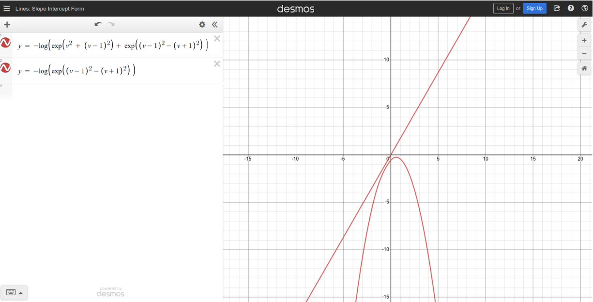

#! https://zhuanlan.zhihu.com/p/527886815

# 1013: 混合模型(MM)及(不严格的)期望最大算法(EM)

[CATSMILE-1013](http://catsmile.info/1013-mixture-and-em.html)


```{toctree}
---
maxdepth: 4
#caption: mycap
numbered: 0
---
1013-mixture-and-em.md
```

## 前言

- 目标: 公理化地从自编码角度应用混合模型
- 结论: 
  - 用编码-解码的角度去改造EM,严格意义上这里讨论的并不EM算法本身.
  - Vanilla EM可以认为是Bayes Theorem的一个应用, 一半Bayesian(隐变量用分布表示)一半MAP(参数用点估计)的hybrid算法
- 备注: 
  - 不知道是不是上学时哪里出了些岔子,一直没有真正自己推导过EM,(HMM里推过Baum-Welch但是也没有应用).
可能之前对多元高斯变量不够熟悉,老是被sufficient statistics这类词吓着．实际上，
从KMeans,和分步骤最优化的角度去理解EM,还是非常简洁的. 
  - EM是通过在隐变量上采样,把隐藏变量积分出去,计算似然的期望. 之所以在隐变量上采样,是希望隐变量编码
  数据的相关信息. 这里采取的极端一点的做法,就是用一个 $\text{argmax}$ 点估计,来替代这个分布. 因为
  在很多神经网络里,点估计早就是很常用的操作了
  - 里面有一步取下界的过程,也就是用EOL作为LEOP的下界,
  - EM可能的问题,可能和Gibbs采样类似,有可能卡在一些奇怪的地方,对初始化比较敏感
  - 构造GAE的过程中,发现softargmax是一个隐性的判别函数,使用不当,容易出现奇怪的问题.加入一个正则项,可以较好地避免推开(push-away)的现象,确保计算隐藏变量时有比较好的收敛性.这或许可以解释LayerNorm的有效性
  - Bayesian可以认为是MAP的热力学化对应概念,MAP是Bayesian的低温极限
  - Inspiration Needs to be Tamed by Rationale, 设计很重要,
  验证也很重要. 设计允许我们扩大解的空间,验证帮助我们控制解的性质
- 更新时间:
  - 20220614

混合模型一般使用EOP作为严格的概率密度函数,对于独立同分布一般取对数为似然LEOP,有时可以用EOL作为下界去近似.
为方便理解,可以想象我们在混合高斯分布 $p(x|c_k)\sim N(\mu_k,\Sigma_k)$ ,当然本文一般只在M-step才需要用到这个条件 


## 生成式自编码模型 Generative AutoEncoder (GAE)

$$
\left \{
\begin{align}
EOP(x,z) &=  \sum_k p(x|c_k) p(c_k) \\
LEOP(x,z) &=  \log \sum_k p(x|c_k) p(c_k) \\
EOL(x,z) &= \sum_k p(c_k) \log p(x|c_k)\\
LOE(x,z) &=-(x- \sum_k p_z(c_k) A_k )^2
\end{align}
\right.
$$

我们知道EOL是这三者的下界,也很有意思地接近于概率散度的定义,尽管定义域都不一样...

$$
LOE(x,z) \geq EOL(x,z) \leq LEOP(x,z)
$$

简单的高斯混合模型,一般对概率密度进行直接的拟合,也就是
假设数据都是从同一个分布采样,直接优化likelihood

$$
\begin{align}
m &=\text{model parameters}       \\
c_b &\in \{1,\dots, k\}\\ 
L(X,m) &= \sum_b  \log p(x_b | m) \\
L(X,m) &= \sum_b  \log \sum_k p(c_b|m)  p(x_b| c_b, m ) \\
\hat m(X) &= \text{argmax}_{m} L(X,m)
\end{align}
$$

其中 $\hat m$ 就是给定数据 $X$ 时的最优参数.注意这里 
$p(c_b)=p(c_b=k)=p(c)$一般取一个常量,也就是不允许根据样本 $x_b$ 来选择对应的生成组分. 当然这个LEOP函数也可以用EOL作为下界去逼近.

## GAE的一般形式

考虑如下的通用混合过程,似然函数是经典的混合模型, $p(x_b|z=k,m)$
是隐变量$z=k$时的条件组分分布, 隐藏变量上的分布 $u_{b}(z=k)$ 
是一个待定的,用来吸收有关 $x_b$ 的信息的变量/分布.

$$
\begin{align}
\sum_k u_b(k) &= 1 \\
L(X,m,U) &= \sum_b  \log \sum_k u_{b}(z=k)p(x_b| z=k, m ) 
\\
L_b(x_b,m,u_{b}(k)) &= \sum_b  \log \sum_k u_{b}(k)p(x_b| k, m ) 
\end{align}
$$

其中MAP编码过程相当于倒过来使用条件分布,在给定 $x_b$ 的情况下找到
最大化似然的那个隐藏变量 $u(k)$. 这里考虑的基本都是non-Bayesian的
方法,通过重参数化把 $u(k)$ 映射到参数空间的一个点,来得到一个确定性
(deterministic)的编码,来简化模型架构,并允许更加简单的后续对比.相比
之下,Bayesian 一般使用一个隐藏变量上的分布来描述隐变量,而不是一个
简单的向量空间, 这使得编码过程热力学化, 也增加了分析难度. 换句话说,
通过将温度设为负无穷,我们先考虑Bayesian的极限情况-MAP,来简化分析.

$$
\begin{align}
\hat u_{b}(k) = \text{argmax}_{u(k)} L_b(x_b,m, u(k)) \\
\end{align}
$$


### 离散隐变量

如果要用GMM去做编码,先考虑最简单的one-hot编码. 考虑两步的过程, 对于每一个样本,
令$p(c_b=k|x_b)=u_{bk}$ 放松成一个函数, 目标就变成同时优化$u_{bk},m$,使得似然函数取到最大


但是用$u_{bk}$直接做隐变量有一个问题,就是维度随着k增大而增大. 所以还是考虑
用$u_{bk}$对$c_b$做一个近似 $\delta(c_b) \approx \text{softargmax}(\beta \cdot  u_{bk},k)$,那么

$$
\begin{align}
L(X,m,U) &= \sum_b  \log \sum_k u_{bk} p(x_b| c_b, m ) \\
L(X,m,C) &= \sum_b  \log \sum_k \delta (c_b) p(x_b| c_b, m ) \\
\approx L(X,m,U) &= \sum_b  \log \sum_k \text{softargmax}(\beta \cdot u_{bk},k) p(x_b| c_b, m ) \\
\end{align}
$$

通过这个近似,我们将 $\delta(c_b)$ 变得可微,通过在优化中逐渐增大 $\beta$ ,最终找到一个收敛到 $\delta$ 上的解.
如果不用这个近似,搞个拉格朗日乘子,说不定也能写出一个迭代算法?

对比VQ-VAE,优化的是最优解码情况下的似然. 反过来说,我们并不能指望去优化最差解码的似然,因为最差解码尽管
对应着似然的下界,但意味着这个编码完全失去了意义. 在VQ里面,$c_{b+} = f(x_b,m)=\text{argmax}_k p(x_b|k,m)$ 退化成一个无参函数,因此不再需要优化.

$$
\begin{align}
c_{b+} &= \text{argmax}_k p(x_b|k,m) \\
p(x_b|k,m) &\leq  p(x_b|c_{b+},m)\\
 \sum_k \delta (c_b,k) p(x_b| k, m )  &\leq  \sum_k \delta (c_{b+},k) p(x_b| k, m ) \\
 L(X,m,C) &\leq L(X,m,C_+)
\end{align}
$$

我们可以看到,用生成模型来计算隐变量,一般需要遵循最大似然的目标,因为数据是不能动的.于是就会出现
鸡生蛋,蛋生鸡的问题,这个时候就只好用期望最大算法,对变量进行交替优化,来确保L一直上升.

$$
\hat C(X,m)= \text{argmax}_{C} L(X,C,m)\\
\hat m(X,C) = \text{argmax}_{C} L(X,C,m) \\
(\hat C,\hat m)(X) = \text{argmax}_{C,m} L(X,C,m)
$$

在E-step,编码得出隐变量,就是令 $c_b = c_{b+}(x_b,m)$

在M-step,就是令 $\hat m = \text{argmax}_{C} L(X,C,m)$

这类EM的一个特例,就是kmeans算法([StatsSE post 78278](https://stats.stackexchange.com/a/78278)),
在组分概率为固定方差的高斯时取到 $p(x_b|k,m)\sim N(\mu_k,\sigma^2 I)$. 这个隐藏变量虽然是一维离散的,
但却可以收纳任意量的信息,从某种意义上,跟knn也有联系,是一个1-nn算法

### 连续隐变量

如果我们在高斯混合模型里尝试用一个连续隐变量,那么有一种方式就是人为制造一个嵌入空间 $v_{be},w_{ke}$,令嵌入空间的距离反映不同组分的强度

经过一系列的计算,并没有找到比较好的E-step闭式解,只能迭代一下,对于嵌入的空间,因为有softargmax的存在,原本的简单高斯平均变复杂了

$$
\begin{align}
L(X,m,U) &= \sum_b  \log \sum_k u_{bk} p(x_b| k, m )\\
u_{bk} &= \text{softargmax}( -\sum_e ( v_{be} - w_{ke} )^2,k )\\
L(X,m,v_{be},w_{ke}) &= \sum_b  \log \sum_k  \text{softargmax}( -\sum_e ( v_{be} - w_{ke} )^2,k )\cdot  p(x_b| k, m )
\end{align}
$$

M-step,一般比较简单,用闭式解,或者梯度下降计算 $$\hat m = \text{argmax}_m L(X,m,v_{ke},w_{ke})$$

E-step,这里复杂一些,应当调整 $v_{be},w_{ke}$,来逼近最优连接矩阵 $u_{bk}\approx \delta (\text{argmax}_k p(x_b|k,m))$.

实际操作里,要么用梯度,要么再做两个子步骤.

#### E-step for $v_{be}$ 推导

对于新来的样本,需要进行隐变量编码 $\hat v_{be} = \text{argmax}_{v_{be}} L(x_{b},m,v_{be},w_{ke})$,
让我们来求导观察一下这个参数要怎么算比较好

$$
\begin{align}
{\partial \over \partial v_{be}} L &=
{\partial \over \partial v_{be}} \sum_b  \log \sum_k  \text{softargmax}( -\sum_e ( v_{be} - w_{ke} )^2,k )\cdot  p(x_b| k, m )
\\
&= {\partial \over \partial v_{be}} \sum_b  \log \sum_k   q_{bk}(v_{b})\cdot  p(x_b| k, m )\\
&= \sum_b { 1\over \sum_k   q_{bk}(v_{b})\cdot  p(x_b| k, m )} {\partial \over \partial v_{be}}   \sum_k   q_{bk}(v_{b})\cdot  p(x_b| k, m )\\
&= \sum_b { 1\over \sum_k   q_{bk}(v_{b})\cdot  p(x_b| k, m )}    \sum_k p(x_b| k, m ) {\partial \over \partial v_{be}} q_{bk}(v_{b})\\
\end{align}
$$

应用[softargmax](./1012-softargmax)求导的一般结论 
$$\sum_k t_k{  \partial \over \partial z} p_k(z) = 
\sum_k p_{k}(z) \cdot ({t_k - \sum_k t_k p_k(z)}) {  \partial \over \partial z} h_k(z)$$

得到

$$
\begin{align}
h_{bk}(v_{be} ) &= -\sum_e (v_{be} - w_{ke})^2  \\
{\partial \over \partial v_{be}} h_{bk}(v_{be} ) &= 
2(w_{ke}-v_{be}) \\
{\partial \over \partial v_{be}} L 
&= \sum_b { 1\over \sum_k   q_{bk}(v_{b})\cdot  p(x_b| k, m )}   
 \sum_k p(x_b| k, m ) {\partial \over \partial v_{be}} q_{bk}(v_{b})\\
&= \sum_b { 1\over \sum_k   q_{bk} \cdot  p(x_b| k, m )}    \sum_k
q_{bk}
(p(x_b| k, m ) -\sum_j p(x_b| j, m )q_{bj} )
{\partial \over \partial v_{be}} h_{bk}(v_{be})
\\
&=  2
\sum_b { 1\over \sum_k   q_{bk} \cdot  p(x_b| k, m )}    \sum_k
q_{bk}
(p(x_b| k, m ) -\sum_j p(x_b| j, m )q_{bj} )
(w_{ke}-v_{be})
\\
&=  2
\sum_b { 1\over \sum_k   q_{bk} \cdot  p(x_b| k, m )}    \sum_k
r_b \exp (\sum_e  -(v_{be} - w_{ke})^2)
(p(x_b| k, m ) \\
&- \sum_j r_b p(x_b| j, m ) \exp(\sum_e  -(v_{be} - w_{je})^2 ))
(w_{ke}-v_{be})
\\
\end{align}
$$

如果能够找到一个$v_{be}$满足所有导数都为0,就得到了一个驻定的 $v_{be}$,观察这个导数,可以认为受到了强度为 $q_{bk} (p(x_b| k, m ) -\sum_j p(x_b| j, m ) q_{bj})$ 的吸引.如果$p(x_b|k,m)$高于在$q_{bk}$上的期望,那么就会吸引到对应的 $w_{ke}$ 上,如果低于期望,就会产生斥力.但是整体来讲,这个式子不太好解,也用不上高斯的良好性质.于是我们考虑EOL下界

#### EOL下界

$$
\begin{align}
L(X,m,U) &= \sum_b  \log \sum_k u_{bk} p(x_b| k, m )\\
u_{bk} &= \text{softargmax}( -\sum_e ( v_{be} - w_{ke} )^2,k )\\
L(X,m,v_{be},w_{ke}) &= \sum_b  \log \sum_k  \text{softargmax}( -\sum_e ( v_{be} - w_{ke} )^2,k )\cdot  p(x_b| k, m ) 
\\
&= \sum_b  \log \sum_k  \text{softargmax}( -\sum_e ( v_{be} - w_{ke} )^2,k )\cdot  { p(x_b| k, m ) 
\over  \sum_k p(x_b| k, m ) 
} \sum_k p(x_b| k, m ) 
\\
\\
&= \sum_b  \log  ( \sum_k p(x_b| k, m ) )\sum_k  \text{softargmax}( -\sum_e ( v_{be} - w_{ke} )^2,k )\cdot  { p(x_b| k, m ) 
\over  \sum_k p(x_b| k, m ) 
} 
\\
&= \sum_b  \log  ( \sum_k p(x_b| k, m ) ) + \log\sum_k  \text{softargmax}( -\sum_e ( v_{be} - w_{ke} )^2,k )\cdot  { p(x_b| k, m ) 
\over  \sum_k p(x_b| k, m ) 
} 
\\
&\geq 
 \sum_b  \log  ( \sum_k p(x_b| k, m ) ) + \sum_k  { p(x_b| k, m ) 
\over  \sum_k p(x_b| k, m ) 
} \log \text{softargmax}( -\sum_e ( v_{be} - w_{ke} )^2,k )\cdot  
\\
&= \sum_b  \log  ( \sum_k p(x_b| k, m ) ) + \sum_k  { p(x_b| k, m ) 
\over  \sum_k p(x_b| k, m ) 
} [ \log  \exp(-\sum_e ( v_{be} - w_{ke} )^2)\\
&-  
\log \sum_k \exp(-\sum_e ( v_{be} - w_{ke} )^2) ]
\\
&=
\sum_b  \log  ( \sum_k p(x_b| k, m ) ) -  
\log \sum_k \exp(-\sum_e ( v_{be} - w_{ke} )^2) \\
&+ \sum_k  { p(x_b| k, m ) 
\over  \sum_k p(x_b| k, m ) 
} (-\sum_e ( v_{be} - w_{ke} )^2
)
\end{align}
$$

如果只有最后一项的话,退化成一个高斯模型,求个平均就能找到最大值点,
但是问题是中间多了一项logsumexp,于是这个极值点就没那么简单.这个
logsumexp,希望最近的那个点,尽量地远

$$
\begin{align}
{\partial \over \partial v_{be}}L(X,m,v_{be},w_{ke}) &=
{\partial \over \partial v_{be}} \sum_b  \log  ( \sum_k p(x_b| k, m ) ) -  
\log \sum_k \exp(-\sum_e ( v_{be} - w_{ke} )^2) \\
&+ \sum_k  { p(x_b| k, m ) 
\over  \sum_k p(x_b| k, m ) 
} (-\sum_e ( v_{be} - w_{ke} )^2
)
\\
&=
 \left[ 
   \begin{aligned}
    0   -  
  \sum_k  {  \exp(-\sum_e ( v_{be} - w_{ke} )^2)\over \sum_k \exp(-\sum_e ( v_{be} - w_{ke} )^2)}2(w_{ke} -v_{be}) \\ 
  + \sum_k  { p(x_b| k, m ) 
  \over  \sum_k p(x_b| k, m ) 
  } 2 (  w_{ke} -v_{be} ))
  \end{aligned}
\right]
\\
&=
2  \left[ 
  \begin{aligned}
  -\sum_k  {  \exp(-\sum_e ( v_{be} - w_{ke} )^2)\over \sum_k \exp(-\sum_e ( v_{be} - w_{ke} )^2)} (w_{ke} -v_{be}) \\ 
  + 
  \sum_k  A_{bk}(  w_{ke} -v_{be} ))
\end{aligned}
\right]
\\
 &=
2 \left[ 
  \begin{aligned}
-\sum_k  {  B_{bk}}(w_{ke} -v_{be}) 
+ \sum_k  A_{bk} (w_{ke} - v_{be} )
\end{aligned}
\right]
\\
 &=
2 \sum_k  (A_{bk} - B_{bk}) (w_{ke} - v_{be} )
\\
0 &=
2 \sum_k  (A_{bk} - B_{bk}) (w_{ke} - v_{be} )
\\
0 &=
\sum_k  (A_{bk} - B_{bk}) w_{ke} -  \sum_k  (A_{bk} - B_{bk})v_{be} 
\end{align}
$$


#### E-step for $v_{be}$ 结论

$$
\begin{align}
\left\{\begin{aligned}
 v_{be}  &=
{\sum_k  (A_{bk} - B_{bk}) w_{ke} \over  \sum_k  (A_{bk} - B_{bk})}
\\
B_{bk}(v_{be}) &= {  \exp(-\sum_e ( v_{be} - w_{ke} )^2)\over \sum_k \exp(-\sum_e ( v_{be} - w_{ke} )^2)}
\end{aligned}
\right.
\end{align}
$$

注意这里得出的是一个迭代式,而不是一个驻点,因为驻点太难解了.这个迭代的方法还没证明是单调的.既然反正用了下界也没解出驻点,可能用原来的式子做迭代也是可以的. 好的,那么这样我们大致有一个办法计算$v_{be}$了,尽管效果并不一定很有保障.


#### E-step for $w_{ke}$ 


$w_{ke}$估计也会碰上跟$v_{be}$类似的问题,那就意味着只能用迭代的方法

$$\hat w_{ke} = \text{argmax}_{w_{ke}} L(X,m,v_{ke},w_{ke})$$


### 改进高斯隐藏变量

#### 问题在哪?

因为没法推导出一个解析解,我尝试思考这个简单构造背后到底出现了什么问题.
这是一个非常简单的设计,人为制造一个嵌入空间 $v_{be},w_{ke}$,令嵌入空间的距离反映不同组分的强度. 

高效发现问题一个重要方法是考察尽量简化模型,我通过下面这个例子,发现
这个简单设计的编码过程由于softargmax的使用,造成push-away的问题,使得嵌入向量$v_{be}$不能很好地收敛到任何一个组分上(见上一节累死累活的推导)

$$
\begin{align}
L(X,m,U) &= \sum_b  \log \sum_k u_{bk} p(x_b| k, m )\\
L(X,m,v_{be},w_{ke}) &= \sum_b  \log \sum_k  \text{softargmax}( -\sum_e ( v_{be} - w_{ke} )^2,k )\cdot  p(x_b| k, m )
\end{align}
$$

让我们考察一下这里 $u_{bk}$ 的具体计算, 考虑$|K|=2,|E|=1$的特殊情况,一维,两个组分

$$
\begin{align}
u_{bk}
&= \text{softargmax}( -\sum_e ( v_{be} - w_{ke} )^2,k )
\\ &= 
{\exp \left( -||v_b-w_k||^2 \right)
\over
\sum_k \exp \left( -||v_b-w_k||^2 \right)
}
\\
u_1 &= {\exp(-(v-w_1)^2)
\over 
\exp(-(v-w_1)^2) +  \exp(-(v-w_2)^2)
}
\\ &= { 1
\over 
1 + \exp( (v-w_1)^2 -(v-w_2)^2)
}
\end{align}
$$

不失一般性,令$w_1=0,w_2<0$,得到$u_1$关于 $-v^2+(v-w_2)^2=-w_2(2v-w_2) = -2w_2 v +w_2^2$ 单调递增,也就是随着$v$增大而增大,
也就是说,因为softargmax收集了判别信息,所以一个判别模型会通过
不断远离原点来优化判别概率. 

#### 尝试一

如果把L2范数替换成采用L1范数,
那么在一维的情况里,就不能通过这种方式作弊优化判别概率了.在二维情况下,
我们知道距离两点距离之差为定值的集合,落在双曲线上,而且由于几何限制,
L1范数之差不能大于两点之间的距离.这样也意味着,试图优化似然比的梯度,
反映到几何上,就是垂直于双曲线的梯度方向.

$$
d_{ab}+d_{bc}>d_{ac}\\
d_{bc} >d_{ac} - d_{ab}
$$

#### 尝试二


无论L2还是L1,最后最优的点$v$
都是落在 $w$ 原型外侧. 一个简单的修复方法是要求$v$距离原点要尽量近,
来平衡这种push-away的趋势.比如在L2范数下,考虑L2正则化,使得远离原点的
位置概率被降低

$$
\begin{align}
u_{bk}
&= \text{softargmax}( \sum_e -v_{be}^2 -\sum_e ( v_{be} - w_{ke} )^2 ,k )
\\ &= 
 \text{softargmax}( \sum_e -2v_{be}^2 +2v_{be}w_{ke} -w_{ke}^2 ,k )
\end{align}
$$


考虑$|K|=2,|E|=1$的特殊情况


$$
\begin{align}
u_1 &= {
1
\over
1 + \exp( 
  - 
\sum_e  2v(w_1-w_2) -(w_1^2-w_2^2) 
  )
}
\\
u_1 &= {
1
\over
1 + \exp(-f(v))
}
\\
f(v) &= 2(w_1 - w_2) v - (w_1^2-w_2^2)
 \\ &= (w_1 - w_2) (2v - w_1-w_2)
\end{align}
$$

然后这个函数还是炸了,随着v的增大,$f(v)$仍然无界.这是因为,在做似然比的时候,正则项被抵消了,导致正则没有传导进入softargmax.因此,所有形如$f(v)$的
加性正则,都行不通.


### 改进高斯隐藏变量: 尝试三及结论

那么继续考虑一个针对混合过程的构造.我们让所有远离原点的样本,都落入一个
不可能产生数据的吸收模型里,也就是在softargmax时考虑一个吸收组分,
这个组分只进入分母

$$
\begin{align}
L(X,m,U) &= \sum_b  \log \sum_k u_{bk} p(x_b| k, m )\\
L(X,m,v_{be},w_{ke}) 
&= \sum_b \log \left(  \exp (v^T v) \cdot 0 + \sum_k  \exp( -\sum_e ( v_{be} - w_{ke} )^2,k )\cdot  p(x_b| k, m ) \right) \\
&= \sum_b \log \left(   \sum_k  {\exp( -\sum_e ( v_{be} - w_{ke} )^2) \over 
\exp (v^T v) + \sum_k \exp( -\sum_e ( v_{be} - w_{ke} )^2) }\cdot  p(x_b| k, m ) \right) \\
u_{bk} &=   {\exp( -\sum_e ( v_{be} - w_{ke} )^2 ) \over 
\exp (v^T v) + \sum_k \exp( -\sum_e ( v_{be} - w_{ke} )^2) }
\end{align}
$$

再一次,考虑$|K|=2,|E|=1$的特殊情况

$$
\begin{align}
u_1 &= {\exp(  - (v-w_1)^2) 
\over 
\exp (v^2) +  \exp(-(v-w_1)^2) + \exp(-(v-w_2)^2)} \\
&= {1 
\over 
1 + \exp (v^2+(v-w_1)^2)  + \exp((v-w_1)^2-(v-w_2)^2)} \\
\end{align}
$$

谢天谢地,这个函数终于看起来不会炸了,化归成判别能量形式.我靠这个
驻点怎么还是这么难求??先试试$w_1=0,w_2=-1$

$$
\begin{align}
u_1 &= {1 
\over 
1 + \exp [-f(v)] } \\
f(v)&= -\log \left[ \exp (v^2+(v-w_1)^2)  + \exp((v-w_1)^2-(v-w_2)^2) \right ]\\
\hat v &= \text{argmax}_v (u_1) = \text{argmax}_v(f)
\\
{\partial \over \partial v } f &= -{ 
   \exp (v^2+(v-w_1)^2)\cdot(4v-2w_1) +
\exp((v-w_1)^2-(v-w_2)^2) \cdot (-2w_1 + 2 w_2)
  \over \exp (v^2+(v-w_1)^2)  + \exp((v-w_1)^2-(v-w_2)^2) }
\\
0 &= -{ 
   \exp (v^2+(v-w_1)^2)\cdot(4v-2w_1) +
\exp((v-w_1)^2-(v-w_2)^2) \cdot (-2w_1 + 2 w_2)
  \over \exp (v^2+(v-w_1)^2)  + \exp((v-w_1)^2-(v-w_2)^2) }
\\
0 &= \exp (v^2+(v-w_1)^2)\cdot(4v-2w_1) +
\exp((v-w_1)^2-(v-w_2)^2) \cdot (-2w_1 + 2 w_2)
\\
0 &= \exp (2v^2)\cdot(4v) +
\exp(2vw_2 -w_2^2 ) \cdot ( 2 w_2)
\\
0 &= \exp (2v^2 - 2vw_2 +w_2^2)\cdot(4v) +
 \ ( 2 w_2)
\\
0 &= \exp (2v^2 + 2v +1)\cdot(2v) -1
\end{align}
$$

放弃求解析解了,解得 $v=0.13529$, 比较靠近 $w_1=0$.注意下面贴图中,
$w_1=1$而不是0. 可以看到,加入这个正则项让这个关于的函数$v$找回了自己的
界(这个界真不太好找),唯一可惜的是,没找出 $\text{argmax}_v f(v)$ 的解析解

https://www.wolframalpha.com/input?i=+0+%3D+exp%282x%5E2+%2B+2x++%2B+1+%29+*+2+x++-1+

<iframe src="https://www.desmos.com/calculator/0wvoqpi6m4?embed" width="500" height="500" style="border: 1px solid #ccc" frameborder=0></iframe>




### 混合的线性模型 (未完成)

这个模型比较有意思, 是在简易的连续隐变量上继续改造得来.可以先考虑增加了线性隐藏变量的简单形式.但是越复杂的模型,优化的时候碰上的坑也越多.从初步实验来讲,这个模型的优化非常依赖于初始值,具体的原因我还不是很清楚.

$$
\begin{align}
L(X,C,Z,M) &= \sum_b  \log \sum_k \delta (c_b,k) p(x_b| k,z_b, m ) \\
p(x_b| k,z_b, m ) &\sim \exp( -||x_b - \mu_k - W_k z_b  ||^2) 
\end{align}
$$

更新 $c_b = \text{argmax}_k p(x|k,z_b,m)$

$$
{\partial L \over \partial W_{kde}} = 2 \sum_b \delta(c_b,k) \sum_d ( x_{bd} - \mu_{kd} - \sum_{e} W_{kde} z_{be}) z_{be}
$$
更新 $W_k= (x_b-\mu_k)z_b^T$

更新 $z_b = \underset{z_b}{\text{argmax}}( \exp( -||x_b - \mu_k - W_k z_b  ||^2)  )= (W_k^T W_k)^{-1} W_k^T (x_b - \mu_k)$


## 推导Vanilla EM

考虑三元(数据,隐变量,模型)的似然函数 

$$
\begin{align}
f(x_b,z_b,m) &=  p(x_b,z_b| m ) \\
L(X,M) &=  \sum_b \log  p(x_b| m ) \\
&= \sum_b \log \sum_{z}  p(x_b, z_b| m ) \\
(!!!)&= \sum_b \log \sum_{z}  Q(z_b){   p(x_b, z_b| m ) \over  Q(z_b)} \\
&\geq \sum_b \sum_{z}   Q(z_b)  \log { p(x_b ,z_b | m ) \over Q(z_b)} \\
\end{align}
$$ 

注意到这个下界具有KL散度的形式,根据[Gibbs不等式极值条件](https://en.wikipedia.org/wiki/Gibbs%27_inequality),我们需要 
$$
\sum_{z_b} Q(z_b)=1 \\
Q(z_b)= c \cdot p(x_b ,z_b | m )$$
处处成立,这暗示了使用Bayes Theorem是满足这些约束的唯一合适分布 

$$
\begin{align}
Q(z_b) 
&= {p(z_b,x_b|m) \over \sum_{z_b}p(x_b ,z_b | m ) }\\
&= p(z_b|x_b,m)
\end{align}
$$

至此,我们发现, $L(X,M)$ 的下界,在$z_b$ 服从后验分布 $p(z_b|x_b,m)$ 时取到,这个时候
$z_b$ 编码了有关 $x_b$ 的信息.这个过程,真的非常绕脑子,而且$z_b$对于$x_b$信息的编码,是为了优化
一个下界的极值.这从根本上说,应该是由于形式不对称造成的.如果我们尝试一个更加对称的形式.或者说,我们
直接思考EM所对应的编码过程,可以看作是对概率分布的一种invert $p(x_b|z_b)$这样一个系统到底有啥性质呢?

$$
\begin{align}
p(x_b| z_b)&\  \text{(manually defined)}\\
p(z_b|x_b) &= {p(x_b| z_b) \over  \sum_{z_b }p(x_b| z_b)}\\
\sum_{z_b} p(x_b| z_b) p(z_b|x_b) &=  { \sum_{z_b} p(x_b|z_b)p(x_b| z_b) \over  \sum_{z_b }p(x_b| z_b)} \\
\sum_{z_b} \log p(x_b| z_b) p(z_b|x_b) &=  { \sum_{z_b} p(x_b| z_b) \log p(x_b|z_b) \over  \sum_{z_b }p(x_b| z_b)} \\
\end{align}
$$ 

我想了半天,也没想出第二种理解方法来.只能说,是对于Bayes Theorem的一种应用.也就是说,在Bayeian的框架下,
似然函数变成了一个泛函

$$
L(X,p(Z),p(M))=\sum_m \sum_{z_b} p(z_b) p(m) p(x_b|z_b,m)
$$

并不断进行迭代.这样的好处是用一个分布替代一个点估计,坏处是计算可能非常复杂,对于模型参数空间$p(m)$上的积分
是更加难以数值计算,需要闭式解或者其他近似. 关键是这样做,究竟能带来多少好处?如何衡量?这是一眼看不出来的.

$$
p(z_b) = {\sum_m p(m) p(x_b|z_b,m) \over  \sum_{z_b} \sum_m p(m) p(x_b|z_b,m) } \\
p(m) = { \sum_b \sum_{z_b}  p(x_b|z_b,m) p(z_b) \over  \sum_m \sum_b \sum_{z_b}  p(x_b|z_b,m) p(z_b) } \\
$$


## 相关领域:压缩感知


Compressed Sensing using Generative Models: <https://arxiv.org/pdf/1703.03208.pdf>
[github](https://github.com/AshishBora/csgm)

Compressed Sensing with Deep Image Prior and Learned Regularization 
[github](https://github.com/davevanveen/compsensing_dip)
<https://arxiv.org/pdf/1806.06438.pdf>

Deep Compressed Sensing
[github](https://github.com/deepmind/deepmind-research/tree/master/cs_gan)
<https://arxiv.org/pdf/1905.06723.pdf>


Uncertainty Autoencoders: Learning Compressed Representations
via Variational Information Maximization
<https://arxiv.org/pdf/1812.10539.pdf>