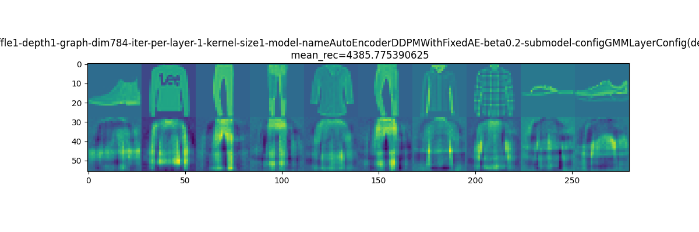
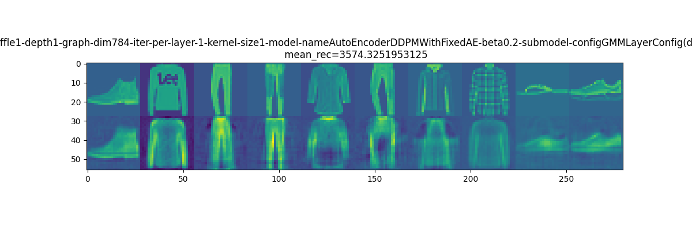
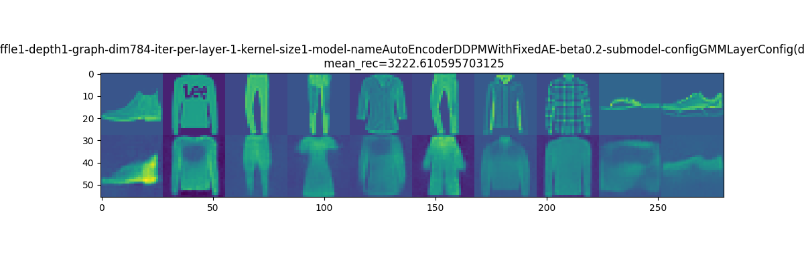
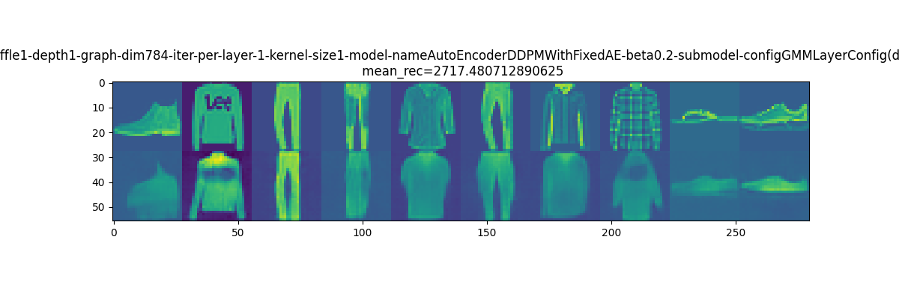

#! https://zhuanlan.zhihu.com/p/534059310

# 1024: 简单降噪扩散概率模型的推导 (SDDPM) Simplified Denoising Diffusion Probabilistic Model

[CATSMILE-1024](http://catsmile.info/1024-ddpm-math.html)


```{toctree}
---
maxdepth: 4
---
1024-ddpm-math.md
```

## 前言

- 目标: 理解DDPM的原理,并且简化其损失函数
- 背景与动机: 
- 结论: 
  - DDPM的简单后向过程对应一个trivial的抽样采样算法. 但是通过在score-function中以神经网络形式注入先验知识,再要求这个结构对这个抽样
  逆向过程的进行逐级近似,可能会导致从原始数据中泛化出一个具有平移和组合不变性的生成模型.
  - Ho2020提出的DDPM,对应一个KL损失用一系列高斯分布近似高斯扩散过程的逆过程. 特别地,DDPM将KL分解成了给定根样本后的条件逆过程与变分过程的KL散度的期望,并且用这个损失形式指导了变分分布的参数化形式.    
- 备注: 
  - 本篇的损失函数是从KL第一性原理推导的,还没有和Ho2020的损失进行比较.
  主要区别在于,采用了一个更加简单的高斯分布作为基础逆过程
  - 相空间上的高斯加噪,对应着概率测度上的卷积,DDPM框架估计也受益于卷积的邻域假设
- 关键词: 
- 展望方向:
  - 加入ClassEmbedding
- CHANGELOG:
  - 20220706 加入可视化
  - 20220629 改进期望计算

我们简单地理解DDPM为一种特定的建模理念

DDPM=联合分布变分下界+正向过程固定为扩散+逆向过程为特定高斯参数化

- 联合分布变分下界的推导见 [CATSMILE-1019](/1019-vaml) KL恒等式. 
- 正向过程固定为高斯扩散见下文
- 逆向过程的参数化见DDPM原文,此处未描述 [TBC]

### 对比

VAE编码和解码过程有点类似左右互搏的过程, GAN也有判别器和生成器的左右互搏.
DDPM是生成器和噪音互搏. DDPM为了简化模型复杂度而把前向过程直接固定下来的了,
也因此造成了隐变量的无意义化. 为了对抗这种无意义化,GLIDE把语义信息加入进来做了多模态.

### 前向过程

让我们不加解释地沿用简单的高斯扩散模型. 因为每次加噪音是独立的,所以可以
把加噪过程叠加起来.这里比较奇怪的是,在 $x_t$ 上的积分在合并高斯的过程中直接消失了. 在合并方差的时候,用到了凑因子的一点技巧

$$\begin{align}
q(x_t|x_{t-1})  &= \mathcal{N}(x_t|\sqrt{1-\beta_t} x_{t-1},\beta_t I) \\
q(x_{t+1},x_t | x_{t-1} ) &= q(x_{t+1}| x_t )q(x_t | x_{t-1})  \\ 
&= \mathcal{N}(x_{t+1}|\sqrt{1-\beta_{t+1}} x_{t},\beta_{t+1} I)  \cdot 
\mathcal{N}(x_t|\sqrt{1-\beta_t} x_{t-1},\beta_t I) \\
q(x_{t+1}| x_{t-1} ) 
&= \sum_{x_t} q(x_{t+1},x_t | x_{t-1} ) &  \\ 
&= \sum_{x_t} \mathcal{N}(x_{t+1}|\sqrt{1-\beta_{t+1}} x_{t},\beta_{t+1} I)  \cdot 
\mathcal{N}(x_t|\sqrt{1-\beta_t} x_{t-1},\beta_t I) \\ 
&= \sum_{x_t} \sqrt{1-\beta_{t+1}} \mathcal{N}({x_{t+1} \over \sqrt{1-\beta_{t+1}} }| x_{t}, {\beta_{t+1} \over 1 - \beta_{t+1}} I)  \\ 
&\,\,\,\,\cdot 
\mathcal{N}(x_t|\sqrt{1-\beta_t} x_{t-1},\beta_t I) \\ 
&= \sum_{x_t} \sqrt{1-\beta_{t+1}} \mathcal{N}({x_{t+1} \over \sqrt{1-\beta_{t+1}} } -  x_{t}| 0, {\beta_{t+1} \over 1 - \beta_{t+1}} I)  \\
&\,\,\,\,\cdot 
\mathcal{N}(x_t - \sqrt{1-\beta_t} x_{t-1}|0,\beta_t I) \\ 
&= \sqrt{1-\beta_{t+1}} \mathcal{N}({x_{t+1} \over \sqrt{1-\beta_{t+1}} } - \sqrt{1-\beta_t} x_{t-1}| 0, ({\beta_{t+1} \over 1 - \beta_{t+1}} +\beta_t) I)  \\ 
&=  \mathcal{N}({x_{t+1}  } - \sqrt{1-\beta_{t+1}}\sqrt{1-\beta_t} x_{t-1}| 0, ({\beta_{t+1} } + (1 - \beta_{t+1})\beta_t) I)  \\ 
&=  \mathcal{N}({x_{t+1}  } | \sqrt{1-\beta_{t+1}}\sqrt{1-\beta_t} x_{t-1}, I + (-I + {\beta_{t+1} } + (- \beta_{t+1})\beta_t) I)  \\ 
&=  \mathcal{N}({x_{t+1}  } | \sqrt{1-\beta_{t+1}}\sqrt{1-\beta_t} x_{t-1}, I + (\beta_t -1 ) (1 - \beta_{t+1})) I)  \\ 
&=  \mathcal{N}({x_{t+1}  } | \sqrt{1-\beta_{t+1}}\sqrt{1-\beta_t} x_{t-1}, [1 - ( 1  -\beta_t) (1 - \beta_{t+1}))] I)  \\ 
\end{align}
$$

我们可以看到,随着t不断增加, $p(x_t)$ 逐渐从初始数据上的狄拉克混合分布,过渡到 $\mathcal{N}(x_t|0,I)$. 对于即便是固定的 $\beta_t=c$ ,反复噪化也可以得到这种过渡.上式也可以用随机变量的和来表示,应当更加简单一些[TBC].

$$
x_T \sim \mathcal{N} (\cdot | \prod_{t=1}^{T} \sqrt{1-\beta_t} x_0, [1-\prod_{t=1}^{T} ({1-\beta_t})] I) \\
x_T = \prod_{t=1}^{T} \sqrt{1-\beta_t} x_0 +  \sqrt{1-\prod_{t=1}^{T} ({1-\beta_t})} \cdot \epsilon
$$


### 后向过程 (Reverse Diffusion): 简单的终末分布后向过程

因为前向过程是给定的,后向过程也就由贝叶斯定理可以直接给出. 让我们观察一个简单热平衡后的逆向过程

$$\begin{align}
q(x_t|x_0) &= \mathcal{N}(x_t | 0,I)\\
q(x_0| x_t) &=  {p_{data}(x_0)q(x_t |x_0) \over \sum_{x_0} p_{data}(x_0)q(x_t |x_0)} \\
&= {p_{data}(x_0) \over \sum_{x_0} p_{data}(x_0)}\\
&= p_{data}(x_0)\\
&= {1\over |B| } \sum_b \delta{(x_{0,b})}
\end{align}$$

可以看到,终末分布分别由数据分布,和单位噪音给定. 这对应一个最简单的抽样算法,就是从数据里面随机抽出一个样本作为抽样结果.但是这样的抽样结果,显然不具有空间上的平移不变性, 也不能考虑物体的组合解耦. 因此可以猜测DDPM并不是完全要近似这个抽样化的逆向过程,而是要用一个具有平移和组合不变性的模型去近似这个抽样模型, 从而从数据中
泛化出一个具有平移和组合不变性的生成模型.

(哈哈哈哈哈哈哈哈哈哈,resampling不愧是最简单的生成模型: A:请给我一个样本. B:好的,这是训练集里的第i个样本,现在它是你的随机生成结果了(doge))

### 隐变量

从刚刚的极端降噪过程例子来看,把加噪结果作为隐变量是有问题的.这个根本冲突在于,
如果加噪到达热平衡,那加噪结果就不应该对数据有任何编码作用(逆噪过程等价于随机抽取数据);而如果实际模型能够使用加噪结果进行编码,那就说明加噪是没有达到热平衡的.

从Chen2018概率流的角度来讲,逆过程只需要判断噪音属于哪个吸引子就可以了. 这或许可以解释为什么噪音可以对数据形成编码. 从这个角度讲,这个隐变量可以认为近似于nearestNeighbor意义上的隐变量. 通过判断跟噪音最相似的那张图片, 将获得这个噪音隐变量的所有权. 也因此这种隐变量是没有任何抽象层级的, 更多地是在数据流形上进行了区块切分.

因此我们不难理解,大多数对DDPM的应用都需要引入新的隐变量/条件变量. DDPM
可以看作是隐式定义了"图片流形",但是在采样层缺乏自行对图片流形进行抽象化的能力(当然也有可能包含在了梯度函数的计算中). 但是其梯度框架又允许其容易地和其他判别模型/语义模型进行融合, 所以DDPM本身也就不需要自行生成一个语义模型. 从这个角度讲,DDPM没有隐变量,恰恰反映其纯粹拟合"广义图片流形"的定位. 而DDPM和classifier(-free) guidance的融合,则意味着多模态模型可以更简单地被构建

### 损失函数

DDPM和VAE的相似之处,通过损失函数可以很好地体现. 在[CATSMILE-1019](/1019-vaml)里我们讨论了VAE的损失函数有两个特点: 1.用联合分布限制边缘分布. 2.用不同的方向,对同一个条件分布进行分解.


$$
L(m) = - D_{KL}[ q_f(x_T,x_{T-1},\dots,x_0)||q_r(x_0,x_1,\dots x_T)]
$$

注意左侧的 $q_f$ 由前向过程可以很方便地采样出来, 而所有的参数化的网络都可以被塞到右侧的后向过程里. score matching的目标,应该也是通过某种方式,对拆解出来的条件分布进行了逐步近似. Song Yang的blog里面有张图,画的是在不同时间点下的边际分布.
让我们尝试利用前向模型的马尔科夫性质进行分解,然后我们就得到一个关于 $q_r$ 的可微形式了? 似乎有点过于的简单? 这里的推导和Ho et al. 2020的区别在于,没有手动
对前向过程 $q_f(x_{t+1}|x_t,x_0)$ 取逆. 

 总结来讲, 就是没必要给采样器限制一个局部单模态高斯的架构,因为这个局部高斯是给定 $x_0$ 才有的形式,采样器面对的都是 $x_0$ 未知的情况, 所以局部高斯并不能保证采样器更好地进行变分近似. 

$$\begin{align}
L(m) &= - D_{KL}[ q_f(x_{0:T}) || q_r(x_{0:T})]\\ 
&= \sum_{x_{0:T}} q_f(x_{0:T}) \log {q_r(x_{0}|x_{1})\dots  q_r(x_{T-1}|x_T) q_r(x_T)\over q_f(x_0) q_f(x_1|x_0) \dots  q_f(x_T|x_{T-1})}  \\ 
&= \sum_{x_{0:T}} q_f(x_{0:T}) ( \log { q_r(x_T) \over q_f(x_0)} + \sum_{t=0}^{T-1} \log {q_r(x_{t}|x_{t+1}) \over q_f(x_{t+1}|x_t) })  \\  
&=  c + \sum_{x_{0:T}} q_f(x_{0:T}) ( \log { q_r(x_T)} + \sum_{t=0}^{T-1} \log {q_r(x_{t}|x_{t+1}) \over q_f(x_{t+1}|x_t) })  \\  
&=  c +\sum_{x_{0:T}} q_f(x_{0:T}) ( \log { q_r(x_T)} + \sum_{t=0}^{T-1} \log {q_r(x_{t}|x_{t+1}) \over \mathcal{N}(x_{t+1}|\sqrt{1-\beta_{t+1}  } x_t, \beta_{t+1} I)})  \\  
&=  c + \sum_{x_{0:T}} q_f(x_{0:T}) ( \log { q_r(x_T)} + \sum_{t=0}^{T-1} \log {q_r(x_{t}|x_{t+1}) })  \\  
&=  c +   \sum_{t=0}^{T-1} \sum_{x_{0:T}} q_f(x_{0:T}) \log {q_r(x_{t}|x_{t+1}) }  \\  
&=  c +   \sum_{t=0}^{T-1} \sum_{x_0,x_t,x_{t+1}} \sum_{x_{1:t-1}}
\sum_{x_{t+2:T}} q_f(x_t,x_{t+1},x_0) q_f(x_{1:{t-1}}|x_0,x_t) q_f(x_{t+2:T}|x_{t+1}) \\&\cdot\log {q_r(x_{t}|x_{t+1}) }  \\  
&=  c +   \sum_{t=0}^{T-1} \sum_{x_0,x_t,x_{t+1}} q_f(x_t,x_{t+1},x_0) \log {q_r(x_{t}|x_{t+1}) }  
\\&\cdot\sum_{x_{1:t-1}}
  q_f(x_{1:{t-1}}|x_0,x_t) \sum_{x_{t+2:T}}q_f(x_{t+2:T}|x_{t+1})  \\  
&=  c +   \sum_{t=0}^{T-1} \sum_{x_0,x_t,x_{t+1}} q_f(x_t,x_{t+1},x_0) \log {q_r(x_{t}|x_{t+1}) }  \\  
&=  c +   \sum_{t=0}^{T-1} \sum_{x_0,x_t,x_{t+1}} q_f(x_0) q_f(x_t|x_0) q_f(x_{t+1}|x_t) \log {q_r(x_{t}|x_{t+1}) }  \\  
&=  c +   \sum_{t=0}^{T-1} \sum_{x_0,x_t} q_f(x_0)q_f(x_t|x_0) \sum_{x_{t+1}} q_f(x_{t+1}|x_t) \log {q_r(x_{t}|x_{t+1}) }  \\  
&= \left( c +   \sum_{t=0}^{T-1}E_{q_f(x_0)} [\sum_{x_t, x_{t+1}} q_f(x_t|x_0) q_f(x_{t+1}|x_t) \log {q_r(x_{t}|x_{t+1}) }  ]\right)\\    
&=  c +   \sum_{t=0}^{T-1}E_{q_f(x_0)q_f(x_t|x_0)} [\sum_{x_{t+1}} q_f(x_{t+1}|x_t) \log {q_r(x_{t}|x_{t+1}) }  ]\\  
L(m)&=  c +   \sum_{t=0}^{T-1}E_{q_f(x_0)q_f(x_t|x_0) q_f(x_{t+1}|x_t)} [  \log {q_r(x_{t}|x_{t+1}) }  ]\\  
\end{align}$$

这里比较需要写清楚的是从轨迹上的求和简化成三变量上的求和 $x_0,x_t,x_{t+1}$. 这个约束表明,在 $q_f(x_t)$ 的局部,我们要求逆过程近似于一个高斯加噪过程的的逆分布.
而高斯加噪的逆,取决于加噪前的狄拉克数据分布.不过不论怎样,只要参数化确定,
通过采样是可以给出梯度的估算的,就是可能估算值的方差没有啥保障

考虑一个高斯平滑化的后向分布, 注意这里我们相当于在近似离散差 $||(x_{t+1} -x_t) + \epsilon ||^2$ 又因为前向过程近似对应着高概率向低概率的流动,所以离散差近似于局部的梯度.

$$\begin{align}
L(m) &= - D_{KL}[ q_f(x_{0:T}) || q_r(x_{0:T})]\\ 
&=  c +   \sum_{t=0}^{T-1}E_{q_f(x_0)q_f(x_t|x_0)q_f(x_{t+1}|x_t)} [  \log q_r(x_t|x_{t+1})  ]  \\
&=  c +   \sum_{t=0}^{T-1}E_{q_f(x_0)q_f(x_t|x_0) q_f(x_{t+1}|x_t)} [   -(x_{t+1} + \epsilon_r(x_{t+1}) -x_t)^2  ]  
\end{align}$$


再如果考虑一个后向点估计 $q_r(x_t|x_{t+1})= \delta(x_t = \epsilon_r(x_{t+1}))$. ehh这个积分不太好算了,似乎有log负无穷的问题..


$$\begin{align}
L(m)
&=  c +   \sum_{t=0}^{T-1}E_{q_f(x_0)q_f(x_t|x_0) q_f(x_{t+1}|x_t)} [ \log q_r(x_t|x_{t+1}) ) ]  \\
\end{align}$$

### 重参数化

把高斯条件变量写成随机变量和

$$\begin{align}
x_{t+1} = \sqrt{1- \beta_{t+1}} x_t + \sqrt{\beta_{t+1}} z  
\end{align}$$

### 可视化

这个可视化的目的是，确认不同的自编码器结构先验,对于SDDPM目标有递进的效果

采用Ho2020, variance-preserving noise 固定 $\beta_t=0.2$, T=50.
图片表征的是(编码-解码过程),也即用对上方图片,用前向模型进行加噪编码后,再用固定的降噪模型解码,得到下方图片

```python

  conf.lconf  =lconf= DDPMModelConfig(
      depth = 1,
      iter_per_layer=-1,
      n_step = 50,
      beta = 0.2,
      graph_dim = conf.dataset.graph_dim,
      # graph_dim = (28,28),
      embed_dim = 30,
      kernel_size = 1,
      model_name = 'AutoEncoderDDPMWithFixedAE',
      # submodel_name='BetaVAENoNoise',
      submodel_config = GMMLayerConfig(
          depth = 1,
          iter_per_layer=-1,
          n_step = 5,
          beta = 0.0,
          embed_dim = 30,
          kernel_size = 0,
          graph_dim = (1,28,28),
          model_name = 'BetaVAENoNoise', 
          ### [Conv AutoEncoder]


          # graph_dim = (1,28,28),
          # model_name = 'AutoEncoderBakeOff',  
          ### [Dense AutoEncoder ]

          # graph_dim = 784,
          # model_name = 'AutoEncoder',
          ### [Shallow AutoEncoder]
          p_null = 0.,
      ),
      p_null = 0.,
  )
  conf.learning_rate = 0.0001
```

#### 逆模型:浅层自编码器

- Shallow AutoEncoder 
- epoch 10 with 30 hidden units



#### 逆模型:多层自编码器

- Multi-layer AutoEncoder
- epoch 10 with 30 hidden units



#### 逆模型:卷积自编码器

- Convolutional AutoEncoder
- epoch 10 with 30 hidden units




- Convolutional AutoEncoder
- epoch 30 with 30 hidden units




### 探讨

这里的推导和Ho et al. 2020的区别在于,没有手动
对前向过程 $q_f(x_{t+1}|x_t,x_0)$ 取逆. Ho 2020的损失函数好处在于可以用KL
闭式解直接代替期望函数. 但是我感觉Ho 2020的分解模式最有风险的点在于,他的逆过程是在给定数据 $x_0$ 的情况下求出的, 但是采样器是接触不到 $x_0$ 的, 如果把逆过程
在 $x_0$ 上求期望混合起来,是不能直接由高斯分布来表示的. 从宏观的角度看,预测给定
 $x_0$ 的逆过程对于采样本身是意义不大的(你都知道 $x_0$ 了干嘛还要采样呢?),因此直接拟合混合后的逆过程才能指导采样. 但是同时实际运作的时候又是对损失函数在 $x_0$ 上求期望的, 因此这个时候输出一个单模态的 $\bar{\mu}_t$ 就必然有问题,
 对于来自不同的 $x_0$ 源头的,相同的 $x_t$ 事件,一个单模态的逆向过程,是无法表征
 多模态的祖先路径(ancestral path)的. 一句话总结,不同的 $x_0$ 给出不同的逆向过程 $q_f(x_t|x_{t+1},x_0)$, 压根不可能用同一个噪声预测器来同时预测.所以Ho2020去做一个点估计的参数化 $z_{\theta}(x_t)$ ,是必然对效果有很大影响的.
 而且这个影响,对于祖先混合(ancestral mixing)更强的位置,就更明显.

从RL的角度思考,如果直接去近似 $p_{data}(x_0)$ ,模型得到的信息其实非常稀疏,只在数据点上才能得到奖励. 于是我们退而求其次, 把数据分布逐步加热成一个热平衡后的高斯分布,从而在整个相空间上都得到梯度信息. 于是,我们就得到了一种把任意狄拉克分布煮熟,来提取梯度信息的烹饪流派

数据狄拉克分布上高斯扩散的逆实在很有意思. 从降噪的角度看,BERT的MLM目标就是离散相空间的DDPM. 不过DDPM因为具有更好的连续性,所以拟合起来更简单一点吧

## 参考

- zhihu post by 卡卡猡特. 主要搬运了 Ho2020的公式 <https://zhuanlan.zhihu.com/p/530602852>
- Blog by Song yang: Generative Modeling by Estimating Gradients of the Data Distribution <https://yang-song.github.io/blog/2021/score/>
- (scoreSDE) Score-Based Generative Modeling through Stochastic Differential Equations, Song 2021. <https://arxiv.org/abs/2011.13456>
- Denoising Diffusion Probabilistic Models, Ho2020 <https://arxiv.org/abs/2006.11239>
- Neural ordinary differential equation, Chen2018 <https://arxiv.org/abs/1806.07366>