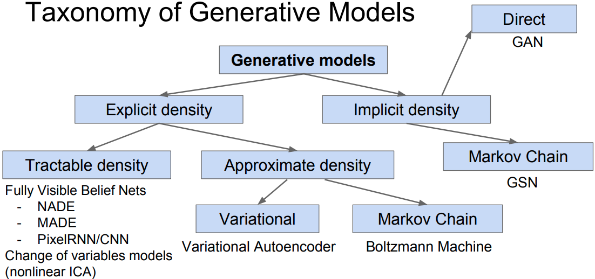

# 1027-共享计算图嵌入 SCGE Shared Computational Graph Embedding

[CATSMILE-1027](http://catsmile.info/1027-scge.html)


```{toctree}
---
maxdepth: 4
---
1027-scge.md
```

## 前言

- 目标: 验证一个能够搜索出CNN的SCGE算法
- 背景与动机:
- 结论: 
- 完成度: 
- 备注: 
- 关键词: 
- 展望方向:
  - 如何处理Transformer擅长处理的超距作用?
- 相关篇目
- CHANGLOG:
  - 20220710 init from 9015-why-cnn
  

### 共享计算图嵌入 SCGE Shared Computational Graph Embedding

这段讨论会跟NAS(Neural Architectural Search)比较相关,让我们沿着CNN的路径去思考一个GNN化的模型.我们为每一个计算节点配上一个
graph embedding, 用来尝试表征我们的神经网络.

不同于GCN已知graph connection,我们引入SCGE的目标是把计算图参数化,
因此graph connection是我们的参数. SCGE的目标很简单,就是针对一个数据模态找到
最好的神经网络,在数据压缩的限制下,形成一个高效表征. 为了确保高效,我们需要为
SCGE引入稀疏性和对称性,但是允许模型自由改变其链接.(多年前我做了一些greedy-MC尝试,但是速度不理想.不过当时手算梯度比较弱比较依赖heuristics). 理论上模型应该超过全连接层自编码器,或者在CNN的参数空间附近超过CNN,但具体实现将是一个比较漫长的工程学过程. 而且因为牵扯到Spontaneous Formation of spatial coordinate,这个
问题的优化可能会非常困难,需要深入地调试NAS逻辑才有可能给出能跑的算法. 因为计算是取决于CGE的,而且要用到SoftAttention或者HardAttention,我们需要找到一个合理地的在CGE上获得梯度的一个方法,或者是进行采样的方法,来避免陷入local minima.在每一层,SCGE的单元都需要按照Attention函数和CGE响量去链接自己的上家,形成计算图,然后
在这个计算图上运行自编码过程. 

也就是说,我们考虑一个由CGE参数化的分层计算过程,
然后想办法同时优化CGE和CP(Convolutional Parameters,卷积参数,或者聚合函数).
可以想见,CGE和CP是高度耦合的,而CGE的导数完全来自于Attention函数里.这看似是有一些问题的,因为CGE并没有显著的动力把高度相关的两个node链接到一起, 因为attention只考虑CGE之间是否符合要求. 这就体现不出Hebbian Postulate ("Fire Together, wire together")

$$\begin{align}
y = f_g(x) = E_g[h_g(x)]
\end{align}$$

[TBC,验证SCGE的loss下界至少是CNN]

应用:SCGE的主要应用当然不是对标CNN,而是提供一种同时对模态d和数据b进行标注的通用框架,来为多模态融合提供理论基础

- 插播广告: permutation已经够狠了,居然还有玩permutation-invariant RL的,也是开眼了.
    - Permutation-Invariance in RL <https://attentionneuron.github.io/>.  <https://arxiv.org/abs/2109.02869>)


### 考察目标: 数据压缩的效率

我们知道,压缩感知(Compressed Sensing)和流形学习(Manifold Learning)给
神经网络带来了一些理论基础.在图像建模领域,我们发现图片是可以被可靠地压缩的,
这是因为我们可以假设数据落在一个低维流形上,以MNIST为例子,原始数据具有28x28=784个维度,但是使用各类有损压缩算法后,我们可以可靠地在测试集上以
较低的L2损失恢复出数据. 

原则上,只要精度足够,我们可以用一个数字就对数据做到无损压缩,但是实践上,
瓶颈的维度越高,能表达的信息就越多. 我们称这个最为瓶颈的隐藏层为模型的隐变量层( Latent Layer). 为方便比较,我们同时要求这个隐变量是一个无噪声的表示, 也就是关于x的条件分布在z上是一个狄拉克分布.
对于常见的有噪声的隐变量,我们一般可以取其参数空间上的狄拉克分布来构造无噪表征.

$$q_e(z|x)=\delta(z(x))$$

同时我们考虑一个确定性的解码器

$$
r(z) \in \{x\}
$$


### 和生成模型的对比



### 其他素材

## 参考

- 黄伟: 深度学习平均场理论第三讲：tanh的复兴和dynamical isometry <https://zhuanlan.zhihu.com/p/95484999> 

- 黄伟: 深度学习平均场理论第四讲：Resnets为什么这么强大 <https://zhuanlan.zhihu.com/p/97363355>

- 低维流形假设, Pope2021: <https://arxiv.org/abs/2104.08894.pdf>


- 黄伟: 深度学习平均场理论第一讲：综述介绍 <https://zhuanlan.zhihu.com/p/97363355>

- 黄伟: 深度学习平均场理论第二讲：表达性&可训练性 <https://zhuanlan.zhihu.com/p/92455114>
