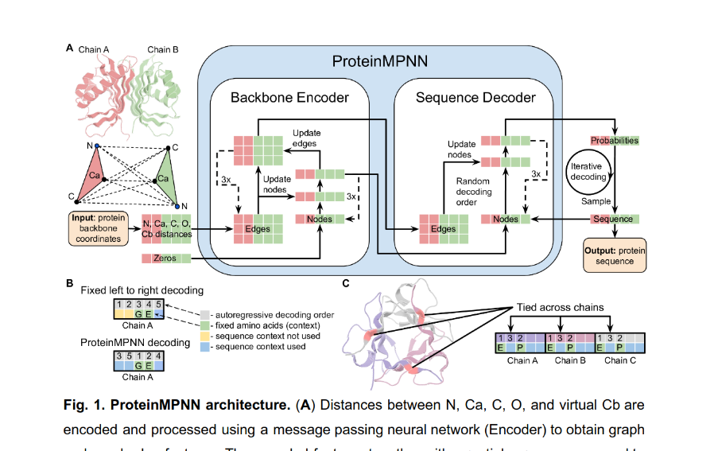

#! https://zhuanlan.zhihu.com/p/527675732
# 3008: 蛋白质序列设计

[CATSMILE-3008](http://catsmile.info/3008-protein-struct.html)


```{toctree}
---
maxdepth: 3
#caption: CATSMILE-MAIN
numbered: 0
---
3008-protein-struct.md
```

## 前言

- 目标: 探讨当前蛋白质结构预测和设计的问题和解法

- 方法:
    - inverse structural model 
      - 建模 $P(结构|序列)$ , hallucination
      - 可以用梯度或者MCMC对序列进行采样优化
      - 优点: 可以复用现有的structure预测器, 如AlphaFold2,RoseTTAFold等
      - 可能问题: 
          - 序列初始化的可能性非常多
          - 结构模型本身比较慢,有时候有$L^2$的注意力模块
      - 参考: 
        - trRosetta-based design: <https://www.pnas.org/doi/epdf/10.1073/pnas.2017228118> {footcite:t}`trRosetta-design-2021`
    - explicit sequence model
      - 建模 $P(序列|结构)$      
      - 优点: 快, 不需要序列初始化,可以直接采样
      - 可能问题: 
        - 是否会造成misfold?
      - 参考: 
        - ESM <https://www.biorxiv.org/content/10.1101/2022.04.10.487779v1.full.pdf>
        - GVP-GNN
        - Structured Transformer, Ingraham2019<https://www.mit.edu/~vgarg/GenerativeModelsForProteinDesign.pdf>
        - ProtMPNN: <https://www.biorxiv.org/content/10.1101/2022.06.03.494563v1.full.pdf>
        {footcite:t}`protmpnn-dauparas2022`
- 应用问题:
  - 蛋白设计目前的瓶颈?
    - 实验验证速率
  - 蛋白序列设计的应用前景?
    - 辅助理解序列分布的隐藏约束
    - 辅助理解蛋白演化的过程
  - 蛋白结构预测的应用前景?
    - 辅助结构解析


## 例子: 基于 trRosetta 的序列设计

利用梯度反传找到比较好的seq,实际使用中用高斯初始化$seq$的隐藏变量.

从逻辑上讲,seq的初始化非常重要,因为seq的相空间过于庞大 $20^L$,很有可能非常碎片化. 

### 目标函数

$$
\log P(struct| seq) \in \{AF2, RoseTTAFold , \dots \}\\
seq = seq + \alpha \cdot Norm( {\partial \over \partial seq} \log P(struct| seq) )
$$

### 模型架构

$L^2 \times 526 -> L^2 \times 6 \times B$, 使用2D卷积网络.
只对主链的几何信息进行预测


```
trRosetta的输入特征
526 * L^2 
    442 pairwise 特征
        1 average product correction
        441 pairwise precision matrix 
    84 position wise 特征
        42 left
        42 right
            20 query one-hot
            21 PSSM 
            1  positional entropy
```
trRosetta的输出特征
- 对于每个特征,输出一个概率分布,可以用来score P(struct|seq)
- $\omega$: $C_\beta$之间的dihedral angle,对称
- $\theta$: $C_{\alpha}-C_\beta$之间的dihedral,非对称
- $\phi$: $C_{\alpha}-C_\beta$到$C_\beta-C_\beta$ 之间的planar angle,非对称
- $d$: $C_\beta$之间的距离,对称
- 对于每个上三角矩阵 $\sum_{i<j}$ 计数,每个元素6个自由度.
- 如果考虑上下三角 $\sum_{i\neq j}$,则每个元素3个自由度

### 实验验证

trRosetta的能量函数能够更好地预测蛋白质表达时的溶解性和结构性


结构预测的模型更加复杂

## 例子: ProtMPNN

- 目标: 给定主链结构,对序列进行解码
- 特点: 
  - 高度工程化.
  - 类似XLNET和GPT的自回归模型,对条件概率 $P(序列|结构)$ 进行建模.
  用随机解码顺序,避免过拟合
  - 用k近邻和RBF对结构进行编码,避免了Transformer的$L^2$计算. 
  之所以可以这样做,是因为(结构->序列)问题中,不存在隐藏的超距作用. 
  k = 30
  - 在主链上加入高斯噪声,避免过拟合
  - 基于MPNN图神经网络对(主链?)结构进行编码
- 评价函数:
  - native sequence recovery
  - perpelexity
  - diversity
  - structure prediction validation
- 好处:
  - 快
  - 可以自回归采样,采样的扩展性比较高
  - 有实际使用的例子
- 可能问题: 
  - 是否会造成misfold?
  - 如何处理多序列,同结构的问题? 由于自回归解码器的结构,
  可以自然地通过调整温度,采样出不同的序列.再用结构模型二次筛选
- 展望:
  - 结合MSA,研究结构对于序列的约束
  - 允许对结构进行噪音以外的微调
  - 对结构互作用进行更多表征.
  - 用多个结构,对蛋白质的序列采样
  - 局部重采样
  - 结构优化

损失函数,按照sample函数大致推测预训练目标为

$$\begin{align}
\log P(sequence|struct) &=  \log P(s(1),s(2),\dots,s(j) | struct) \\
 (随机解码顺序) &= \sum_{\{o_i\}} P(order=\{o_i\}) \cdot (\\
 0&+\log P[s(o_{i}) \ |s(o_{i-1}),s(o_{i-2}),\dots,s(o_1)\ ,struct]\\
&+ \log P[s(o_{i}) \ |s(o_{i-2}),\dots,s(o_1)\ , struct] \\
&+ \cdots 
+ \log P[s(o_1) , struct] 
)
\end{align}$$

```python
def decoder_layer_forward(V, E, S, mask):
E_ij = Concat[E_ij, S_j] * mask_ij + Concat[E_ij, 0.0*S_j] * (1-mask_ij)
M_ij = MLP[V_i, V_j, E_ij]
dV_i = Sum_j [M_ij]
V_i = LayerNorm[V_i + Dropout(dV_i)]
dV_i = FeedForward[V_i]
V_i = LayerNorm[V_i + Dropout(dV_i)]
return V
```





## 应用问题

结构预测可以用来interpret结构生物学的数据,如X-ray,CryoEM.做
Molecular Replacement

RoseTTAFold: Molecular Replacement to solve X-ray crystollographic structures

ROSETTAFOLD: M. Baek et al., Science
10.1126/science.abj8754 (2021) <https://www.ipd.uw.edu/wp-content/uploads/2021/07/Baek_etal_Science2021_RoseTTAFold.pdf>

## 参考


trRosetta: transform-restrained Rosetta. Improved protein structure prediction using predictedinterresidue orientations
<https://www.pnas.org/doi/10.1073/pnas.1914677117>


```{footbibliography}
```


### 参考: ProtMPNN 源码

```python
'''
source: https://github.com/dauparas/ProteinMPNN/blob/0a721279f6706478193f50dff9c1e5ff96214778/ca_proteinmpnn/protein_mpnn_utils.py
'''


def gather_nodes_t(nodes, neighbor_idx):
    # Features [B,N,C] at Neighbor index [B,K] => Neighbor features[B,K,C]
    idx_flat = neighbor_idx.unsqueeze(-1).expand(-1, -1, nodes.size(2))
    neighbor_features = torch.gather(nodes, 1, idx_flat)
    return neighbor_features

def cat_neighbors_nodes(h_nodes, h_neighbors, E_idx):
    h_nodes = gather_nodes(h_nodes, E_idx)
    h_nn = torch.cat([h_neighbors, h_nodes], -1)
    return h_nn


class ProteinFeatures(nn.Module):
    def _dist(self, X, mask, top_k_sample=True, eps=1E-6):
        """ Pairwise euclidean distances """
        # Convolutional network on NCHW
        mask_2D = torch.unsqueeze(mask,1) * torch.unsqueeze(mask,2)
        dX = torch.unsqueeze(X,1) - torch.unsqueeze(X,2)
        D = mask_2D * torch.sqrt(torch.sum(dX**2, 3) + eps)

        # Identify k nearest neighbors (including self)
        D_max, _ = torch.max(D, -1, keepdim=True)
        D_adjust = D + (1. - mask_2D) * D_max
        if top_k_sample:
            sampled_top_k = np.random.randint(32,self.top_k+1)
        else:
            sampled_top_k = self.top_k
        D_neighbors, E_idx = torch.topk(D_adjust, np.minimum(self.top_k, X.shape[1]), dim=-1, largest=False)
        mask_neighbors = gather_edges(mask_2D.unsqueeze(-1), E_idx)
        return D_neighbors, E_idx, mask_neighbors
        
    def forward(self, Ca, mask, residue_idx, chain_labels):
        """ Featurize coordinates as an attributed graph """
        if self.augment_eps > 0:
            Ca = Ca + self.augment_eps * torch.randn_like(Ca)

        D_neighbors, E_idx, mask_neighbors = self._dist(Ca, mask, top_k_sample=False)

        Ca_0 = torch.zeros(Ca.shape, device=Ca.device)
        Ca_2 = torch.zeros(Ca.shape, device=Ca.device)
        Ca_0[:,1:,:] = Ca[:,:-1,:]
        Ca_1 = Ca
        Ca_2[:,:-1,:] = Ca[:,1:,:]

        V, O_features = self._orientations_coarse(Ca, E_idx)
        
        RBF_all = []
        RBF_all.append(self._rbf(D_neighbors)) #Ca_1-Ca_1
        RBF_all.append(self._get_rbf(Ca_0, Ca_0, E_idx)) 
        RBF_all.append(self._get_rbf(Ca_2, Ca_2, E_idx))

        RBF_all.append(self._get_rbf(Ca_0, Ca_1, E_idx))
        RBF_all.append(self._get_rbf(Ca_0, Ca_2, E_idx))

        RBF_all.append(self._get_rbf(Ca_1, Ca_0, E_idx))
        RBF_all.append(self._get_rbf(Ca_1, Ca_2, E_idx))

        RBF_all.append(self._get_rbf(Ca_2, Ca_0, E_idx))
        RBF_all.append(self._get_rbf(Ca_2, Ca_1, E_idx))


        RBF_all = torch.cat(tuple(RBF_all), dim=-1)


        offset = residue_idx[:,:,None]-residue_idx[:,None,:]
        offset = gather_edges(offset[:,:,:,None], E_idx)[:,:,:,0] #[B, L, K]

        d_chains = ((chain_labels[:, :, None] - chain_labels[:,None,:])==0).long()
        E_chains = gather_edges(d_chains[:,:,:,None], E_idx)[:,:,:,0]
        E_positional = self.embeddings(offset.long(), E_chains)
        E = torch.cat((E_positional, RBF_all, O_features), -1)
        

        E = self.edge_embedding(E)
        E = self.norm_edges(E)
        
        return E, E_idx 

class ProteinMPNN(nn.Module):
    def __init__(self, num_letters, node_features, edge_features,
        hidden_dim, num_encoder_layers=3, num_decoder_layers=3,
        vocab=21, k_neighbors=64, augment_eps=0.05, dropout=0.1):
        super(ProteinMPNN, self).__init__()

        # Hyperparameters
        self.node_features = node_features
        self.edge_features = edge_features
        self.hidden_dim = hidden_dim

        # Featurization layers
        self.features = ProteinFeatures(node_features, edge_features, top_k=k_neighbors, augment_eps=augment_eps)

        self.W_e = nn.Linear(edge_features, hidden_dim, bias=True)
        self.W_s = nn.Embedding(vocab, hidden_dim)
        self.W_v = nn.Linear(node_features, hidden_dim, bias=True)
        # Encoder layers
        self.encoder_layers = nn.ModuleList([
            EncLayer(hidden_dim, hidden_dim*2, dropout=dropout)
            for _ in range(num_encoder_layers)
        ])

        # Decoder layers
        self.decoder_layers = nn.ModuleList([
            DecLayer(hidden_dim, hidden_dim*3, dropout=dropout)
            for _ in range(num_decoder_layers)
        ])
        self.W_out = nn.Linear(hidden_dim, num_letters, bias=True)

        for p in self.parameters():
            if p.dim() > 1:
                nn.init.xavier_uniform_(p)

    def forward(self, X, S, mask, chain_M, residue_idx, chain_encoding_all, randn, use_input_decoding_order=False, decoding_order=None):
        """ Graph-conditioned sequence model """
        device=X.device
        # Prepare node and edge embeddings
        E, E_idx = self.features(X, mask, residue_idx, chain_encoding_all)
        h_V = torch.zeros((E.shape[0], E.shape[1], E.shape[-1]), device=E.device)
        h_E = self.W_e(E)

        # Encoder is unmasked self-attention
        mask_attend = gather_nodes(mask.unsqueeze(-1),  E_idx).squeeze(-1)
        mask_attend = mask.unsqueeze(-1) * mask_attend
        for layer in self.encoder_layers:
            h_V, h_E = layer(h_V, h_E, E_idx, mask, mask_attend)

        # Concatenate sequence embeddings for autoregressive decoder
        h_S = self.W_s(S)
        h_ES = cat_neighbors_nodes(h_S, h_E, E_idx)

        # Build encoder embeddings
        h_EX_encoder = cat_neighbors_nodes(torch.zeros_like(h_S), h_E, E_idx)
        h_EXV_encoder = cat_neighbors_nodes(h_V, h_EX_encoder, E_idx)


        chain_M = chain_M*mask #update chain_M to include missing regions
        if not use_input_decoding_order:
            decoding_order = torch.argsort((chain_M+0.0001)*(torch.abs(randn))) #[numbers will be smaller for places where chain_M = 0.0 and higher for places where chain_M = 1.0]
        mask_size = E_idx.shape[1]
        permutation_matrix_reverse = torch.nn.functional.one_hot(decoding_order, num_classes=mask_size).float()
        order_mask_backward = torch.einsum('ij, biq, bjp->bqp',(1-torch.triu(torch.ones(mask_size,mask_size, device=device))), permutation_matrix_reverse, permutation_matrix_reverse)
        mask_attend = torch.gather(order_mask_backward, 2, E_idx).unsqueeze(-1)
        mask_1D = mask.view([mask.size(0), mask.size(1), 1, 1])
        mask_bw = mask_1D * mask_attend
        mask_fw = mask_1D * (1. - mask_attend)

        h_EXV_encoder_fw = mask_fw * h_EXV_encoder
        for layer in self.decoder_layers:
            # Masked positions attend to encoder information, unmasked see. 
            h_ESV = cat_neighbors_nodes(h_V, h_ES, E_idx)
            h_ESV = mask_bw * h_ESV + h_EXV_encoder_fw
            h_V = layer(h_V, h_ESV, mask)

        logits = self.W_out(h_V)
        log_probs = F.log_softmax(logits, dim=-1)
        return log_probs
```


### 参考: lDDT 计算源码

```python
'''
Source: https://github.com/ba-lab/disteval/blob/main/LDDT.ipynb
'''

# Calculate lDDT using numpy scheme
def get_LDDT(true_map, pred_map, R=15, sep_thresh=-1, T_set=[0.5, 1, 2, 4], precision=4):
    '''
    Mariani V, Biasini M, Barbato A, Schwede T.
    lDDT: a local superposition-free score for comparing protein structures and models using distance difference tests.
    Bioinformatics. 2013 Nov 1;29(21):2722-8.
    doi: 10.1093/bioinformatics/btt473.
    Epub 2013 Aug 27.
    PMID: 23986568; PMCID: PMC3799472.
    '''
    
    # Helper for number preserved in a threshold
    def get_n_preserved(ref_flat, mod_flat, thresh):
        err = np.abs(ref_flat - mod_flat)
        n_preserved = (err < thresh).sum()
        return n_preserved
    
    # flatten upper triangles
    true_flat_map = get_flattened(true_map)
    pred_flat_map = get_flattened(pred_map)
    
    # Find set L
    S_thresh_indices = get_sep_thresh_b_indices(true_map, sep_thresh, 'gt')
    R_thresh_indices = get_dist_thresh_b_indices(true_flat_map, R, 'lt')
    
    L_indices = S_thresh_indices & R_thresh_indices
    
    true_flat_in_L = true_flat_map[L_indices]
    pred_flat_in_L = pred_flat_map[L_indices]
    
    # Number of pairs in L
    L_n = L_indices.sum()
    
    # Calculated lDDT
    preserved_fractions = []
    for _thresh in T_set:
        _n_preserved = get_n_preserved(true_flat_in_L, pred_flat_in_L, _thresh)
        _f_preserved = _n_preserved / L_n
        preserved_fractions.append(_f_preserved)
        
    lDDT = np.mean(preserved_fractions)
    if precision > 0:
        lDDT = round(lDDT, precision)
    return lDDT
```


### 常用指标: lDDT

lDDT: a local superposition-free score for comparing protein structures and models using distance difference tests [PMC paper](https://www.ncbi.nlm.nih.gov/pmc/articles/PMC3799472/)

lDDT是CAMEO 中使用的结构可信度的指标,是基于距离矩阵的,因此不需要做结构对齐

lDDT定义: (local distance difference test?) 在模型 $d_{ij}^p$ 和实际结构 $d_{ij}^t$ 的距离矩阵中,符合筛选要求的,保持不变的元素的数量

筛选要求:
- 上三角矩阵,不包括对角线
- 在实际结构里,距离小于 $R0$ , Mariani 2013选用 15 $\AA$

保持不变的要求为, $|d_1-d_2| < d_c$, 其中 $d_c$ 需要在4个cutoff取平均$[0.5\AA, \ 1\AA,\ \  2\AA, 4\AA]$

具体计算

$$
lDDT( d^p_{ij},d^t_{ij}) =  \sum_{i<j,d_c} \mathbb{1}( |d^p_{ij} -d^t_{ij}|\le d_c)\cdot  \mathbb{1}( d^t_{ij} \le R_0)  / (\sum_{i<j,d_c} \mathbb{1}( d^t_{ij} \le R_0))
$$

### 常用指标: TM-score

需要alignment

