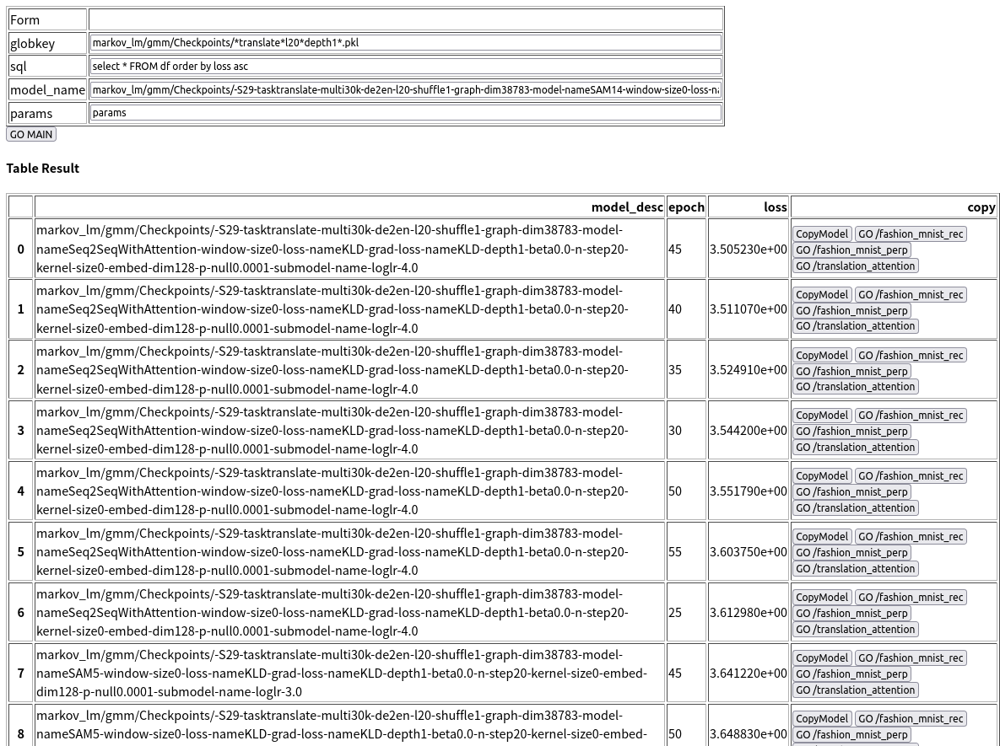

# 8004-个人简介及职业生涯计划

[CATSMILE-8004](http://catsmile.info/8004-career-plan.html)

```{toctree}
---
maxdepth: 4
---
8004-career-plan.md
```

### 前言

- 结论:
- 背景与动机: 梳理个人职业生涯的过去以及将来
- 备注: 
- 关键词:
- 后续目标/展望方向:
- 相关篇目:
- CHANGLOG:

### 个人定位和目标:

- 根据业务目标和客户调研,对接(科技相关的)业务需求和建模能力,完成 

    `业务设计 -> 数据设计 -> 模型设计 -> 验证与再设计` 
    
    的闭环, 从而实现商业价值.

- 积累技术工具和数据标准,不断完善将技术转化为价值的方法论.

### 时间线

- 2014-2017: UCL攻读本科,学习分子生物学及生物化学
- 2017-2018: 剑桥DAMTP攻读计算生物学研究生,接触生物信息学的各个方面
    - HMM和动态规划在生物学中的应用
    - GLM线性模型
    - 高通量测序,和相关数据分析
- 2018-2019:
    - 在剑桥Sainsbury实验室Philip Wigge组研究植物转录组数据,开发基于混合/聚类模型的bulk-seq转录组表征和chip-seq表征
    - 亮点: 用autograd和概率图模型方法论,实现基于似然的第一性原理建模.
    - 技能: linux各类工具使用,架设数据处理工作流
- 2019-2020:
    - 疫情回国后研究stm32单片机和硬件相关技术栈.
- 2020-2022:
    - 就职于碧迪医疗,在产品售后维护客户满意度,并通过分析反馈信息,迭代升级产品,实现商业价值
    - 亮点: 小规模python全栈开发.
- 2022-:
    - 开始CATSMILE项目,接触不同的数据模态并复现各类模型.利用消融实验,调试图,数学工具,来对模型是否起效进行实际验证,并对起效原因做经验性,对比性分析.
    - 相关项目: 
        - LLGAE 局部线性自编码器,对数据进行无监督的压缩归类.
        - SoftAlignmentModel 翻译模型
        - MGRU (Minimal Gated Recurrent Unit) 递归模型,用于NLP建模.


### 技术主线1: 无监督学习,从聚合模型到局部线性生成式自编码器

- 项目: rnaclu
- 业务目标: 为生物学家解读高通量测序数据提供自动化,可视化的工具
- 技术路线: 基于von-mise Fisher(球面归一化)混合模型的自动聚类
- 替代品: tSNE/PCA/Isomap降维分析


(rnclu,rnaseq聚类结果,RNASeq from Brachypodium )

- 项目: CATSMILE-1022, LLGAE, 局部线性的生成式自编码模型
- 业务目标: 暂无
- 技术路线: 结合连续和离散隐藏变量,对数据进行自动化建模
- 替代品: 降噪自编码器(DAE),生成式对抗网络(GAN)等


(LLGAE将上图编码为1个离散变量加20个连续变量后,恢复出下图)

- 项目: CATSMILE-9020, LangaugeModel, 语言模型
- 业务目标: 暂无
- 技术路线: 原本想验证Transformer的有效性,但目前只验证了LSTM系列模型的有效性. 
- 亮点: 通过消融实验简化网络结构
- 替代品: Transformer语言模型,如GPT,XLNET等

| model_desc | mutated_pos | epoch | loss_E20  | loss_E30  |
|------------|-------------|-------|---------|---------|
| DLM47      | 4,6         | 20    | 3.739  | 3.560 |
| DLM46      | 0,2,4,5     | 20    | 3.7811 |  |
| DLM46      | 0,4,5       | 20    | 3.745  |  |
| DLM46      | 4           | 20    | 3.7434  | 3.62257 |
| DLM46      | 5           | 20    | 3.7914  | 3.70547 |
| DLM46      | 0           | 20    | 3.80641 | 3.76959 |
| DLM46      | 2           | 20    | 3.81147 | 3.73109 |
| DLM46      | 3           | 20    | 3.81406 | 3.72296 |
| DLM46      | -1          | 20    | 3.8209  | 3.72316 |
| DLM47      | 4,6,9       | 20    | 3.859   |    |
| DLM47      | 4,6,7       | 20    | 3.921   |    |
| DLM47      | 5           | 20    | 4.03182 | 3.86436 |
| DLM46      | 1           | 20    | 4.0029  | 3.89041 |
| DLM47      | 4,6,10      | 20    | 4.052   | 3.779   |
| DLM46      | 6           | 20    | 4.21133 | 4.1882  |
| DLM47      | 4,6,8       | 20    | 4.242   |    |
| DLM46      | 7           | 20    | 4.31114 | 4.11738 |
| DLM46      | 3,2,4,5         | 20    | 4.296  |  4.091|
| DLM47      | 4              | 20    | 4.527  |  4.348|

loss是Multi30k-en数据上的每词困惑度 $\log(pplpt)$


### 技术主线2: 基于业务期望的模型调试界面

- 项目: [CATSMILE-9017](./9017-attention) 翻译模型中的注意力和质控.
- 业务目标: 验证注意力机制和词语对齐图对于翻译模型的效果
- 技术路线: 先基于简单的IBM1混合模型,后续不断扩展,加入HMM元素.
- 替代品: RNN递归翻译模型
- 亮点: 用图模型和后验概率捕捉模型状态,与业务期望交叉验证



(可操作的简易模型调试界面)


(SAM14模型将德文和英文进行了对齐)


(SAM4的对齐不如SAM13)


(简易带注意力的RNN不如SAM13)
