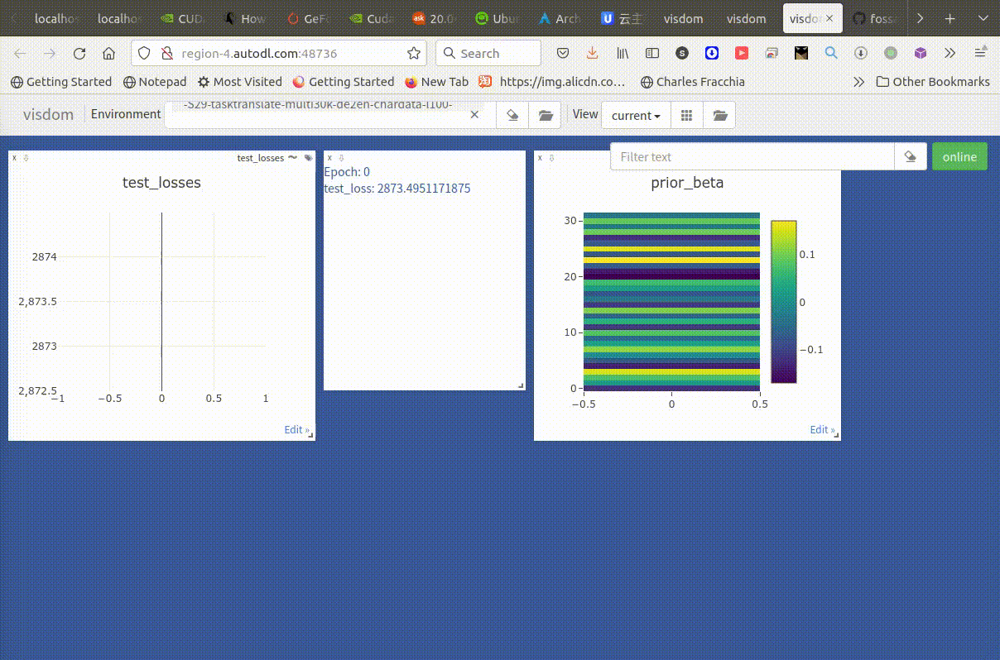
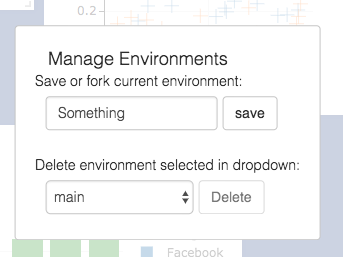

#!https://zhuanlan.zhihu.com/p/560030079

# 8506-浅析visdom的构造和用法，暨tensorboard,visdom,wandb的不完全对比

[CATSMILE-8506](http://catsmile.info/8506-vis-visdom.html)

```{toctree}
---
maxdepth: 4
---
8506-vis-visdom.md
```

## 前言

- 目标:
- 背景与动机:
    - 在检查模型收敛性的时候，想要做一些training dynamics的分析，
    于是搜索了一下可用工具，就搜到了visdom，感觉还比较符合个人需求
    - 需求: 查出VAE的方差为什么爆炸。这还是从调试的角度出发，因此希望尽量地快速，并且可以挂到不同的tensor上
- 结论: 
    - [DONE:autosave-branch:加入-cache_type-JPWA] [OLD:在实现自动数据持久化之前,visdom似乎不太适合做MLCA建模管理.这个似乎可以用tensorboard直接补足?]
    - `python3 -m pip install https://github.com/shouldsee/visdom/tarball/autosave`
    - wandb的本地部署在虚拟机比较困难，需要装docker
    - 业务结构反映在数据里就是schemas和data_types，像visdom这种data_type很弱的系统，其对于业务流的耦合也比较弱。
    - dash似乎没有做统一的数据接口，解耦起来会有点困难。
- 完成度: 
- 备注: 
- 关键词: 
- 展望方向:
    - 用wandb做model-session-management
    - [TBC,用sphinx对visdom加入文档]
- 相关篇目
- 主要参考:
    - [visdom-github-readme](https://github.com/fossasia/visdom)
- CHANGLOG:
    - 20220903 加入`-cache_type JPWA` 的持久化模式，避免内存数据丢失

## 简介



实现代码:

```python
class U(object):
    '''
    Utility class
    '''
    @staticmethod
    def N(v):
        if isinstance(v,torch.Tensor):
            return v.detach().cpu().numpy()
        elif isinstance(v, list):
            return v
        else:
            raise NotImplementedError(f"Not impl for {v!r}")

    @staticmethod
    def callback_checkpoint(conf, model,  target):
        vis = conf.vis
        if vis is not None:
            # env = target
            env = conf._session_name
            meta = model.meta
            if len(model.meta['test_losses']):
                key = 'test_losses'
                vis.line( U.N(model.meta['test_losses']),opts=dict(title=key),win=key, env=env)
            # vis.line(U.)
            vis.text(f'''
            Epoch:      {meta['epoch']}<br/>
            test_loss: {model.meta['test_losses'][-1]}
            ''',
            env=env,win='title')
            key = 'prior_beta'
            vis.heatmap(U.N(model.prior_beta[0,0]),env=env,opts=dict(title=key),win=key)

        return
```
### visdom是啥,有什么优劣？

visdom是一个前后端分离的web可视化框架。经常和机器学习脚本联用。

- 后端:python-tornado
- 前端:react,plotly

visdom的文档似乎比较少，只有[github-readme](https://github.com/fossasia/visdom)，并没有正式的doc网页。


- 优势:
    - 轻便！
    - apache开源
    - objectSchema较为简单
- 劣势:
    - 数据持久化逻辑较差。相比之下，tensorboard对数据持久化就支持较好
    - 不做metadata管理
    - 模型的计算图解析(可能)不太强


### 竞品对比


- metadata
    - visdom: env-window层级机制,更松散灵活一点
    - dash: TBC?
    - wandb: 基于session的metadata管理机制，比较session-centered
    - tensorboard: TBC?

- 数据交互，业务脚本和后端
  - visdom: http: plotly-based json
  - dash: 似乎没有固定通信模块，全靠手写?
  - wandb: http?
  - tensorboard: file-based protobuf. 

- 数据持久化
  - visdom: 需要手动实现
  - wandb: 自动持久化
  - tensorboard: 自动持久化

- 文档
  - dash: 有文档
  - visdom: 凄惨的readme.md
  - wandb: 有gitbook
  - tensorboard: 有文档

- 依赖:
  - visdom: 业务逻辑用tornado控制。用了websocket可能加速啥的。在js端，据称用了plotly进行渲染。
    ```python
    requirements = [
        'numpy>=1.8',
        'scipy',
        'requests',
        'tornado',
        'pyzmq',
        'six',
        'jsonpatch',
        'websocket-client',
        'networkx'
    ]
    ```
  - wandb:
      - 本地部署需要docker. 这说明wandb的服务端工程化和版本控制还是蛮强的，
      但是人家tensorboard都不依赖docker啊.可能wandb刻意维持了本地部署的门槛吧。
      我上一次装docker应该是在2021年了。再加上目前的云计算资源是没有systemd的虚拟机，
      要部署wandb属实有点困难。
    ```
    Click>=7.0,!=8.0.0  # click 8.0.0 is broken
    GitPython>=1.0.0
    requests>=2.0.0,<3
    promise>=2.0,<3
    shortuuid>=0.5.0
    psutil>=5.0.0
    sentry-sdk>=1.0.0
    six>=1.13.0
    docker-pycreds>=0.4.0
    protobuf>=3.12.0,<4.0dev
    PyYAML
    pathtools # supports vendored version of watchdog 0.9.0
    setproctitle
    setuptools
    dataclasses; python_version < '3.7'
    ```
  - tensorboard: 
      ```
        Requires-Dist: absl-py (>=0.4)
        Requires-Dist: grpcio (>=1.24.3)
        Requires-Dist: google-auth (<3,>=1.6.3)
        Requires-Dist: google-auth-oauthlib (<0.5,>=0.4.1)
        Requires-Dist: markdown (>=2.6.8)
        Requires-Dist: numpy (>=1.12.0)
        Requires-Dist: protobuf (<3.20,>=3.9.2)
        Requires-Dist: requests (<3,>=2.21.0)
        Requires-Dist: setuptools (>=41.0.0)
        Requires-Dist: tensorboard-data-server (<0.7.0,>=0.6.0)
        Requires-Dist: tensorboard-plugin-wit (>=1.6.0)
        Requires-Dist: werkzeug (>=1.0.1)
        Requires-Dist: wheel (>=0.26)
      ```
      - tensorboard是基于bazel管理依赖的，这个[BUILD](https://github.com/tensorflow/tensorboard/blob/e23de9dfca79048b570389c5b025ad8788197d7a/tensorboard/BUILD)太长我就不贴了。

## 架构与业务

### 相关依赖


## 业务流程概览

整个流程可以如下抽象

```
Visdom后端
   启动服务监听端口

业务脚本   
   建立到visdom后端的连接
   调用python方法时，向visdom后端进行http调用
   收到visdom后端callback时，执行callback

Visdom前端
   筛选plotWindow
   保存env数据

```

## 具体流程细节

### 流程：visdom后端：启动服务监听端口 `python -m visdom.server`

`python -m visdom.server -env_path ./visdom_env/ -port 6006`

- 后端默认会cache到 `$HOME/.visdom` 下，建议用`-env_path`控制，似乎有一些cookie相关的瑕疵


### 流程：业务脚本：建立到visdom后端的连接 `visdom.Visdom()` 

`visdom.Visdom`在业务脚本里主要通过这个class跟visdom后端通信

延续本例子 `python exmaple.py`

```python
import visdom
import numpy as np

## 建立连接
vis = visdom.Visdom(server='http://localhost',port='6006',env='example_env')

## 绘图
for i in range(3):
    vis.scatter(np.random.random((50,2)))
```

### 流程：业务脚本：发送数据并绘图

！！注意:visdom后端对于刚刚接受到的数据是存在内存里的，一旦关闭后端将丢失。
这可能是因为visdom在一开始设计的时候就没有考虑persistent localStorage，主要是放在内存里，
其实是很不安全的。原则上讲，logging数据应当直接保存到磁盘文件里较为妥当。这点tensorboard做的比较好。

#### 基本例子

例子

```python
vis.scatter(np.random.random((50,2)))
```

#### 复杂例子：直接调用plotly

`vis._send` 遵循plotly的data-layout结构

```python
import visdom
vis = visdom.Visdom()

trace = dict(x=[1, 2, 3], y=[4, 5, 6], mode="markers+lines", type='custom',
             marker={'color': 'red', 'symbol': 104, 'size': "10"},
             text=["one", "two", "three"], name='1st Trace')
layout = dict(title="First Plot", xaxis={'title': 'x1'}, yaxis={'title': 'x2'})

vis._send({'data': [trace], 'layout': layout, 'win': 'mywin'})
```

### 流程：业务脚本： 其他函数

- [`vis.close`](#visclose)    : close a window by id
- [`vis.delete_env`](#visdelete_env) : delete an environment by env_id
- [`vis.win_exists`](#viswin_exists) : check if a window already exists by id
- [`vis.get_env_list`](#visget_env_list) : get a list of all of the environments on your server
- [`vis.win_hash`](#viswin_hash): get md5 hash of window's contents
- [`vis.get_window_data`](#visget_window_data): get current data for a window
- [`vis.check_connection`](#vischeck_connection): check if the server is connected
- [`vis.replay_log`](#visreplay_log): replay the actions from the provided log file

### 流程：Visdom前端:保存env

这一步目前需要手工触发[TBC,考虑env的自动保存]。保存以后，在`-env_path ./visdom_data/`下生成json数据。
个人感觉json的数据量可能有些大最好是压缩一下。



### 架构:改进:数据持久化

目前visdom是把env的整个内容作为一个原子进行保存和读取的，因此每一次存/读的开销都随着env里面的数据量增加而增长。
这其实不太符合ModelViewController的设计，MVC一般会把数据和view分离开来。目前可能是直接把View作为Model来简化设计了。

问题:周期性全量数据snapshot的开销太大，且没有业务必要。

改进:[TBC]应该搞一个异步的data broker，在接收数据和生成window之间，做一次caching。所有被plot过的数据，都应当保存到本地。
save时以window为单位而不是以env为单位,对于存在epoch时间维度的数据还可以以epoch为单位。但这意味着数据模型需要有一些大改动。

```python
def serialize_env(state, eids, env_path=DEFAULT_ENV_PATH):
    env_ids = [i for i in eids if i in state]
    if env_path is not None:
        for env_id in env_ids:
            env_path_file = os.path.join(env_path, "{0}.json".format(env_id))
            with open(env_path_file, 'w') as fn:
                if isinstance(state[env_id], LazyEnvData):
                    fn.write(json.dumps(state[env_id]._raw_dict))
                else:
                    fn.write(json.dumps(state[env_id]))
    return env_ids


def serialize_all(state, env_path=DEFAULT_ENV_PATH):
    serialize_env(state, list(state.keys()), env_path=env_path)
```

读取Env数据，通过LazyEnvData实现

```python
class LazyEnvData(Mapping):
    def __init__(self, env_path_file):
        self._env_path_file = env_path_file
        self._raw_dict = None

    def lazy_load_data(self):
        if self._raw_dict is not None:
            return

        try:
            with open(self._env_path_file, 'r') as fn:
                env_data = tornado.escape.json_decode(fn.read())
        except Exception as e:
            raise ValueError(
                "Failed loading environment json: {} - {}".format(
                    self._env_path_file, repr(e)))
        self._raw_dict = {
                'jsons': env_data['jsons'],
                'reload': env_data['reload']
        }

    def __getitem__(self, key):
        self.lazy_load_data()
        return self._raw_dict.__getitem__(key)

    def __setitem__(self, key, value):
        self.lazy_load_data()
        return self._raw_dict.__setitem__(key, value)

    def __iter__(self):
        self.lazy_load_data()
        return iter(self._raw_dict)

    def __len__(self):
        self.lazy_load_data()
        return len(self._raw_dict)
```


## 流程具体参数

### 流程具体参数：visdom后端：启动服务监听端口 `python -m visdom.server`


The following options can be provided to the server:

1. `-port` : The port to run the server on.
2. `-hostname` : The hostname to run the server on.
3. `-base_url` : The base server url (default = /).
4. `-env_path` : The path to the serialized session to reload.
5. `-logging_level` : Logging level (default = INFO). Accepts both standard text and numeric logging values.
6. `-readonly` : Flag to start server in readonly mode.
7. `-enable_login` : Flag to setup authentication for the sever, requiring a username and password to login.
8. `-force_new_cookie` : Flag to reset the secure cookie used by the server, invalidating current login cookies.
Requires `-enable_login`.
9. `-bind_local` : Flag to make the server accessible only from localhost.
10. `-eager_data_loading` : By default visdom loads environments lazily upon user request. Setting this flag lets visdom pre-fetch all environments upon startup.

When `-enable_login` flag is provided, the server asks user to input credentials using terminal prompt. Alternatively,
you can setup `VISDOM_USE_ENV_CREDENTIALS` env variable, and then provide your username and password via
`VISDOM_USERNAME` and `VISDOM_PASSWORD` env variables without manually interacting with the terminal. This setup
is useful in case if you would like to launch `visdom` server from bash script, or from Jupyter notebook.
```bash
VISDOM_USERNAME=username
VISDOM_PASSWORD=password
VISDOM_USE_ENV_CREDENTIALS=1 visdom -enable_login
```
You can also use `VISDOM_COOKIE` variable to provide cookies value if the cookie file wasn't generated, or the
flag `-force_new_cookie` was set.


### 流程具体参数：业务脚本：建立到visdom后端的连接 `visdom.Visdom()` 

The python visdom client takes a few options:
- `server`: the hostname of your visdom server (default: `'http://localhost'`)
- `port`: the port for your visdom server (default: `8097`)
- `base_url`: the base visdom server url (default: `/`)
- `env`: Default environment to plot to when no `env` is provided (default: `main`)
- `raise_exceptions`: Raise exceptions upon failure rather than printing them (default: `True` (soon))
- `log_to_filename`: If not none, log all plotting and updating events to the given file (append mode) so that they can be replayed later using `replay_log` (default: `None`)
- `use_incoming_socket`: enable use of the socket for receiving events from the web client, allowing user to register callbacks (default: `True`)
- `http_proxy_host`: Deprecated. Use Proxies argument for complete proxy support.
- `http_proxy_port`: Deprecated. Use Proxies argument for complete proxy support.
- `username`: username to use for authentication, if server started with `-enable_login` (default: `None`)
- `password`: password to use for authentication, if server started with `-enable_login` (default: `None`)
- `proxies`: Dictionary mapping protocol to the URL of the proxy (e.g. {`http`: `foo.bar:3128`}) to be used on each Request. (default: `None`)
- `offline`: Flag to run visdom in offline mode, where all requests are logged to file rather than to the server. Requires `log_to_filename` is set. In offline mode, all visdom commands that don't create or update plots will simply return `True`. (default: `False`)


### 流程具体参数：业务脚本：发送数据并绘图

#### Basics: 基础函数

Visdom offers the following basic visualization functions:

- [`vis.image`](#visimage)    : image
- [`vis.images`](#visimages)   : list of images
- [`vis.text`](#vistext)     : arbitrary HTML
- [`vis.properties`](#visproperties)     : properties grid
- [`vis.audio`](#visaudio)    : audio
- [`vis.video`](#visvideo)    : videos
- [`vis.svg`](#vissvg)      : SVG object
- [`vis.matplot`](#vismatplot)  : matplotlib plot
- [`vis.save`](#vissave)     :这个是比较重要的状态保存函数 serialize state server-side

`vis.save`会对后端发起post请求，触发文件保存


```python
def serialize_env(state, eids, env_path=DEFAULT_ENV_PATH):
    env_ids = [i for i in eids if i in state]
    if env_path is not None:
        for env_id in env_ids:
            env_path_file = os.path.join(env_path, "{0}.json".format(env_id))
            with open(env_path_file, 'w') as fn:
                if isinstance(state[env_id], LazyEnvData):
                    fn.write(json.dumps(state[env_id]._raw_dict))
                else:
                    fn.write(json.dumps(state[env_id]))
    return env_ids
```

#### Plotting: 绘图函数

We have wrapped several common plot types to make creating basic visualizations easily. These visualizations are powered by [Plotly](https://plot.ly/).

The following API is currently supported:
- [`vis.scatter`](#visscatter)  : 2D or 3D scatter plots
- [`vis.line`](#visline)     : line plots
- [`vis.stem`](#visstem)     : stem plots
- [`vis.heatmap`](#visheatmap)  : heatmap plots
- [`vis.bar`](#visbar)  : bar graphs
- [`vis.histogram`](#vishistogram) : histograms
- [`vis.boxplot`](#visboxplot)  : boxplots
- [`vis.surf`](#vissurf)     : surface plots
- [`vis.contour`](#viscontour)  : contour plots
- [`vis.quiver`](#visquiver)   : quiver plots
- [`vis.mesh`](#vismesh)     : mesh plots
- [`vis.dual_axis_lines`](#visdual_axis_lines)     : double y axis line plots

#### Generic Plots: 定制绘图

Note that the server API adheres to the Plotly convention of `data` and `layout` objects, such that you can produce your own arbitrary `Plotly` visualizations:

```python
import visdom
vis = visdom.Visdom()

trace = dict(x=[1, 2, 3], y=[4, 5, 6], mode="markers+lines", type='custom',
             marker={'color': 'red', 'symbol': 104, 'size': "10"},
             text=["one", "two", "three"], name='1st Trace')
layout = dict(title="First Plot", xaxis={'title': 'x1'}, yaxis={'title': 'x2'})

vis._send({'data': [trace], 'layout': layout, 'win': 'mywin'})
```

## 草稿

初步测试可以发现，在业务脚本里初始化`visdom.Visdom()`时，会尝试与visdom后端建立连接。这里的逻辑可能要考虑一下，是否强制要求session连接到visdom？如果不连接的话，training的数据就没法记录下来了的，所以应当是合理的，只要别因为网络连接性终止连接就好。

### 重构增加自动保存逻辑

在重构的时候，需要确保之前的调用能够被正常处理。 可以看到，保存逻辑目前可以通过前端后端一共4个触点触发，
前端的触点似乎有点重复。

看一下后端的触点，基本上数据都是从events和update进来的。在这边发生数据录入的时候，需要加上自动数据缓存的逻辑。
更进一步的，数据的接收应该都会调用__setitem__.

```python
handlers = [
    (r"%s/events" % self.base_url, PostHandler, {'app': self}),
    (r"%s/update" % self.base_url, UpdateHandler, {'app': self}),
    (r"%s/close" % self.base_url, CloseHandler, {'app': self}),
    (r"%s/socket" % self.base_url, SocketHandler, {'app': self}),
    (r"%s/socket_wrap" % self.base_url, SocketWrap, {'app': self}),
    (r"%s/vis_socket" % self.base_url,
        VisSocketHandler, {'app': self}),
    (r"%s/vis_socket_wrap" % self.base_url,
        VisSocketWrap, {'app': self}),
    (r"%s/env/(.*)" % self.base_url, EnvHandler, {'app': self}),
    (r"%s/compare/(.*)" % self.base_url,
        CompareHandler, {'app': self}),
    (r"%s/save" % self.base_url, SaveHandler, {'app': self}),
    (r"%s/error/(.*)" % self.base_url, ErrorHandler, {'app': self}),
    (r"%s/win_exists" % self.base_url, ExistsHandler, {'app': self}),
    (r"%s/win_data" % self.base_url, DataHandler, {'app': self}),
    (r"%s/delete_env" % self.base_url,
        DeleteEnvHandler, {'app': self}),
    (r"%s/win_hash" % self.base_url, HashHandler, {'app': self}),
    (r"%s/env_state" % self.base_url, EnvStateHandler, {'app': self}),
    (r"%s/fork_env" % self.base_url, ForkEnvHandler, {'app': self}),
    (r"%s/user/(.*)" % self.base_url, UserSettingsHandler, {'app': self}),
    (r"%s(.*)" % self.base_url, IndexHandler, {'app': self}),
]
```

```
817:                serialize_env(self.state, [self.eid], env_path=self.env_path)
# Frontend handler
950:                serialize_env(self.state, [self.eid], env_path=self.env_path)
# Frontend handler
1668:        serialize_env(handler.state, [eid], env_path=handler.app.env_path)
# ForkEnvHandler
1948:        ret = serialize_env(handler.state, envs, env_path=handler.env_path)
# SaveHandler
```

这里标注了一下register_window的逻辑

```python
def register_window(self, p, eid):
    '''
    :param p: a dict containing the plotted data
    :param eid: a string pointing to the registered environment
    '''
    # in case env doesn't exist

    ### get default new window
    is_new_env = False
    if eid not in self.state:
        is_new_env = True
        self.state[eid] = {'jsons': {}, 'reload': {}}

    env = self.state[eid]['jsons']

    '## allocating window index'
    if p['id'] in env:
        '## window_id already in env'
        p['i'] = env[p['id']]['i']
    else:
        '## allocate index for new window id'
        p['i'] = len(env)

    env[p['id']] = p


    '## sync window to clients'
    broadcast(self, p, eid)
    if is_new_env:
        '## sync env list to clients'
        broadcast_envs(self)

    '## write response to caller through handler'
    self.write(p['id'])

```

### 重构:LazyContainerPrototype生命周期管理

数据流进入LCP网络的办法无非就是两个，`__setitem__` 和 `lazy_read`。
其中lazy_read也会调用`_pure_setitem`,因此在`lazy_read`的时候加入`callback_before_setitem`即可用
callback统一捕捉输入流。

这样可以在数据进入网络前将其bind到对应的(tree,xt)二元组上，从而完成init过程。事实上，我们似乎需要确保
tree是和LCP绑定的，而不能同时出现(tree,LCP.tree)之间的冲突。但是如果把pathtree硬绑定到LCP上，那就要
确保节点之间tree的关系符合节点的连接关系，这个工作量似乎太大了（但是似乎是一个很好的业务方式）。
<del>所以既然要用schema捕捉节点之间的关系，那就应该用schema来计算出具体的tree，因此在init的时候只需要xt，不需要tree。</del> 事实上，每个节点的tree
最好还是绑定到内存对象上，这样每次做lazy_load或者dump的时候可以直接以当前节点tree为磁盘目标。只要操作节点的
tree正确，那么dump的时候子节点就会按照schema自动生成文件结构。同时生成的子节点也会绑定到对应的tree上。

目前实现的SimpleWindowJsonAutoSave类，实现了LCP抽象数据树状网络，接收数据时的自动casting，同时在业务层面可以
触发子树dump到disk，或者从disk读取。但是目前还有一些可以改进的点

- [TBC]
- [] 硬盘读取不应该block接口响应
- [] lazy的标准可以加入时间戳
- [] 数据迁移范式

### 相关报错:

切换caching机制时有可能出现属性报错，这个时候直接清空`-env_path`的内容就可以

`[Errno 20] Not a directory: 'test_data/test.json/jsons'`

### 安装带autosave的分支:

`python3 -m pip install https://github.com/shouldsee/visdom/tarball/autosave`

### visdom的caching机制

### visdom的数据格式

### visdom的常用接口

### tensorboard技巧:

同时监测多个logdir

```bash
tensorboard --logdir=name1:/path/to/logs/1,name2:/path/to/logs/2
```

```
/some/path/mnist_experiments/
/some/path/mnist_experiments/run1/
/some/path/mnist_experiments/run1/events.out.tfevents.1456525581.name
/some/path/mnist_experiments/run1/events.out.tfevents.1456525585.name
/some/path/mnist_experiments/run2/
/some/path/mnist_experiments/run2/events.out.tfevents.1456525385.name
/tensorboard --logdir /some/path/mnist_experiments
```
