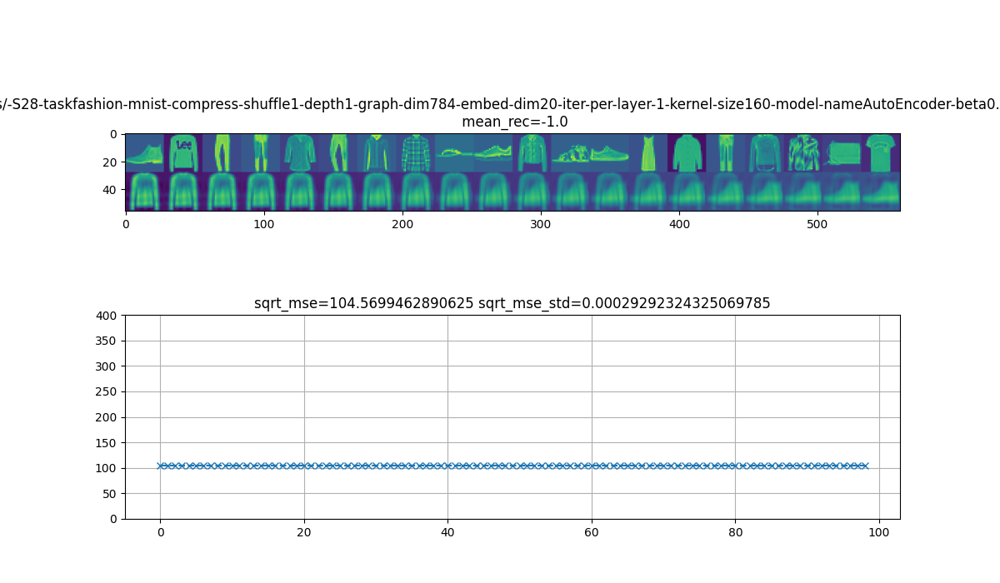
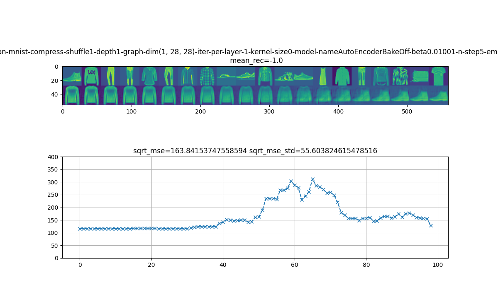
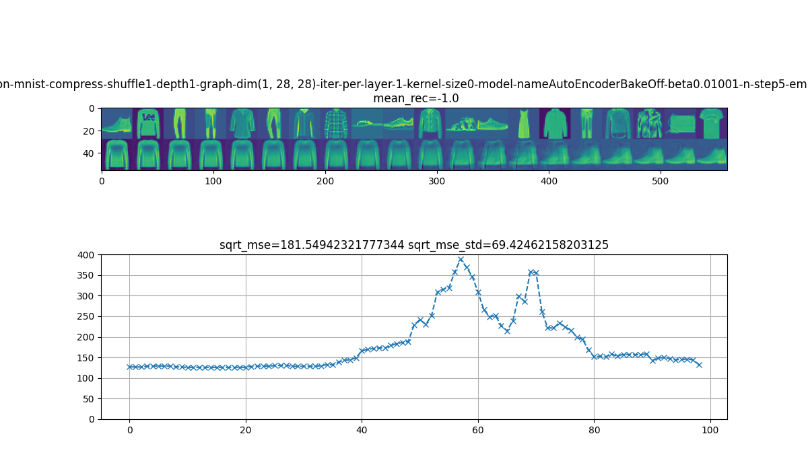
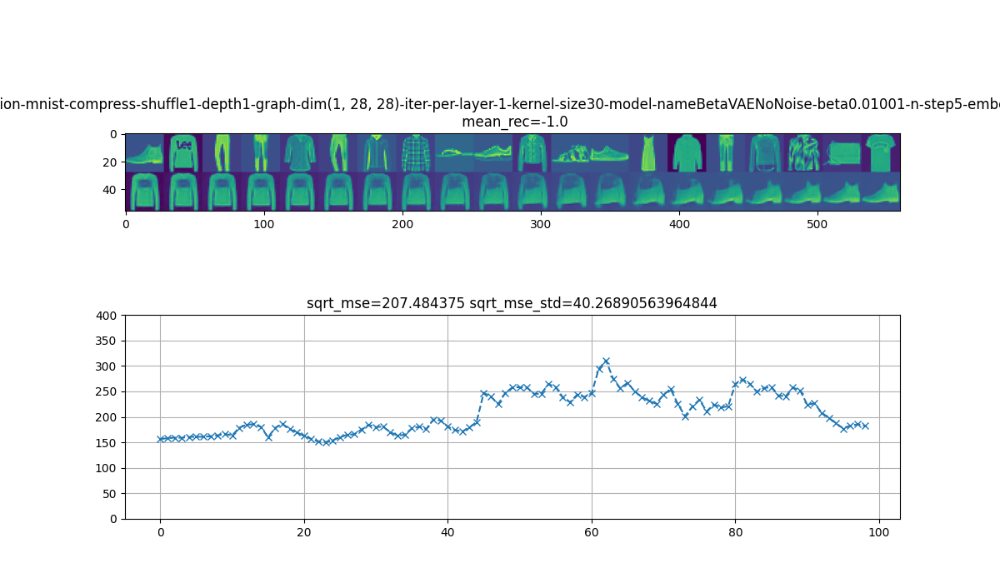

# 9015-卷积神经网络有什么好? Why CNN is better?

[CATSMILE-9015](http://catsmile.info/9015-why-cnn.html)


```{toctree}
---
maxdepth: 4
---
9015-why-cnn.md
```

## 前言

- 目标: 从高效编码和压缩的角度审视CNN为什么有效,从而总结出更通用的神经网络指导原则.
- 背景与动机:
  - 尽管卷积神经网络在各个领域取得了巨大的成功,但却很少有对于
  其成功秘诀的讨论. DeepImagePrior说明了网络结构会天生带来奇特的性质.
  我希望通过数据压缩这个代理任务,来解释CNN之所以成功的原因.
- 结论: 
  - 卷积可以用稳定的,弱线性的变化完成数据空间的中长距离的线性插值(morphing)
  - CNN = MLP + LocallyConnectedNetworks + Translational Equivariance 
- 备注: 
- 关键词: 
- 展望方向:
- 相关篇目
- CHANGLOG:
  - 20220710 加入从CNN到Transformer的讨论
  - 20220703 INIT

### 考察目标: 数据压缩的效率

我们知道,压缩感知(Compressed Sensing)和流形学习(Manifold Learning)给
神经网络带来了一些理论基础.在图像建模领域,我们发现图片是可以被可靠地压缩的,
这是因为我们可以假设数据落在一个低维流形上,以MNIST为例子,原始数据具有28x28=784个维度,但是使用各类有损压缩算法后,我们可以可靠地在测试集上以
较低的L2损失恢复出数据. 

原则上,只要精度足够,我们可以用一个数字就对数据做到无损压缩,但是实践上,
瓶颈的维度越高,能表达的信息就越多. 我们称这个最为瓶颈的隐藏层为模型的隐变量层( Latent Layer). 为方便比较,我们同时要求这个隐变量是一个无噪声的表示, 也就是关于x的条件分布在z上是一个狄拉克分布.
对于常见的有噪声的隐变量,我们一般可以取其参数空间上的狄拉克分布来构造无噪表征.

$$q_e(z|x)=\delta(z(x))$$

同时我们考虑一个确定性的解码器

$$
r(z) \in \{x\}
$$

### 引理1: 数据空间L2损失的一个上界 

这个上界和解码器 $r(z)$ 的jacobian有关 

$$||r(z_2) - r(z_1)||^2\leq E_{q_f(z)} [ || \nabla_z r(z) ||_F^2 ]$$

考虑一个思想实验,我们在数据空间有相隔较远的两点 $x_1,x_2$ ,如果自编码器是完备的,那么存在 $r(z_1)=x_1,r(z_2)=x_2$ ,对于任意连接隐变量的路径 $z(t)$,根据微积分的定义,我们有

$$\begin{align}
r(z_2) - r(z_1) &= \int_{t=l^{-1}(z_1)}^{t=l^{-1}(z_2)} d r(z(t))\\
&= \int_{t_1}^{t_2} \nabla_z r(z)|_{z=z(t)} \cdot  d [z(t)]\\
&= \int_{t_1}^{t_2} \nabla_z r(z)|_{z=l(t)} \cdot \nabla_t z(t) d t\\
||\nabla_t z(t)||^2&=1
\end{align}$$

我们可以把这理解为某种边际化,也就是把路径上的积分转化成z上的一个梯度场上,以及一个特定分布概率所构成的期望,这样我们可以更简单地计算L2距离. 借用每个维度的L2分量,我们可以对期望做分解

$$\begin{align}
f(z) &= \nabla_t z(t) \\
q_f(z) &\propto 1[ z \in  z(t)]\\
r(z_2) - r(z_1) &= \int_z q(z) \nabla_z r(z) f(z)\\
&= E_{q_f(z)}[\nabla_z r(z) \cdot f(z)] \\
||r(z_2)-r(z_1)||^2 
&= ||E_{q_f(z)}[\nabla_z r(z) \cdot f(z)]||^2\\
&= \sum_e E_{q_f(z)}[ ( \nabla_z r(z) \cdot f(z) )_e]^2 \\ 
&= \sum_e - Var_{q_f(z)}[ ( \nabla_z r(z) \cdot f(z) )_e] + E_{q_f(z)}[( \nabla_z r(z) \cdot f(z) )_e^2]
\end{align}$$

写这些积分,是为了引出 $\nabla_z r(z)$ 的范数的意义. 那么我们就可以忽略掉第一非负项的方差,又因为矩阵积的jacobian范数是小于因子矩阵的jacobian之积的(柯西施瓦兹不等式,讨论见[CATSMILE-1006](./1006-jacobian-matrix),我们可以找到一个上界

$$\begin{align}
||r(z_2) - r(z_1)||^2 &= \sum_e - Var_{q_f(z)}[ ( \nabla_z r(z) \cdot f(z) )_e] + E_{q_f(z)}[( \nabla_z r(z) \cdot f(z) )_e^2] \\
&\leq \sum_e E_{q_f(z)}[( \nabla_z r(z) \cdot f(z) )_e^2] \\
&= E_{q_f(z)}[ || \nabla_z r(z) \cdot f(z) )||^2]\\
&\leq E_{q_f(z)} [ || \nabla_z r(z) ||_F^2 \cdot || f(z) )||_F^2] \\
&= E_{q_f(z)} [ || \nabla_z r(z) ||_F^2 \cdot 1]
\end{align}$$

也就是说,数据空间两点之间L2距离,最大不能超过连接这两点的路径的Jacobian的F范数的期望. 也因此使得Jacobian范数期望最小的那条路径,提供了最紧的下界. 从这个角度讲, 模型通过 $||\nabla_z r(z)||_F$ 来解释数据空间的多样性

我们注意到,运用CS不等式之前的那个形式,基本等同于StyleGAN所提出的感知路径长度(Perceptual Path Length)

运用引理1,我们可以很简单地考察一个线性系统的情况. 对于PCA这种线性解码器来说,
他的Jacobian是一个定值 $\nabla_z r(z) = W_m$ ,意味着这个模型的空间是平坦的, 每个点都没啥大区别. 而对于卷积神经网络,就可能存在JF比较大的位置,和JF比较小的位置了. 而对于有特定结构的模型, 可以构造出有特定性质的JF突变区域. 原则上,
解码器可以被它的Jacobian矩阵集完全刻画. 所以只要理解了Jacobian矩阵的性质,也就算是理解了这个模型.

### 实验1:

计算VAE两个样本差值路径上的Jacobian范数,或者是离散L2距离.

### 显式逼近

因为神经网络的性质可以由其Jacobian唯一描述,所以我们可以强行构造
Jacobian来近似任意的函数, 这和多项式/spline逼近是类似的道理,只不过
Jacobian矩阵考虑的是多对多的mapping. 

考虑 $x=r(z)$ ,我们希望 $r$ 本身也可以表示成 z 的函数,局部地,我们有

$$
\nabla_z r = f(z)
$$

有几种不同的构造方式

### 构造1: 二阶线性的Jacobian. SecondOrderGenerativeAutoEncoder SOGAE

D为数据空间维度, E为隐变量空间维度

$$
\nabla_z r = W_m z
$$

这个系统对应的梯度上升大致为

$$\begin{align}
\nabla_t z &= \beta \nabla_z -{1\over 2}||x-r(z)||^2\\
\nabla_t z &= \beta  (x-r(z))^T \nabla_z r\\
\nabla_t z &= \beta  (x-r(z))^T (W_m z)\\
\end{align}$$

也就是一个双线性(Bilinear)的系统,. 取决于 Jacobian 是在隐变量还是显变量上计算, 这样一个系统的参数量是 $O(DE^2)$ 或者 $O(D^2 E)$ 

### 构造2: 局部线性的Jacobian

$$
\nabla_z r = \sum_k {\exp E_k(z) \over \sum_k \exp E_k(z)} W_{mk}
$$

其中局域化可以由高斯实现 $E_k(z)=  ||z-\mu_k||^2 / (2 \sigma)$

$$\begin{align}
\nabla_t z &= \beta  (x-r(z))^T \nabla_z r \\
\nabla_t z &= \beta  (x-r(z))^T \sum_k {\exp E_k(z) \over \sum_k \exp E_k(z)} W_{mk}
\end{align}$$

参数量可以是 $O(KE(D+1))$ 或者 $O(K(E+1)D)$

如果要降低参数量,可以进一步假设 $W_{mk}$ 具有低秩分解,不过鉴于这里隐变量一般维度已经很小了,所以一般不需要多此一举动

因为实际计算时我们希望有一个具体的函数形式,所以让我们考虑如下的解码器形式,
这允许我们更快地进行计算. 对于绝对零度的 $E_k(z)$ , 这里的softmax就退化成极值形式.

$$\begin{align}
r(z) &= \sum_k {\exp E_k(z) \over \sum_k \exp E_k(z)} W_{k}(z - f_k) + \mu_k
\\
\nabla_z r &\approx \sum_k {\exp E_k(z) \over \sum_k \exp E_k(z)} W_{k} 
\end{align}$$

### 构造3: 卷积的结构

如果我们忽略网络中的全连接层, 那么基于卷积的网络具有一种特殊的特性,
就是在某一个方向上进行平移插值时,对应的图像也会进行平移插值,这意味着
这条路径在数据空间上将会是平滑的插值,因为每一个微小的平移所造成的L2损失
都是一样的. 而卷积的特性将保证这样的插值在隐变量空间也会有类似的对应.
从这个意义上来讲,数据空间和隐变量空间是"平行的",因为数据上的平移所构成的
集合一一对应到隐变量空间上的一个平移构成的集合. 因此自然而然地,我们也希望
这个事实对于数据直接的插值也最好能够成立. 

这某种程度上是一种隐式的数据增强,因为卷积神经网络保证一旦一个图像可以被表示,
那么它的所有平移结果也可以被表示,反之亦然. 从这个角度讲,一条由平移平滑变化导出的感知轨迹,在这个方向上是弱线性的. 之所以是弱线性,是因为Jacobian矩阵是变化的,但是同时局部变化的L2范数又是恒定的. 反之,如果Jacobian恒定,那么局部变化的L2范数一定是恒定的.


### 模型插值路径 AutoEncoder: 浅层自编码器

由于线性原因,Jacobian基本为定值



L2RecoverLoss=1214

### 模型插值路径 AutoEncoderBakeOff: 去除了BN的多全连接层自编码器



L2RecoverLoss=702



L2RecoverLoss=686

### 模型插值路径 ConvAutoEncoder: 多层的卷积自编码器

Adapted from BetaVAE



L2RecoverLoss=530


我们可以发现,CNN用稳定的变化,完成了morphing


### 从对比的角度出发

如果我们放松拟合的要求,只要求拟合相对距离

$$\begin{align}
L(m) &= -|| (x_1 - r(z_1)) - (x_2 - r(z_2) )||^2 \\
&= -|| (x_1 - x_2) - ( r(z_1) - r(z_2) )||^2 \\
&= -|| (x_1 - x_2)||^2  - || r(z_1) - r(z_2)||^2 + 2 (x_1 - x_2)^T \cdot [r(z_1) - r(z_2)] \\
&= c - || r(z_1) - r(z_2)||^2 + 2 (x_1 - x_2)^T \cdot [r(z_1) - r(z_2)] \\
&= c - [  (r(z_1) - r(z_2)) - 2 (x_1 - x_2) ]^T \cdot [r(z_1) - r(z_2)] \\
\end{align}$$

$$\begin{align}
\nabla_{z_1} L &= -2 [r(z_1) - r(z_2)]^T \nabla_{z_1} r  + 2 (x_1 - x_2)^T \nabla_{z_1} r \\
&= -2 \left[ [r(z_1) - r(z_2)]-(x_1 - x_2) \right]^T \nabla_{z_1} r  
\end{align}$$

### 差异表示假说: Variance fitting hypothesis

目前可以对于CNN提出的假说有

1. 局部连接性/链接稀疏性,确保了在同等神经元数量下,CNN模型是低维的. 但是LocallyConnected 模型是否同样有效,还需要观察
1. 卷积先验确保了空间平移操作能够生成大量的差异性.

如果把图像从左边移动到右边,在数据空间会引起大的L2差异. 我们借助这个观察,猜测CNN的架构更加容易
为编码器提供明确的梯度导向. 而相比之下,全连接的自编码器需要自行建构这种表示体系,而对称的表示体系,
显然比随机的表示体系,占有的概率要低得多,(因为自由度降低了,所以可能的相空间也减小了). 但是非平衡态物理告诉我们,结构的存在目标有可能是最快地对能量进行耗散. 如果从bayes的角度讲,存在如上的几种模型,依Gibbs Distribution分布,那么模型取CNN的概率是远高于全连接自编码器的,尽管还要考虑参数上的概率测度的定义问题.

明确的梯度导向,在隐藏空间应当表现为均匀且高值的JacobianNorm. 如果CNN提供的loss landscape比
全连接自编码器更加的平滑,那我们就可以认为这个平滑性是其良好表示的一个原因. 因为这意味着一个次优的
编码器能够利用这个层次性的损失面不断地优化其自身的参数.

#### 困难的转化问题

但是问题在于,即便我们能证明这样的一条理论,又如何能转化为我们的建模的方法论呢? 我们很久以前就知道CNN是好的了, 但是问题在于怎么让机器自动地意识到这是好的呢? 自动地找寻CNN结构之所以困难,是因为局域链接网络的参数量无比的大,其同步运算的计算量大致是CNN的700倍(每个像素需要单独运算).当然这可能和具体的算法实现有关系,原则上这个计算量是一直存在的,但是CNN里这些共享参数的梯度在空间维度上被平均掉了.也就是说,我们不需要对
空间的每个位置单独构建一个模型,而是认为空间上的差异都直接可以被捕捉在隐藏状态里.


### 

- [TBC] JacobianNorm plot of 2-class mnist for different models
- [TBC] Loss plot of 2-class mnist for different models on specific examples.

### 参数共享问题

从某种程度上,模型就是"被共享的参数". 对于每一片数据,我们都假设模型是一个通用的描述机制,
所以第一层的对称性就在于,"每个数据的差异都能在同一个模型下转化成隐变量之间的差异".
那么卷积先验在这个对称性的基础上,又增加了"每个数据中不同位置的差异,都能在同一个模型下,转化
成每个位置上的隐变量之间的差异." 所以我们可以认为CNN把数据进行了层次化建模,在空间尺度上
把大数据分割成了小数据,在两个尺度上同时运用了"一般化建模思想",从而解释了数据之间的差异.

那么对于卷积先验的疑问,也就可以转化成另一个疑问:在数据尺度上,我们是否应该用同一个模型去描述
所有的数据?通常答案是显然的,又或者说,建模的根本意义就在于抽取数据间的通用特征,而不是为每个数据
构造专用的特征.但是,这里隐藏的要求就是要对数据进行模态对齐(modality alignment),譬如在784维度
的mnist图片数据中,突然混进了784维度的wav音频数据,是肯定对模型的效果产生很大影响的.又或者,如果采集到
的数据来自于一台有系统性偏差的相机,那么CNN的各个位置同模态的卷积假设就不再准确了.

让我们重新在模态对齐和差异表示的情景下再思考卷将积先验一般化的具体实现问题, 首先需要设定的是一个合理的参数空间,让模型能够合理地在卷积和非卷积模型之间进行选择. 实现这种选择的典型方法就是采用一个局部线性的模型, 让模态选择转化成选择最适合的一组线性基来描述数据. 又或者说,我们允许模型选择最合适的模型来描述它所见到的数据,这等价
于在Jacobian上创建一个巨大的高差异区域. 对于视觉模型来说,我们需要模型能够自行对见到的数据进行解析,并判断哪些部分是适合用同一个模型反复描述的. 我们知道,在给定
的差异量下最小化表示的自由度,等价于在给定的自由度下寻找最大的差异量. (parameter parismony vs variance maximisation). 我们隐约可以感觉到,这个最大化
差异的问题,可能联系到耗散结构的最大化能量耗散目标. 

从差异表示的思路出发,我们要拟合的是数据之间的相对关系而非绝对坐标, 也就是说我们希望我们的隐变量可以表征

借鉴GNN和Attention的思路,我们可以基于稀疏性和对称性对网络进行扩展. 可微分的稀疏性可以通过对节点构造一个嵌入空间,并在这个嵌入空间上进行KNN操作得到一个计算图.
而对称性可以通过要求节点上的聚合使用统一的一个函数来实现. 在这个框架下,连接性
通过嵌入空间和邻接判断变成了模型的一个可变参数. 然后通过聚合函数的参数共享,我们
隐性地要求模型复用同一个模型,也就是把大数据解构成更小的数据(compositionality).

通过shared computational graph embedding(SCGE)我们可以把CNN放松成具有某种对称性的GCNN.
这个操作本身就可能具有极重大意义了,因为这意味着我们可以去拟合shuffle以后的图像了,
而不必依赖给定的数据标注.这是从CNN走向多模态的重要一步.但是这样的一步松弛必然
需要扎实的优化思考作为高效模型选择的后盾,因为我们不能离开优化效率谈论模型的可拟合性,优化复杂度过高和无法拟合其实在某种意义上是对偶的两种表述.

走到GCNN这一步,我们距离Transformer的GAT其实只有一步之遥了. 其实引入SCGE的目标
非常的简单:允许我们处理未对齐(比如统一shuffle过的)的数据.但是这里的Node Embedding是不随数据而改变的,因为我们认为计算图是数据模态的一个属性,而图片的
数据模态一般是较为稳定的. 

在自然语言处理Transformer范式中,连NodeEmbedding都成为数据,而不是模态,的一个属性.这在图像处理里可能有一些理念上的困难.因为特征的可组合性一般对应着子模型的对称性. 而CNN之所以成功又源于可以明确地推断出一个带有位置信息的表征. 这种对于位置信息推断的复杂度在CNN情景下是不可能降低的,因为我们无法在知道一个物体的位置之前猜出他的位置. 

而在Transformer的语境下,计算图是动态的,尽管在第一层仍然会加入SpatialEmbedding, 但是后续的计算却是不区分KeyVector和ValueVector的.
这带来几个问题.NLP的VanillaTransformer是残差模式的,也就是说隐变量的维度跟输入
的token的维度一样,所以模型会依赖初始的Tokenisation.在ViT进行16x16 patch的操作也是一样. 我们当然确实希望能在隐变量里通过Embedding直接编码位置信息,但是这是否可行呢? 最大的障碍在于,这样的一个位置隐变量是不能用gradient来进行推断的,因为这个
位置向量直接决定隐变量如何投射到不同空间位置上,因此是highly local的一个表征.所以强行对图像数据上ViT或者MAE的建模方法,一方面会失去隐变量的维数可控性,另一方面也无法表征空间维度,纯粹是供给侧的方法论迁移,而非针对明确需求的构造.当然对于semantic information的处理确实很重要, 采用带有空间embedding的隐藏表征也不是不可以,但是
对于其高效推断是需要重新梳理一下的. 这方面,我猜测对于蛋白质结构数据,或者点云,或者其他3D数据的处理方法,是可以反哺一下视觉模型的 [TBC]. 这种Dense-Sparse表征的转化,
应该是一种比较本质的建模手段(Dense对应卷积先验空间下的分布式表征,Sparse对应以坐标形式的粒子式表征,这都快赶上波粒二相性的图景了...). 而且在可以预见的将来,DenseSparse问题会在CNN和Transformer的不断融合中得到解决.  

### Compositionality of Representation 表征的复合性


(Compositionality亦见夕小瑶的文章[Zhihu539269835](https://zhuanlan.zhihu.com/p/539269835) )

我们所希望的compositionality,其实是这里有张脸,脸右上方有条眉毛,下面两寸有个眼睛,眼睛外面有一圈睫毛,这样的表述. 

插播一则广告: Permutation-Invariance in RL <https://attentionneuron.github.io/>.  <https://arxiv.org/abs/2109.02869>


### 和生成模型的对比


### 其他素材

## 参考

- 黄伟: 深度学习平均场理论第三讲：tanh的复兴和dynamical isometry <https://zhuanlan.zhihu.com/p/95484999> 

- 黄伟: 深度学习平均场理论第四讲：Resnets为什么这么强大 <https://zhuanlan.zhihu.com/p/97363355>

- 低维流形假设, Pope2021: <https://arxiv.org/abs/2104.08894.pdf>

### 其他参考

- 黄伟: 深度学习平均场理论第一讲：综述介绍 <https://zhuanlan.zhihu.com/p/97363355>

- 黄伟: 深度学习平均场理论第二讲：表达性&可训练性 <https://zhuanlan.zhihu.com/p/92455114>
