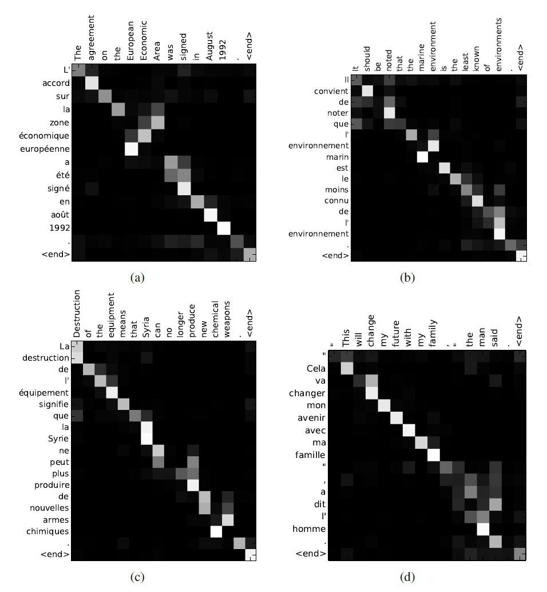

# 9016-刨出Transformer的根 Digging the root of Transformer Model

[CATSMILE-9016](http://catsmile.info/9016-why-transformer.html)


```{toctree}
---
maxdepth: 4
---
9016-why-transformer.md
```

## 前言

- 目标:
- 背景与动机:
  - 从等变性的角度分析变形器
  - 从图结构的角度分析注意力和变形器
- 结论: 
- 完成度: 
- 备注: 
- 关键词: 
- 展望方向:
- 相关篇目
- CHANGLOG:
  - 20220716 INIT


### 起源:

通常认为,Transformer所基于的注意力机制,最早可以追溯到惊世骇俗的RNNLM(Bahdanau-Bengio2014).在这篇有关机器翻译的文章里,大家第一次见到了软注意力的神奇能力



这篇文章的技巧也非常朴素,就是一个基于softmax的注意力函数,对于
解码侧的位置i的内涵 $c_i$ ,由编码侧j上内涵 $h_j$ 的加权和得出. 其中相似性函数 $a$ 也使用了一个神经网络来参数化.

$$\begin{align}
c_i = \sum_j {\exp A(s_i, h_j) \over \sum_k \exp A(s_i, h_k)} h_j
\end{align}$$ 

注意到 $\sum_j w_{ij}=1$ ,这个性质有助于从图的角度去理解这个操作. 我们可以认为, 这个对应关系本身可以理解为数据的一个特质,而注意力模型把这个对应关系分解成了一个编码器 $h_j$ ,一个解码器 $s_i$ ,和一个对齐函数 $A$ . 从这个角度思考,我们认为注意力机制,对于对应关系做了限制,使其变成了 $s_i$ 和 $h_j$ 的函数. 但是这样的一个操作似乎并不是完全必要的,因为
我们并不能保证这个图结构可以从这些变量中计算出来.

即便我们不要求 $w_{ij}$ 是数据 $x_j,y_i$ 的函数,只要参与了损失函数的计算, $w_{ij}$ 就会隐式地依赖于数据. 当然头疼的点在于 $y_i$ 是不可观测的, 所以需要先计算出 $w_{ij}$ 再计算出 $y_i$ .

因为 $f_m(x_j) = y_i$ ,所以图结构必须成为模型在计算过程中的一个中间态. 理论上,我们只要计算出这个对齐图,就能够对原始数据进行变换. 而解码器很大程度上也是在预测这个对齐图. (对齐图+发射模型=目标序列)

所以这个视角就能体现出离散数据和连续数据之间的区别: 离散数据的拟合目标,
虽然可以被视作是基于Hellinger距离或其对数替代品的目标,但是中间计算过程却牵扯到图结构的拟合. 而且图结构上的一些基本操作,如插入/删除,可以使得函数的空间具有更好的性质. 

这种性质是来自于我们操作的空间是嵌入空间,例如插入操作对于相空间的影响可以转变为一个集体的坐标平移,而不需要在未嵌入的离散空间上用一个permutation操作进行表征.总的来说,图的嵌入是一个强大的对离散数据的表征工具,可以把复杂的变换群简单化.

### Transformer

如果我们从 Transformer Circuits 提供的视角去考虑, 那么我们可以认为在某种程度上最小化了一个能量函数. 在由W所确定的局域内,进行V函数的最优化.
这种W和V之间的关联应当是非常重要的,比如W表征的是电荷相关性,V就可以表征距离. 我们也可以猜测,单纯的一个W函数可能不能很好地表征一个空间坐标. 

总之,如果 $x_i^T W x_j$ 看成是一个球面上的负距离函数,那么就可以理解为这个 V 函数只对 W 距离最近的那几个 j 起作用.原则上,我们可以把归一化去掉/做截断/在分母上加一个offset,借此来加速计算

$$\begin{align}
dx_i &= \sum_j {\exp x_i^T W x_j  \over \sum_j \exp x_i^T W x_j} V x_j \\
W    &= Q^T K
\end{align}$$

考察一个比较简单的力场

$$\begin{align}
E &= - \sum_{ij}   y_i^T W y_j  (x_i - x_j)^2 \\
\nabla_{x_i} E &= 2 \sum_{j}   y_i^T W y_j  (x_j - x_i)
\end{align}$$

从图的角度出发,我们可以认为Transformer对于初始图进行了一些计算,
从而得到终态图. 一个简单的假设是空间各处的作用都是相同的

我们假设Transformer的态矢包含的信息是"在哪里"和"是什么".并且
进一步要求在空间上只能有局域性的作用.这样就可以把原始空间上的超距
作用转化为新空间上的局域作用.这在生物物理里是非常常见的一种效应.

在这个基础上,我们把Transformer看成是一个对Token按照一定标准进行
变换的网络.我们希望Transformer的微观操作至少能够表征块状的平移.


### 考察目标: 数据压缩的效率

### 草稿

我们已经发现,要把数据塞进一个低维流形里,需要这个高低维变换
有着足够的复杂度,这个复杂度可以通过混合模型,或者增加非线性层数,来确保把数据空间的方差压缩到嵌入空间里.

对于离散的自然语言数据,其方差的定义比连续空间的图片更为困难. 对于对齐的序列,我们可以用熵来衡量序列中含有的信息. 

在图片自编码的场景下,我们可以使用自然的欧式距离来描述数据流形.
在自然语言的场景下,最自然的距离似乎是汉明距离.汉明距离只在离散的空间上有定义,对于含有不确定性的离散变量,必须推广汉明距离才能使用.显然,要计算推广的汉明距离,我们必须得到每个令牌的概率才能计算,这显然对于计算效率很不友好. 这就
为我们使用一个连续的嵌入空间提供了动机.

嵌入空间,原则上最简单的要求就是不能退化,也就是格点之间要有充足的距离,否则在unembed的时候就无法区分嵌入前的东西. 嵌入空间的每个点,都可以通过它到K个顶点之间的距离,映射到K离散变量上的分布. 那么我们其实希望保留的是独热向量,也就是K变量上的狄拉克分布之间的距离.

之所以我们找这么一个结构衡量标准这么复杂,其实是因为实际使用中大家用的损失函数其实很奇怪,是从分类任务里继承下来的交叉熵损失,也其实是K分布上的分布x和分布y之间的KL散度. 拟合目标是最大化负KL散度

## 参考

Bahdanau-Bengio2014: Neural Machine Translation by Jointly Learning to Align and Translate <https://arxiv.org/abs/1409.0473.pdf>
