#! https://zhuanlan.zhihu.com/p/545545719

# 9017-机器翻译中的注意力和质控 Attention And Quality Control in Machine Translation

[CATSMILE-9017](http://catsmile.info/9017-attention.html)


```{toctree}
---
maxdepth: 4
---
9017-attention.md
```

## 前言

- 背景与动机: 
    - 往期实验中难以复现transformer的优越性
    - 所以转向了更为直观的NMT翻译中的注意力机制
    - 为IBM-Model适配一个词嵌入范式下的梯度模型,命名为SAM(SoftAlignmentModel)
- 结论: 
    - 虽然SAM14的负对数损失不如SAM5,但是SAM14的对齐效果却比SAM5好很多.这也侧面说明,仅靠损失函数去指导模型选择,有可能是会误入歧途的.
    - Multi30K的质量看起来比WMT14要好很多
    - WMT14不干净,不要轻信数据集的整洁性,质控要勤,数据蒸馏和数据质控很重要!
    - 我们目前无法从给定的数据中,学到数据中并不存在的事实. 即便天王老子来了,也不可能无中生有.
    - PS: 要是在这么脏的数据集上能训练出接近对角的注意力矩阵才是见鬼了吧.
    - `业务 -> 数据 -> 模型` 在这个链条上,信息是逐渐减少的. 模型不一定能捕捉到数据的所有特征,数据也不能捕捉到业务的所有特征.
    - `业务设计 <- 数据结构设计 <- 模型设计` 这是上式,在设计空间的对偶,应当先对业务进行设计,再决定用什么样的数据结构去捕捉业务信息,再决定用什么样的模型去自动分析这些数据结构. 可以说,很多灌水的深度学习的工作,就是没有尊重这个依赖链条,过多地纠结在了模型设计里.
    - 当然,后续机器学习的发展方向之一,就是逐渐把这些设计过程集成起来,变成一套统一的方法论,但是目前似乎还没有令人满意的
- 完成度: 中,缺代码和公式
- 备注: 
    - 本来这个周末是想研究一下插入/删除/反序操作的toy model的,
    周六改了半天RNN,周日调了一天WMT14.醉了
- 关键词: WMT14/数据质量控制/NMT
- 后续目标/展望方向:
    - [TBC,找个中文数据集]
    - [TBC,清理一下标点符号]
    - [TBC,检查注意力机制对于删除/反序问题的效果]
    - [DONE,用Multi30K:清洗一下WMT14,或者找个干净点的数据集]
    - [DONE:记录在SAM7旁边了:做一下消融实验证明注意力机制的优越性]
    - 关注ConvS2S对Transformer的高效替换
    - Transformer/大模型的效果那么好,是不是因为其对数据的洁净度/结构化要求更低呢?
    - [DONE:SAM3和IBM1有explicit的关系.结合IBM-Model范式思考]
    - 接下来可以做的有几个方向:
      - [DONE] 一是加入有关翻译图的先验,我们希望从源语言构建翻译图
- 相关篇目
- CHANGLOG:
    - 20220801 加入基于HMM的SAM13和SAM14
    - 20220730 加入SAM4,SAM5,SAM6的图片,开始研究SAM7
    - 20220729 加入MaskSetting1/2/3的对比,说明setting3的优越性. 定义缩写为SAM(SoftAlignmentModel)
    - 20220728 加入Multi30K质量控制内容
    - 20220724 加入WMT14质控相关内容


### 材料与结论: WMT14数据集不是很干净

我画了半天alignment图,说怎么看起来这么奇葩,原来WMT14 En-De 数据集似乎不是很干净

```bash 
# See https://nlp.stanford.edu/projects/nmt/
wget https://nlp.stanford.edu/projects/nmt/data/wmt14.en-de/train.en
wget https://nlp.stanford.edu/projects/nmt/data/wmt14.en-de/train.de
```

### 结论: Multi30K比较干净

Source: `torchtext.datasets.translation`

```python
class Multi30k(TranslationDataset):
    """The small-dataset WMT 2016 multimodal task, also known as Flickr30k"""

    urls = ['http://www.quest.dcs.shef.ac.uk/wmt16_files_mmt/training.tar.gz',
            'http://www.quest.dcs.shef.ac.uk/wmt16_files_mmt/validation.tar.gz',
            'http://www.quest.dcs.shef.ac.uk/'
            'wmt17_files_mmt/mmt_task1_test2016.tar.gz']
    name = 'multi30k'
    dirname = ''

```

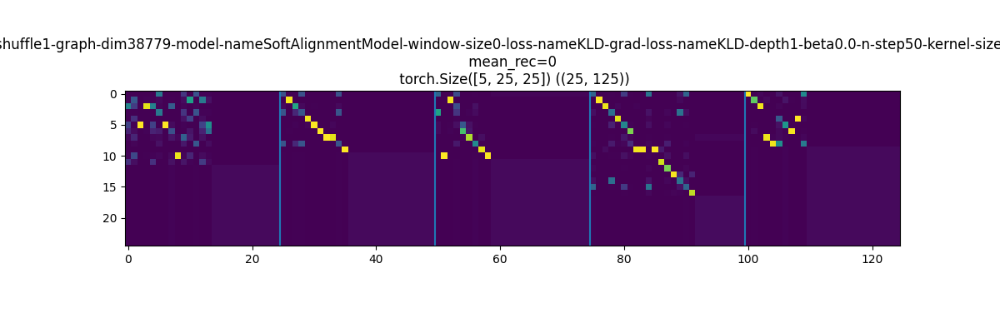

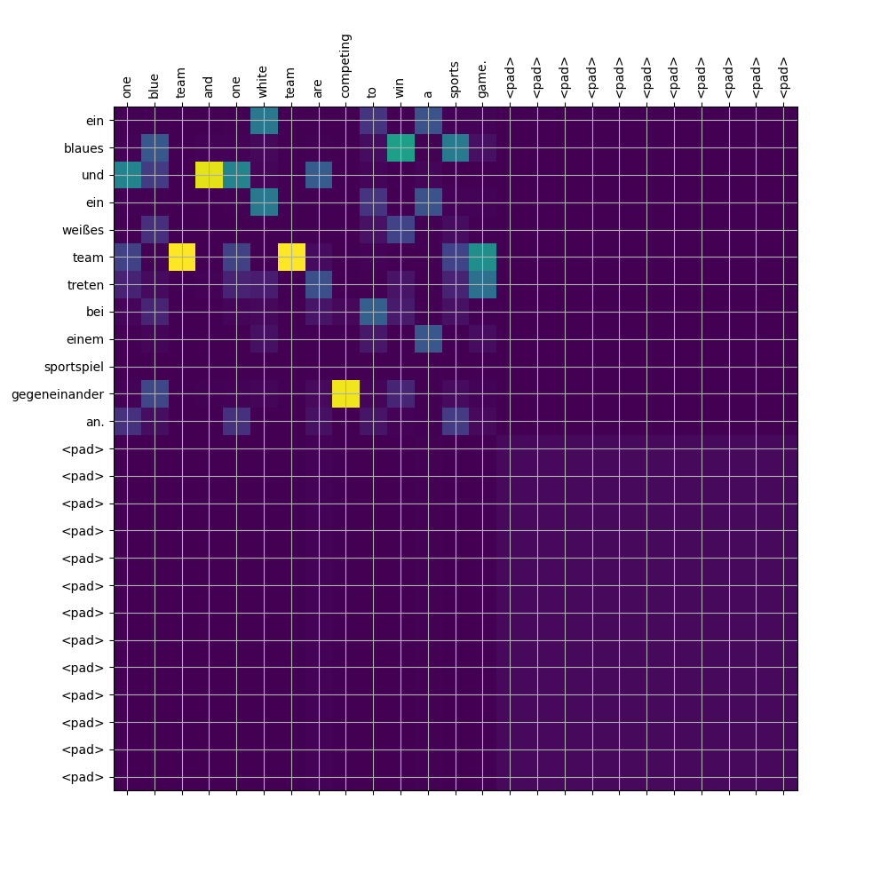

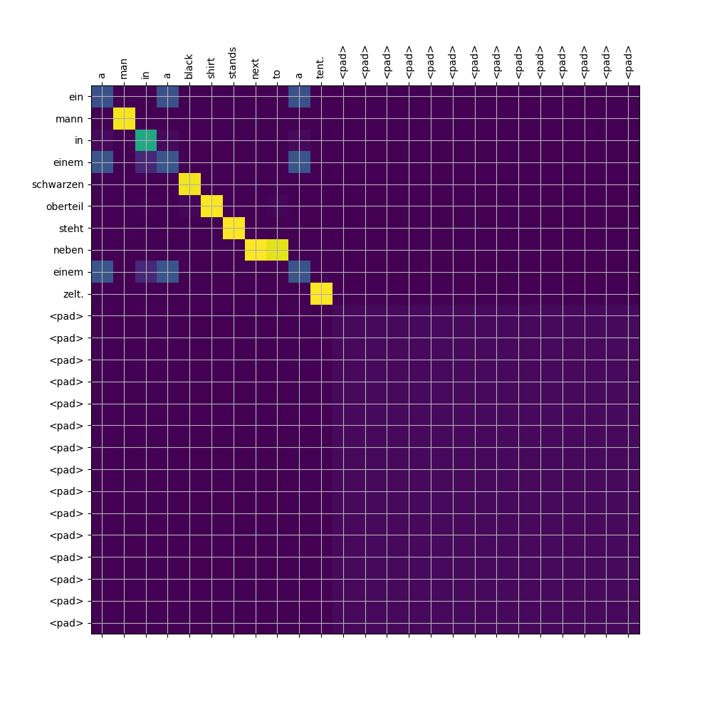


### 例子: WMT14里面一个对齐得比较好的例子

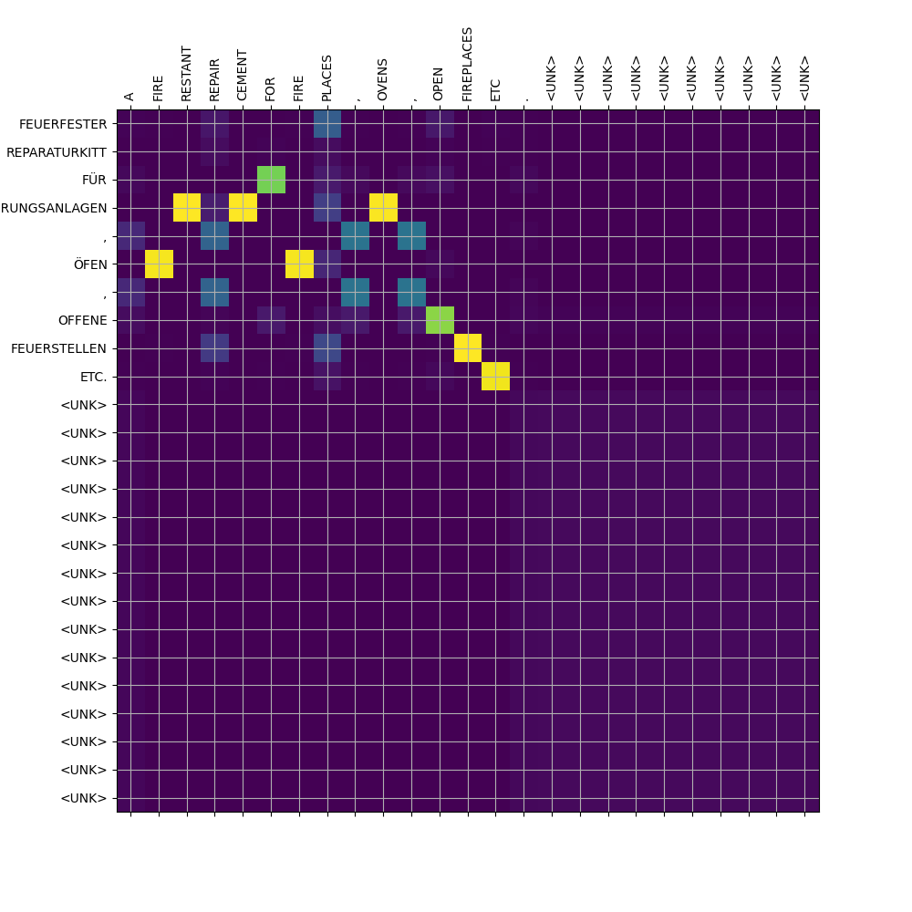


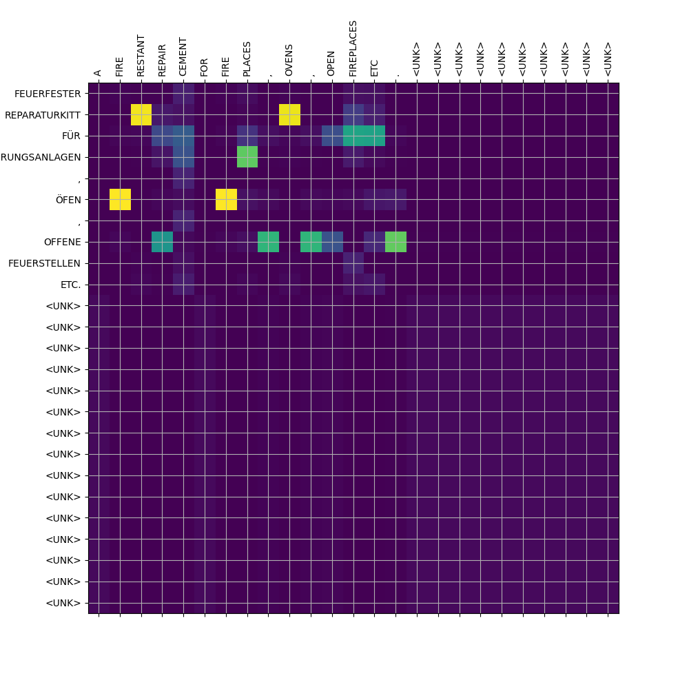


### 例子: WMT14里面对齐得比较差的例子

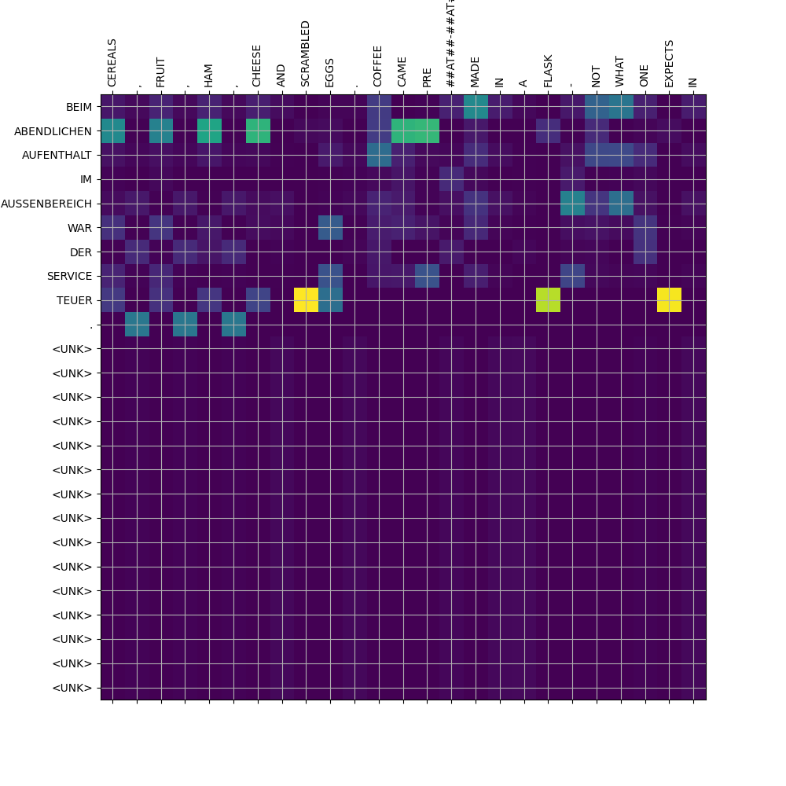

WMT14EN2DE的line4003的对齐确实很糟糕

- line4003 Cereals , fruit , ham , cheese and scrambled eggs . Coffee came pre ##AT##-##AT## made in a flask - not what one expects in a hotel of this calibre .
- line4003 Beim abendlichen Aufenthalt im Außenbereich war der Service teuer .

### 例子: 另一个WMT14对齐失败的例子

#### train.en

- line3994 The 102 rooms , suites and junior suites display elements of contemporary and classical architectural design , along with Florentine furniture and decorations .
- line3995 Hotel Albani Firenze in located in the heart of the city , in a quiet area very close to both the Florence Congress Centre ; Fortezza da Basso , Palazzo dei Congressi and Centro Affari are less then 5 minutes ’ walk away .
- line3996 The main tourist attractions can be reached on foot . The Santa Maria Novella train station is a quick 150 metre walk .

#### train.de

- line3994 Das Hotel verfügt über 102 Zimmer und Suiten , die sowohl moderne als auch klassische Elemente widerspiegeln und die perfekte Verbindung aus modernem Design und florentinischem Zauber bieten .
- line3995 Das Hotel Albani Firenze befindet sich in ruhiger Umgebung im Herzen der Stadt .
- line3996 Sowohl das Kongresszentrum als auch die wichtigsten touristischen Attraktionen sind schnell und bequem erreichbar .

可以看到 3995 和 3996 的英德句子信息并不对称,英文3995有5 minutes away 的信息但是在德文3995里面压根没有出现

### 方法: nano 使用小技巧

- 用nano打开你的txt文件
- Ctrl+Shift+"-"=Ctrl+_ = 跳转到第X行
- Alt+C 显示行数状态栏

### 方法: 质量控制模型

下面的图都是用`markov_lm.Model_NLP.SoftAlignmentModel`画的

[Github: markov_lm.Model_NLP](https://github.com/shouldsee/catsmile/blob/master/markov-lm/Model_NLP.py)

#### markov_lm.Model_NLP.SoftAlignmentModel

为了确保模型尽量简单,我没有使用RNN, 直接对于每个句子对,考虑一个自由的对齐矩阵,然后优化最优对齐情况下的对数似然即可.<del>这似乎等价于IBM-Model1的似然函数.</del>

记源语言序列为 $f_j$ ,目标语言序列为 $e_i$ ,优化的负损失函数目标为

$$\begin{align}
L(m) &= \sum_b \sum_i \log \sum_j \exp ( \log \text{softargmax} (f_j^T W_m e_i, e_i,e_k) )\\
L(m) &= \sum_b \sum_i \log \sum_j \exp \left( f_j^T W_m e_i - \log \sum_k \exp (f_j^T W_m e_k) \right)\\
\nabla_m L &= \sum_b \sum_i p(j|i)\nabla_m \left( f_j^T W_m e_i - \log \sum_k \exp (f_j^T W_m e_k) \right) \\
\nabla_m L &= \sum_b \sum_i p(j|i)\left[\nabla_m ( f_j^T W_m e_i)  - q(k|j) \nabla_m  (f_j^T W_m e_k) \right]
\end{align}$$

考虑其离散形式,用max算子替换softmax算子,我们要求模型仅需要考虑最优配对情况下的编码损失. 

$$\begin{align}
L(m) = \sum_b \sum_i \max_j ( f_j^T W_m e_i)
\end{align}$$


我们知道,对于这样的一个模型,最后得到的参数集合,除了 $f_i,e_i,W_m$ 这些嵌入向量和相关操作外,还有 $\text{argmax}_j (f_j^T W_m e_i)$ 所导出的对齐图谱. 因为很明显,如果不给出目标序列,光从源序列本身,我们是无法计算这个对齐图谱的,而对齐图谱又是一个重要的结构变量. 从这个角度讲,softAlignment必须结合一个对齐图谱,才能进行翻译.比如说一个最简单的对齐图谱就是DiagonalAlignmentMatrix. 一个很单的想法就是去构造一个对角矩阵附近的微扰展开,这个也是cdyer2013的Model2有过EM算法探索的.

原则上,根据IBM-Model1,一般用一个混合模型计算负损失函数.最简单的模型考虑的是均匀对齐先验.但是这里涉及到在离散对齐上进行求和,一时还写不出很直观的形式.

$$\begin{align}
&(\text{IBM-Model-1-With-Embedding})\\
L(m) 
&= \log\sum_{\{a\}} \sum_i \log P(e_i|\{a\},\{f\}) P(\{a\}) \\
&= \log\sum_{\{a\}} \sum_i \log P(e_i|\{a\},\{f\}) \\
&= \log\sum_{\{a\}} \sum_i \log P(e_i|f_{a(i)}) \\
&= \log\sum_{\{a\}} \sum_i \left( f_{a(i)} W_m e_i - \log \sum_k \exp (f_{a(i)}^T W_m e_k)  \right)
\end{align}$$

但是至少,从信息整合和抽取的角度上来讲,SoftAlignment是有比较明确的表征的. SoftAlignment提取出的Alignment可以用来结合源语言来重构出一句目标语言,因为Alignment信息表征了这句源语言的一种翻译方法,也可以认为 $p(j|i)$ 表征了第i个词的一个生成模型上的分布,允许我们用 $p(j|i)$ 采样出一个模型,进而采样出一个翻译. 

我们可以发现, 这类似于一个条件生成模型 $P(\{e\}|\{f\})$. 给定源语言后,我们考虑均概率的1-gram对应 $P(a_i = j)=c$ ,然后用混合好的分布去采样 $P(e_i |\{f\}) = \sum_{a_i} P(e_i | a_i, \{f\})P(a_i)$ 

但是这个生成模型应用到一个生成结果之后,就会产生一个后验 $P(a_i = j | \{e\},\{f\})$ 这个后验分布根据观测,是显然不均匀的.
原则上讲,我们可以修改模型,使得预测 $a_i$ 时可以运用源序列 $\{f\}$ 的信息. [DONE:加入关于{a}变量的先验可以提高NLL:按照公式严格实现条件生成模型,确认是否引入依赖性能够提高效果]

$$
\begin{align}
P(e_i |\{f\}) &= \sum_{a_i} P(e_i | a_i, \{f\})P(a_i)\\
P(e_i |\{f\}) &= \sum_{a_i} P(e_i | a_i, \{f\})P(a_i|\{f\})
\end{align}
$$


从计算形式的角度来讲,和Transformer相似的地方在于logsumexp的使用,使得导数中会出现softargmax项

#### markov_lm.Model_NLP.AlignmentModel

和SoftAlignmentModel类似,区别在于仅考虑了最优对齐,max替代了logsumexp

#### markov_lm.Model_NLP.Seq2SeqWithAttention

从 https://github.com/graycode/nlp-tutorial 里面的seq2seq模型魔改
而来, 原始模型里面居然用for-loop计算了Attention矩阵根本没法并行化,
我也是非常醉. 解码器损失函数用了TeacherForcing/AutoRegression的形式.

Adapted from <https://github.com/graykode/nlp-tutorial/blob/master/4-2.Seq2Seq(Attention)/Seq2Seq(Attention).py>

#### markov_lm.Model_NLP.Seq2SeqWithNoAttention

用来做消融实验的类

### 模型细节: 计算时的token masking

在计算数据似然的时候,我们会把数据对齐到50个令牌来加速运算,
这个时候在source和target都会有pad令牌. 

- 左: source, 右: target
- setting1 : 如果左右都考虑pad令牌, 生成对齐的速度很快
- setting2 : 如果target不考虑pad令牌,source考虑pad令牌, 会导致很多令牌对齐到pad上,但是数据似然上升
- setting3 : 如果target不考虑pad令牌,source不考虑pad令牌, 对齐效果很好,但是数据似然下降

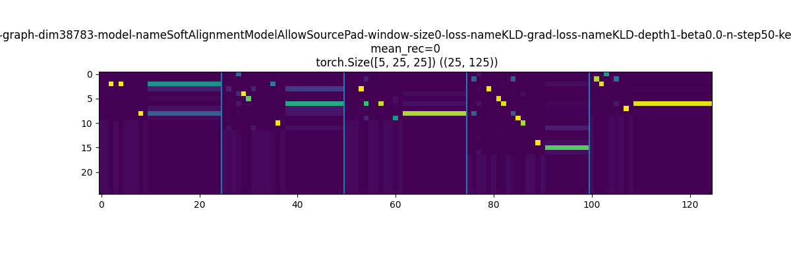

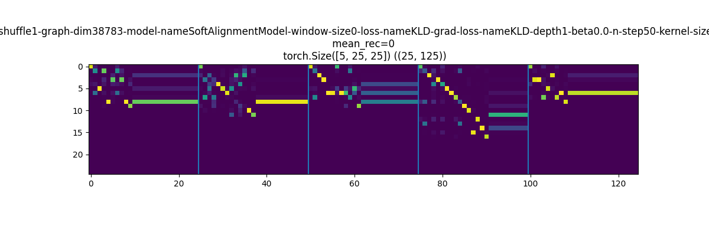

可以看到setting2的数据似然虽然比setting3要好,但是setting3对于
词汇对应却有着更好的作用. 事实上,把setting3的解带入setting2里面,可以进一步降低数据的似然,而直接优化setting2反而不能找到这个解.

对比setting3和setting1,我们可以看到setting3生成了更好的对齐


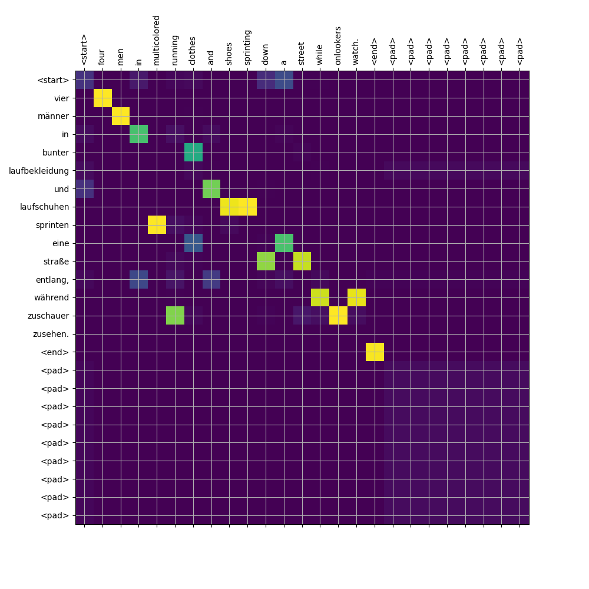

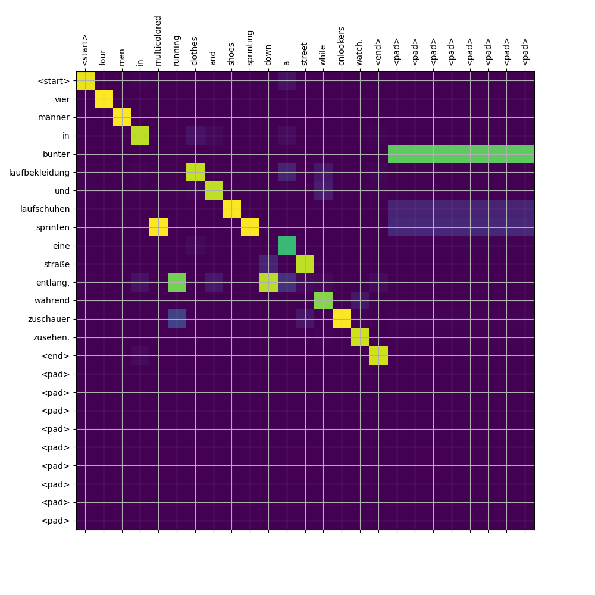


- setting4 : 基于setting3,加入一个固定的参数beta,控制alignment上面的prior.似然好于setting3,对齐和setting3差不多好

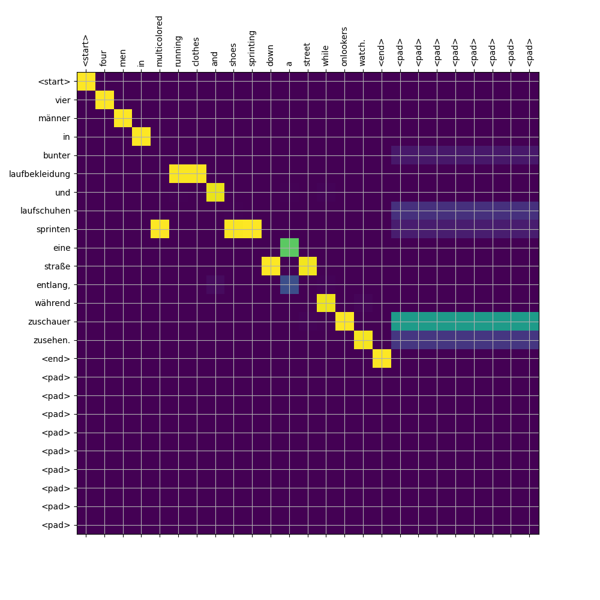

### SAM5: SharedSoftAlignmentModel 共享的Alignment先验

- SAM5: 类比IBM2,对 $P(\{a\})$ 做共享的参数化, 直接储存 $\log P(a_i = j)$ 作为参数, 方便对模型学到的先验做可视化. 从下图中我们可以看到,随着训练的进行, 这个共享的Alignment参数逐渐接近于对角矩阵. 我们注意到随着翻译的进行,噪声逐渐累积,对角对齐假设的有效性逐渐减弱

Loss measured in log conditional per emitted token per sentence pair

$$
loss= {1\over |B|}\sum_{b}{1\over |I|_b} \sum_{i}( \log(P(target_i| source, m)) )
$$

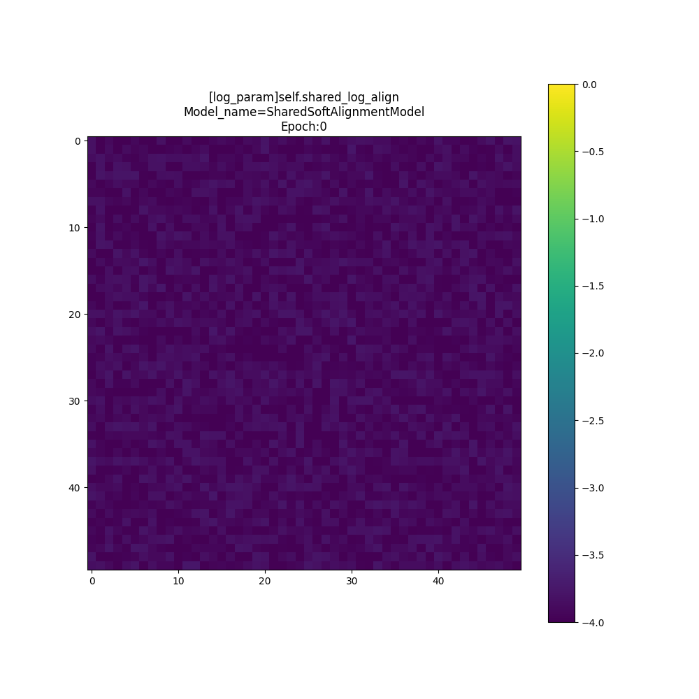
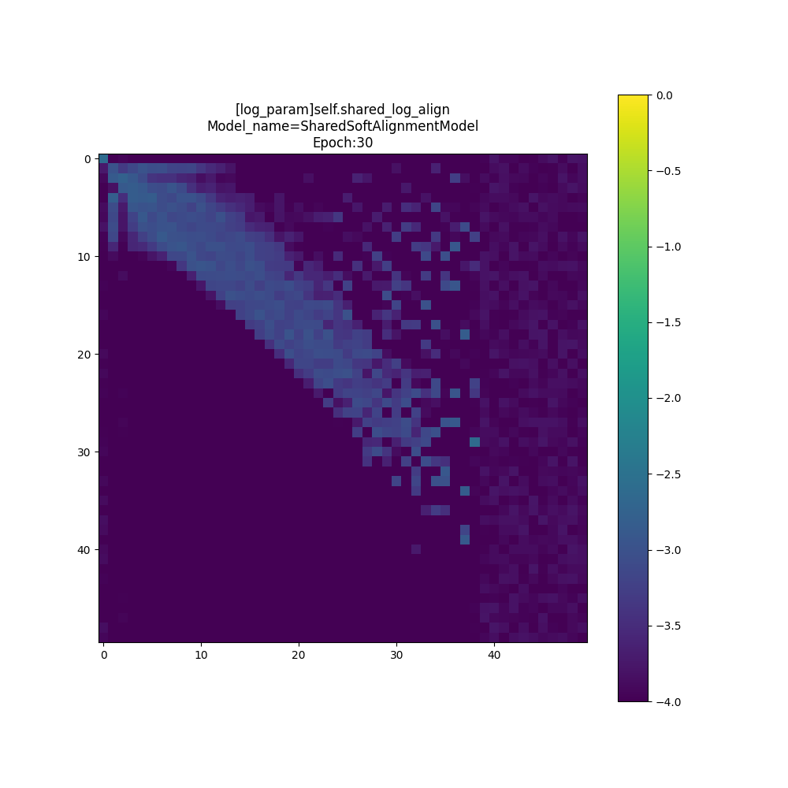
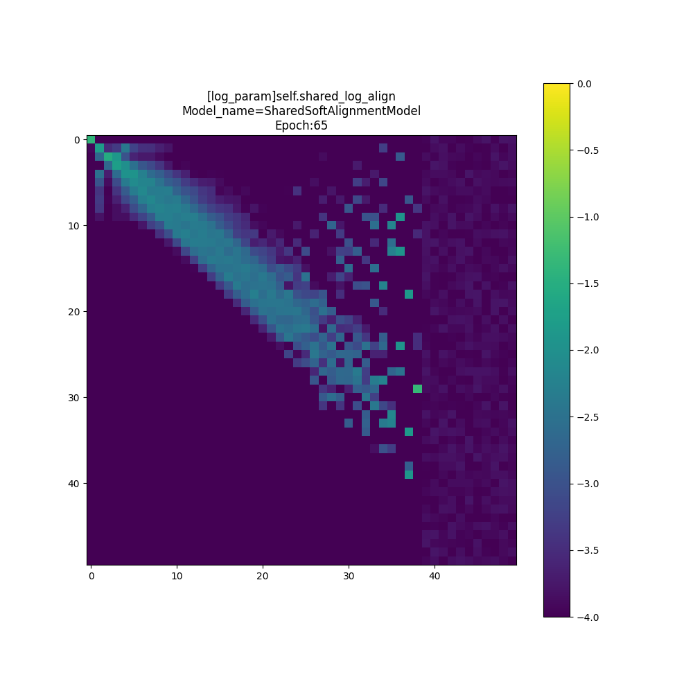
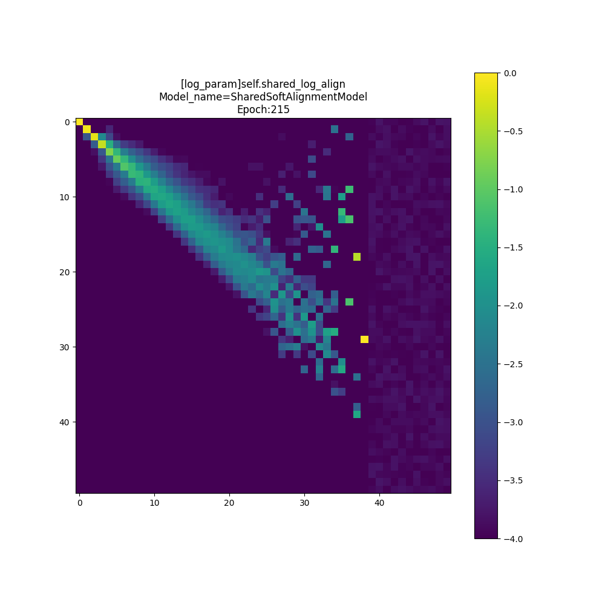


<!--
<table>
<tbody>
<tr>
<td>
Loss: 
<br>
log conditional per emitted token
<br>
{1\over |B|}\sum_{b}{1\over |I|_b} \sum_{i}( log(P(target_i| source, m)) )
</td>

<td>
 	11.95192
</td>


<td>
 	5.24687     
</td>


<td>
 	4.57560
</td>

<td>
3.89307
</td>
</tr>
<tr>

<td>
</td>
<td>
</img>
</td>

<td>
</img>
</td>

<td>
</img>
</td>

<td>
</img>
</td>

</tr>
</tbody>
</table>
-->

### SAM6: 尝试将 $a_i$ 写成 $f$ 的函数: 没啥效果

为了更好地描述Alignment的分布,我尝试对Alignment做一个简单的参数化模型, 对每一个源词语表征
一个偏离对角线的可能性. 注意这里还并不能像NW算法或HMM很好地处理多个区块之间的跳跃, 只是对短语简单地预测其AlignmentMap,使得其AlignmentMap更加符合数据上的分布.

一个比较好的办法,是对词向量进行复用,对计算出来的值直接计算log_softmax,来得到相对的AlignmentProb. 

测试结果: SAM6还没有SAM5来得有效.而SAM5估计又比SAM4弱一些...对于 $P( \{a\} | \{f\})$ 似乎没有必要继续深究.

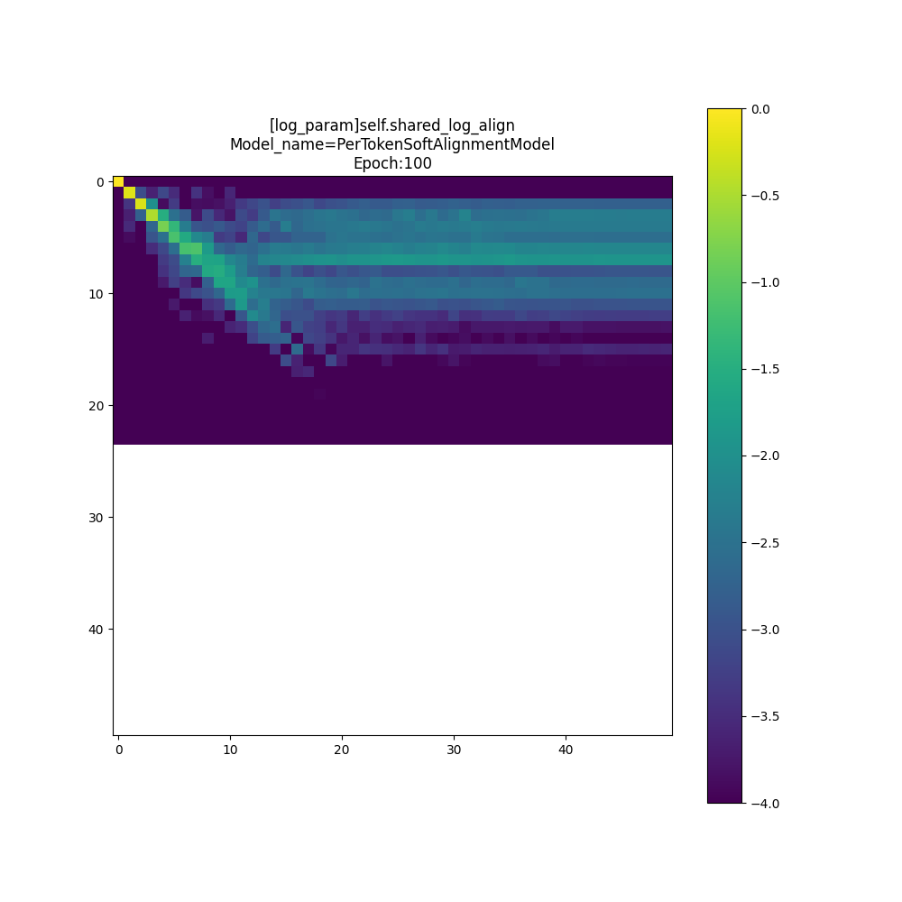

### SAM7: 慢到爆炸

观察到Seq2SeqWithAttention(loss10=3.82) 效果明显好于 Seq2SeqWithNoAttention(loss10=4.29). 也同时好于SAM4(loss10=4.18). 我尝试对SAM4引入一个新的形式,来表征某个句子内部的关联性. 特别地,类似于 $a_i$ ,我们引入一个目标句子内部的关联变量 $b_i$ .简单地先使用均匀的先验 $P(b_i,a_i)$ . 需要注意的是,
这样的一个模型,有可能产生环,从而无法分解成一个DAG的形式. 一个简单的办法是,要求模型只能从左边寻找前一个变量,也就是 $b_i<i$ ,这样得到的一个模型的拓扑就一定是一棵树.

$$\begin{align}
&P(e_i | b_i,a_i, \{e\}_\delta, \{f\}) 
\propto \exp( e_i W_1 e_{b_{i}} + e_iW_2 f_{a_{i}}) \\
P(e_i) &= \sum_{a_i,b_i} P(e_i | b_i,a_i, \{e\}_\delta, \{f\}) P(b_i,a_i)
\end{align}$$

但是我们发现,对于这个模型的Naive实现,需要进行O(STT)的求和,并不是很高效

### SAM8: 引入一点语言模型

为了对SAM7进行加速,<del>我们运用一个Bayes技巧,用某种条件独立性/局部归一化性质,来构造我们的分布.</del> 我们的目标是寻找一个在词表 $e_k$ 上求和归一的概率量, 一个最简单的办法就是把两个概率加起来,这样就使得
词语可以来自同源祖先,或者异源祖先. 事实上,在加和的过程中,我们只需要处理 (S+T) 种可能性即可,并不需要处理 (S*T) 的可能性

$$\begin{align}
P(e_i|\{f\},a_i,b_i) = {1\over 2} (P(e_i|\{f\},a_i) +  P(e_i|\{f\},b_i) )
\end{align}$$


### 草稿: 失败的SAM8尝试

这里一开始求和下标写错了...

$$\begin{align}
P(e_i|\{f\},a_i,b_i) &\propto  P(e_i|\{f\},a_i) \cdot  P(e_i|\{f\},b_i)\\
P(e_i|\{f\},a_i,b_i) &={ P(e_i|\{f\},a_i) \cdot  P(e_i|\{f\},b_i)
\over \sum_{e_k} P(e_k|\{f\},a_i) \cdot  P(e_k|\{f\},b_i)
}\\
\end{align}$$


$$\begin{align}
P(e_i|\{f\},a_i,b_i) &\propto  P(e_i|\{f\},a_i) \cdot  P(e_i|\{f\},b_i)\\
P(e_i|\{f\},a_i,b_i) &={ P(e_i|\{f\},a_i) \cdot  P(e_i|\{f\},b_i)
\over \sum_{a_i,b_i} P(e_i|\{f\},a_i) \cdot  P(e_i|\{f\},b_i)
}\\
&={ P(e_i|\{f\},a_i) 
\over \sum_{a_i} P(e_i|\{f\},a_i)} \cdot 
{ P(e_i|\{f\},b_i) \over \sum_{b_i} P(e_i|\{f\},b_i) }
\end{align}$$

### SAM9,SAM10: 纯语言模型

SAM9:Causal Model only
SAM10: Causal Model with diagonal prior

Causal Model within the target sentence does not help much, nor giving good NLL

### SAM11

在Source侧使用一个LocalContextEncoder

### SAM12

为了解决多意词问题,在双侧都使用LocalContextExtractor这个时候直接采取LayerNorm的形式来避免概率爆炸.

### SAM13: 对 $\{a\}$ 应用马尔科夫分解的先验

#### 讨论

在模型构建的过程中,我发现对于Alignment先验的控制会影响最后的NLL分数. 单纯地构建一个每个位置独立的Alignment先验,会无法捕捉到对角线上的倾向性. 于是开始考虑一个类似于HMM的复制/插入/删除模型(CID Model),也被称为(Probabilistic Finite State Transducer, PFST). 但是对于PFST,我们实际上并不能用前向后向算法得到给定句子对的准确联合概率,因为这个模型显然不具备马尔科夫性.比如,即便在位置3是C,模型的后续并不会因为这个3C而忽略位置2是C还是D,因为如果位置2是D,那么整个序列都会后移,造成位置4即便是C,其发射概率也取决于具体的Alignment.所以我们没有办法用HMM假设来算出期望的概率. 

但是借鉴Needleman-Wunsch算法,我们发现在给定的AtomicAlignmentProb的情况下,最佳Alignment是可以用动态规划解出的.这意味着我们可以得到对于配分函数的一个下界.理论上,我们就可以用这个点估计,来估算句子对的NLL. 注意这里的先验是通过GapPenality,对于连续的Diagonal有较强的偏爱. 但是对于Reordering也需要一个好的处理方法.NW算法的问题还在于,并不能系统地用概率语言表述Alignment的先验,或者说NW算法对应一个MRF,但是其配分函数估算比较困难.

$$
\log\sum_{\{a\}} P(\{e\} ,\{a\}| \{f\}) \geq \log \text{max}_{\{a\}} P(\{e\} ,\{a\}| \{f\})
$$

### SAM13: 前向过程

当然,我们也并非一定要使用PFST或者NW.从目标上来讲,我们只是希望对于不同位置的 $a_i, a_{i+1}$ 引入相互依赖性,那么最简单的办法就是建立一条依赖链(DependencyChain),也就是说{a}上的一个HMM, $P(a_{i+1}|a_i)$ 就可以解决 $a_i$ 相互独立的问题. 考虑对先验做HMM分解,我们希望对于联合概率在所有概率上求和. 记 $es_i=\{e_1,e_2,\dots,e_i\}$ , 我们用图结构和边际化公理可以得出联合概率的前向迭代式子

$$\begin{align}
&P(a_{i+1},es_{i+1}) \\
&= P(e_{i+1}|a_{i+1})P(a_{i+1},es_i) 
\\ &= P(e_{i+1}|a_{i+1}) \sum_{a_i} P(a_{i+1},a_i, es_i)
\\ &= P(e_{i+1}|a_{i+1}) \sum_{a_i} P(a_{i+1}|a_i)P(a_i,es_i ) \\
& \log P(a_{i+1},es_{i+1}) 
\\ &= \log P(e_{i+1}|a_{i+1}) \\&+ \log \sum_{a_i} \exp (\log P(a_{i+1}|a_i) + \log P(a_i,es_i )) \\
\end{align}$$

张量形状: 右侧(B,L,1)的张量被(1,L,L)扩展到 (B,L,L), 然后lse边际化得到 (B,1,L),加上发射概率,就得到了下一个 (B,L,1)


只要对最后一个位点的隐态求边际化,就能得到序列的总概率,从而代入优化目标

$$
P(es_i) = \sum_{a_i} P(a_i,es_i)
$$

如果我们尝试对logp求导,会得到一个softargmax.事实上会有一个比较美观的backprop迭代

$$\begin{align}
\nabla_m \log P(es_i) &= \nabla_m \log \sum_{a_i}\exp \log P(a_i,es_i) \\
&= \sum_{a_i} { P(a_i,es_i)\over \sum_{a_i} P(a_i,es_i)} \nabla_m \log P(a_i,es_i) 
\\
\end{align}$$


事实上,写成对数联合概率的导数迭代会比较清晰.理论上这部分回传用任意backprop自动求导引擎就可以完成

$$\begin{align}
&\nabla_m \log P(a_{i+1},es_{i+1})  
\\&=\nabla_m \log \sum_{a_i} P(a_i,a_{i+1},es_{i+1})  
\\&= \nabla_m \log \sum_{a_i} P(a_i,es_i) P(a_{i+1}|a_{i})P(e_{i+1}|a_{i+1})\\
&=  \sum_{a_i} { P(a_i,a_{i+1},es_{i+1}) \over \sum_{a_i}P(a_i,a_{i+1},es_{i+1})} \nabla_m ( \log P(a_i,es_i ) \\&+\log P(a_{i+1}|a_i)+ \log P(e_{i+1}|a_i) )
\end{align}$$

### SAM13: 后向过程

对于注意力的可视化,可以结合后向变量来计算隐变量的后验

$$\begin{align}
P(a_i|es_T) &= {P(a_i,es_T) \over \sum_{a_i} P(a_i, es_T)}
\\&={P(a_i,es_i) P(es_{i+1:T}|a_i)\over \sum_{a_i} P(a_i,es_i) P(es_{i+1:T}|a_i)}
\end{align}$$

在终末态 $i=T$ ,我们有 $P(es_{T+1:T}|a_T)=1$ ,因为前向变量已经等于联合变量了,没有更多的概率事件

$$\begin{align}
P(a_i,es_T) 
&= P(a_i,es_i) P(es_{i+1:T}|a_i) 
\\&= P(a_i,es_T) \cdot 1
\end{align}$$

我们尝试建立后向迭代运算

$$\begin{align}
&P(es_{i:T}|a_{i-1}) \\
&= \sum_{a_i} P(a_i, es_{i:T}|a_{i-1}) \\
&= \sum_{a_i} P(a_i, e_i, es_{i+1:T}|a_{i-1}) \\
&= \sum_{a_i} P(e_i, es_{i+1:T}| a_i )P(a_i|a_{i-1}) 
\\ &= \sum_{a_i} P(es_{i+1:T}| a_i )P(e_i|a_i)P(a_i|a_{i-1}) \\
&\log P(es_{i:T}|a_{i-1})
\\ &= \log \sum_{a_i} ( \log P(es_{i+1:T}| a_i ) 
\\&+ \log P(e_i|a_i) + \log P(a_i|a_{i-1})) \\
\end{align}$$

这样我们就可以大致地可视化后验分布了

### SAM13: 具体参数化

对于转移矩阵,我们做convection-diffusion的参数化.可能也可以引入一个混合的null分布来捕捉偏离对角线的Alignment

$$
P(a_{i+1}|a_i) \propto \exp(-\beta|a_{i+1} - (a_i + 1)|)
$$

对于发射概率,沿用简单的softargmax分布

$$
P(e_i|a_i) = P(e_i|a_i,\{f\})
\\ = \text{softargmax}({e^k}^T W f_{a_i},e^k=e_i)
$$

思想实验: 引入HMM的好处究竟是啥?我们可以观察一个偏离对角线的对角线来得出, 如果有一个长度为L的Alignment是对角线向下移动了3格的,那么在Gaussian场景下其logp的损失是 $3 \beta L$ ,如果在HMM情境下,其损失仅为 $3\beta$ .这说明HMM对于偏离对角线的对角线具有更好的捕捉能力. 宏观地来说,它关心Alignment内部的相对结构,而不太关心Alignment的绝对位置

当然,HMM的应用代价,是线性于序列长度 $O(L_e)$ 的计算步骤数量, 而Gaussian先验则是 $O(1)$ 的计算步骤数

### SAM14: 和SAM13一样,但是共享一个可调整的转移矩阵参数

注:这个模型用的`log10_learning_rate=-3`,而用Seq2SeqWithAttention用的`log10_learning_rate=-4`. 

对比shared_log_align,可以明显发现,HMM可以准确地捕捉到对齐态之间的迁移,而相比之下SAM5因为拟合的是绝对位置/边际分布,就会产生累计的误差,对于长序列来说就可能产生很大问题.

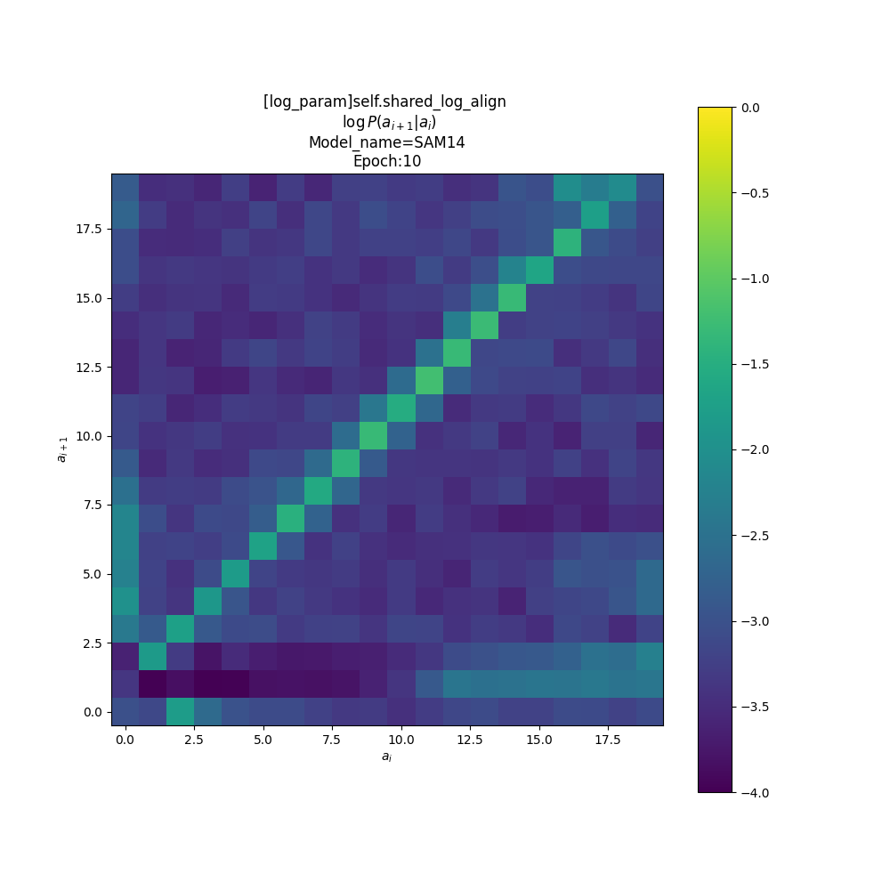

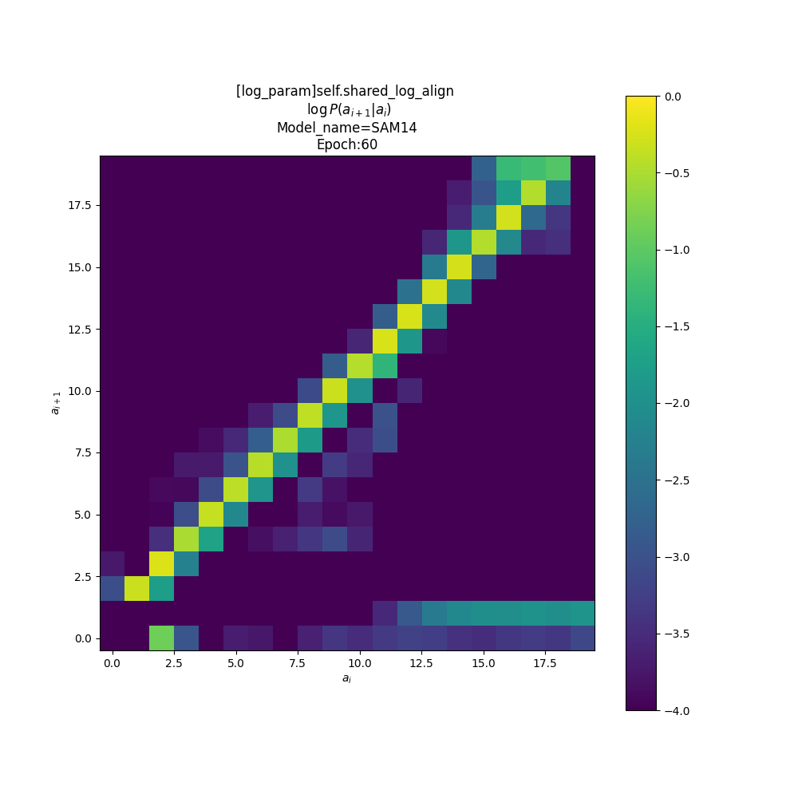

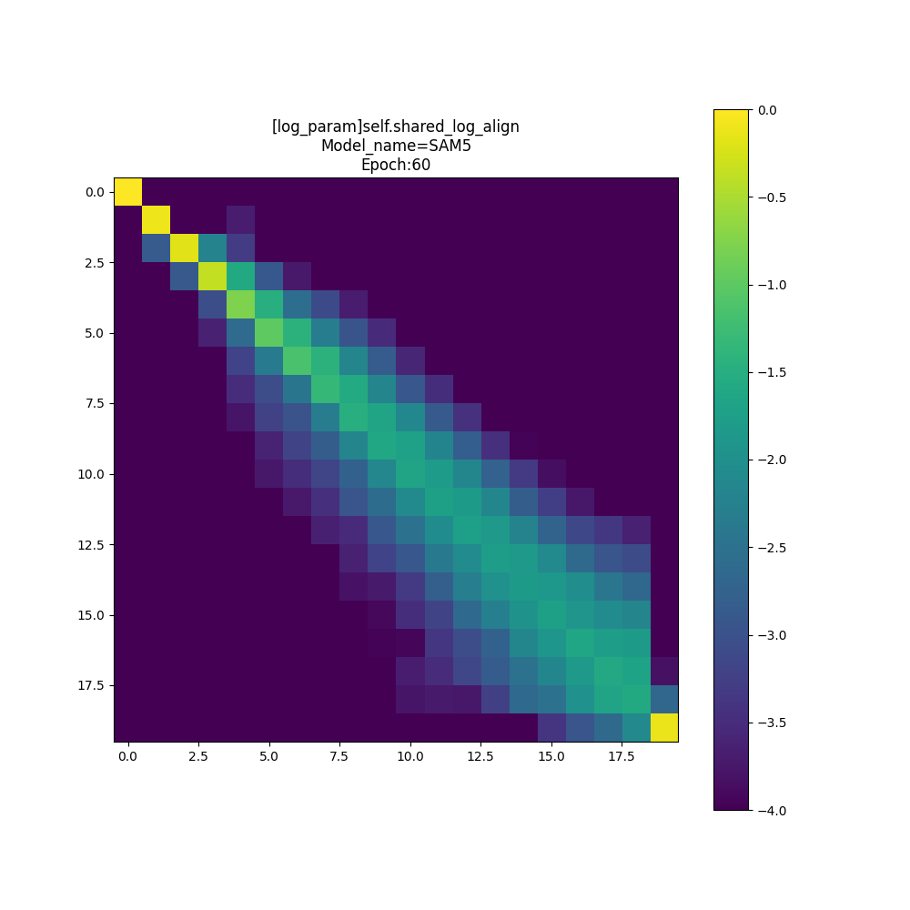

- 观察SAM14的转移参数,可以发现 $P(a_{i+1}=0|a_i=2)$ 异常地大,或者说很多状态倾向于返回 $a_{i+1}=0$ ,观察具体对齐图,这说明有必要引入对于(插入/分裂事件),如插入助词,或分裂出连接词的模型组分

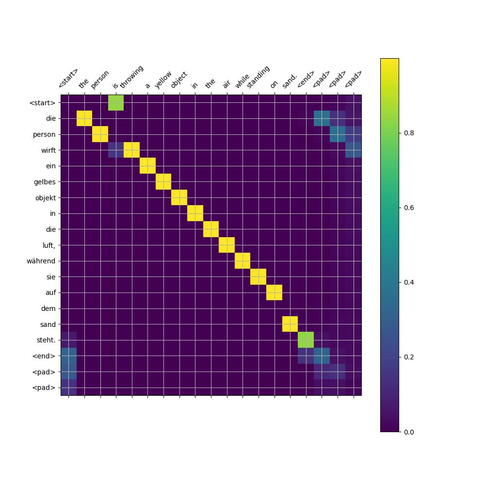

- 转移参数有比较强的停滞/回跳性质.停滞说明一个源词对齐到了两个目标词. 停滞有时候是合理的,因为德文有些组合词确实会对齐到两个英文词,但有时候是被迫的,因为模型无法预测到一个重排

观察具体的对齐图,我们可以发现HMM目前只能一定程度地表征反序,还不能做到系统性地表征. 

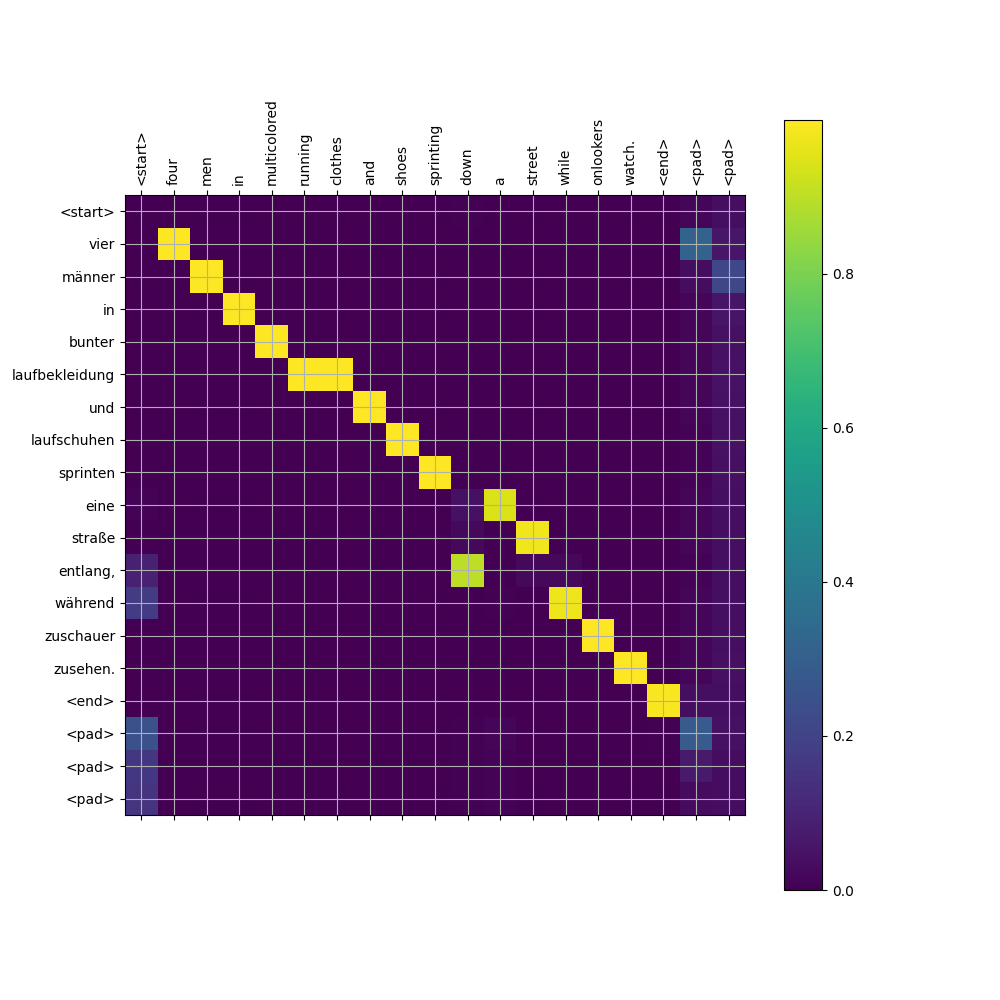

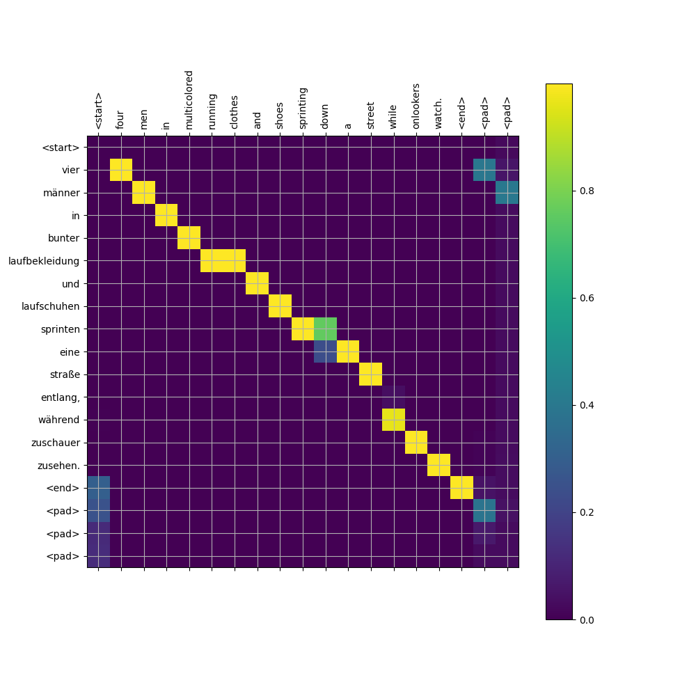

虽然SAM14的负对数损失不如SAM5,但是SAM14的对齐效果却比SAM5好很多.这也侧面说明,仅靠损失函数去指导模型选择,有可能是会误入歧途的.

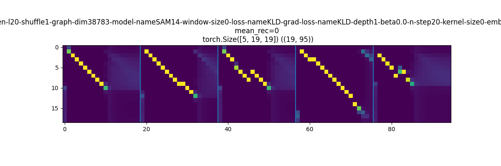

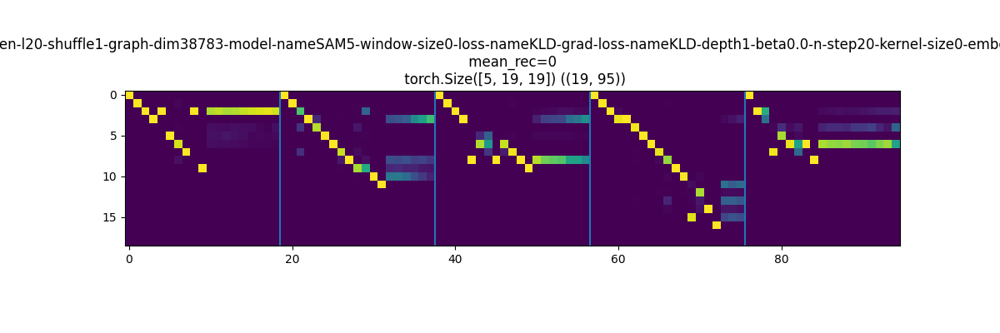

### 质控指标: LPPTT

用log-prob-per-target-token (LPPTT),粗略地衡量一下句子间的对齐程度.应当去除`<sos>`,`<eos>`标签,仅仅对有效令牌做预测

### 与词向量的关联

词向量做了平均场近似,Model1则是在alignment space上做了混合模型. 从这个角度讲,Model1的自由度高于word2vec. 这个自发产生的自由度,隐含了一种关系的对称性,也就是用同一个关系矩阵去在不同的edge上作用.
并在将原始概率做混合模型分解的时候自然地导出. 这样做的结果是,我们会把数据投射到一系列连接图上,而且是禁止自连接的图, 数据就变成了一系列向量和一系列边的形式.

Model1对于alignment的均匀分布,其实是一种最简单的Bayesian先验. 然而NMT所需要的对齐语料的成本并不低,所以
要有比较好的方法去自动标注这些平行语料.

相同的思想完全也可以迁移到LanguageModel上,从这个意义上讲BERT和GPT的建模方法都是poorly principled,完全
基于transformer经验函数形成的构建.从Model1的Alignment思想出发,我们完全可以得到一个不需要transformer函数的模型

用这个AutoAlignmentModel需要区分的一个非常基础的问题就是Tokenization.因为charLevel Alignment和WordLevel Alignment的性质很有可能是不一样的,这个在中文语料上应该比较好验证.这样可能可以用一个通用的框架在不同层次对语言数据进行建模


### 备注和讨论:

今天按照Bahdanuau2014的图去搜了一下复现方法,发现一篇有趣的
pervasive Attention with 2D convolution (Elbayad2018)
用 7M 的参数量复现了 59M Transformer的 BLEU, 不过FLOPS计算量差不多. 手动捋了一下WMT14,发现attention图要复现出来并不是那么trivial.而且Bahdanuau2014居然到处都找不到code,好像是因为其依赖Theano的Groundhog框架已经挂掉几年了

[Google image search](https://www.google.com.hk/imgres?imgurl=https%3A%2F%2Fmiro.medium.com%2Fmax%2F1284%2F1*Zd5VeDGHmNBQo-bwa7bOIg.png&imgrefurl=https%3A%2F%2Ftowardsdatascience.com%2Fend-to-end-attention-based-machine-translation-model-with-minimum-tensorflow-code-ae2f08cc8218&tbnid=3eBlnkQdTTewVM&vet=12ahUKEwij66johZH5AhVZxosBHbshDtMQMygOegUIARDVAQ..i&docid=8LILCvSJCcQH9M&w=642&h=647&q=machine%20translation%20attention%20matrix%20github&client=ubuntu&ved=2ahUKEwij66johZH5AhVZxosBHbshDtMQMygOegUIARDVAQ#imgrc=3eBlnkQdTTewVM&imgdii=HTU8Baqht8I9UM)

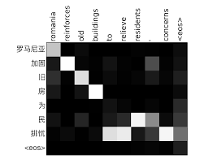

ConvS2S 看起来蛮有吸引力的. attn2d也可以考虑作为接下来的复现目标


### 画廊: 

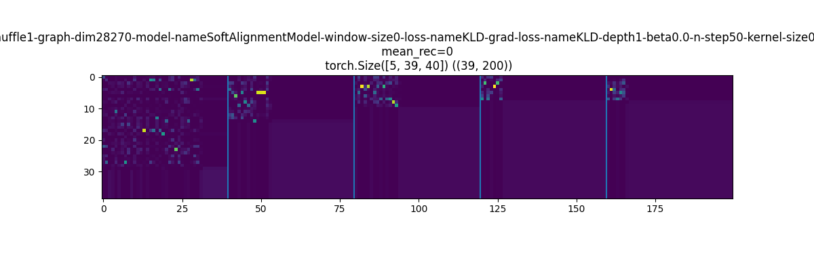

### 代码:

torchtext的数据加载挺魔幻的,正在尝试理解

关于`torchtext>=0.8.0`后的BucketIterator语法的迁移 [Issue969](https://github.com/pytorch/text/issues/969)


在0.8.0版本[data/iterator.py](https://github.com/pytorch/text/blob/release/0.8/torchtext/data/iterator.py)下有调用链条

`data.BucketIterator -> data.pool -> data.batch`

但是实际上把token转化成index的代码是 Field.numericalize ,扒源码+pdb可以发现,是`data.batch.Batch.__init__` 在实例化的过程中调用了 `dataset.fields` 相关方法触发了 `Field.vocab` 的数值转换.不过我最后图方便还是直接使用了`BucketIterator`,但是对train和test做了特殊处理来模拟一个dataloader生成的iterator.

example from doc

```python
# continuing from above
mt_dev = data.TranslationDataset(
    path='data/mt/newstest2014', exts=('.en', '.de'),
    fields=(src, trg))
src.build_vocab(mt_train, max_size=80000)
trg.build_vocab(mt_train, max_size=40000)

train_iter = data.BucketIterator(
    dataset=mt_train, batch_size=32,
    sort_key=lambda x: data.interleave_keys(len(x.src), len(x.trg))
    )
```

example adapted 这里抛弃了iterator,直接用了更底层的方法. 这样会比较容易Adapt进目前的markov_lm架构里.

```python
    src = tgt = torchtext.data.Field(lower=False, include_lengths=False, batch_first=True,fix_length=fix_length)
    root = DIR
    ret = torchtext.datasets.Multi30k.download(root)
    m30k = torchtext.datasets.Multi30k(root+'/multi30k/train',('.de','.en'),(src,tgt))
    src.build_vocab(m30k, max_size=80000)
    tgt.build_vocab(m30k, max_size=40000)
    src.numericalize([m30k[0].src])
```

## 参考

- Bahdanau-Bengio2014: Neural Machine Translation by Jointly Learning to Align and Translate <https://arxiv.org/abs/1409.0473.pdf>
    - Github: <https://github.com/lisa-groundhog/GroundHog/tree/master/experiments/nmt>
    - Polarion的博客<http://polarlion.github.io/nmt/2016/06/06/ground-show-alignment.html>


Tu2016 Modeling Coverage for Neural Machine Translation <https://arxiv.org/abs/1601.04811>

- Elbayad2018 Pervasive Attention: 2D Convolutional Neural Networks for Sequence-to-Sequence Predictiton <https://aclanthology.org/K18-1010.pdf>
    - <https://github.com/elbayadm/attn2d>

Gehring2017 ConvS2S: Convolutional Sequence to Sequence Learning <https://arxiv.org/abs/1705.03122>

Nvidia OpenSeq2Seq <https://github.com/NVIDIA/OpenSeq2Seq>

WMT14 by Stanford NLP <https://nlp.stanford.edu/projects/nmt/>

- cdyer2013: A Simple, Fast, and Effective Reparameterization of IBM Model 2<https://aclanthology.org/N13-1073.pdf>
    - fast_align: <https://github.com/clab/fast_align>

- Vogel1996: HMM-Based Word Alignment in Statistical Translation <https://aclanthology.org/C96-2141.pdf>