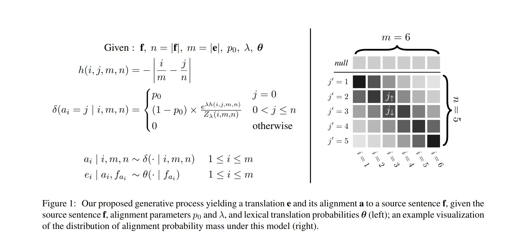

#! https://zhuanlan.zhihu.com/p/545784395

# 9018-IBM模型和统计机器翻译: IBM Models and Statistical Machine Translation

[CATSMILE-9018](http://catsmile.info/9018-ibm-translator.html)


```{toctree}
---
maxdepth: 4
---
9018-ibm-translator.md
```

## 前言

- 背景与动机:
    - 最近发现了IBM Model这个宝藏,顺便看一下增量EM
    - cdyer真是良心工作者,我估计cdyer2013的复现难度会比Bahdanau2014低一些,因为前者是cpp写的,后者是theano写的,web-demo居然还混杂了php和perl这些上古语言..当然,魔改groundhog显然比魔改fast_align更简单一些
- 结论: 
- 完成度: 低
- 备注: 
- 关键词: 
- 目标和展望方向:
- 相关篇目:
- CHANGLOG:



chrisDyer2013: M-step太难了算不出来,所以直接改成gradient ascent了. 确实是常用近似技巧

这篇文章的模型是基于Model2的,我们知道Model2=Model1+alignmentScore,所以只要着重理解alignmentScore就可以了.dyer原文描述如下.

> Our formulation, which we write as δ(ai = j |
i, m, n), is shown in Fig. 1.2 The distribution over
alignments is parameterized by a null alignment
probability p0 and a precision λ ≥ 0 which con-
trols how strongly the model favors alignment points
close to the diagonal. In the limiting case as λ → 0,
the distribution approaches that of Model 1, and, as
it gets larger, the model is less and less likely to de-
viate from a perfectly diagonal alignment. The right
side of Fig. 1 shows a graphical illustration of the
alignment distribution in which darker squares indi-
cate higher probability.

这里用超参数 $\lambda$ 控制了alignment从均匀到对角线之间的渐变. (0对应均匀,无穷大对应(对角?)) 这里
图中表示的是 $h(i,j,m,n)$ 也就是对于各个长度和各个alignmentPair, 有一个固定的参数, 似乎是并没有强制要求对角线的,有兴趣可以plot出来看看参数结果是多少. 我怀疑cdyer可能在初始化的时候用了对角线.

其实


### 其他增量EM

Cappe2009:  Of course, this algorithm is of practical interest only if it is possible to compute and maximise
ˆQn(θ) efficiently.


From Liang2009

> The first is incremental EM (iEM) (Neal and Hin-
ton, 1998), in which we not only keep track of μ but
also the sufficient statistics s1, . . . , sn for each ex-
ample (μ = ∑n
i=1 si). When we process example i,
we subtract out the old si and add the new s′
i.

> Sato and Ishii (2000) developed another variant,
later generalized by Capp ́e and Moulines (2009),
which we call stepwise EM (sEM). In sEM, we in-
terpolate between μ and s′
i based on a stepsize ηk (k
is the number of updates made to μ so far)

> Stepwise EM is motivated from the stochastic ap-
proximation literature, where we think of approxi-
mating the update μ′ in batch EM with a single sam-
ple s′
i. Since one sample is a bad approximation,
we interpolate between s′
i and the current μ. Thus,
sEM can be seen as stochastic gradient in the space
of sufficient statistics.

> The relationship between iEM and sEM (with
m = 1) is analogous to the one between exponen-
tiated gradient (Collins et al., 2008) and stochastic
gradient for supervised learning of log-linear mod-
els. The former maintains the sufficient statistics of
each example and subtracts out old ones whereas the
latter does not. In the supervised case, the added sta-
bility of exponentiated gradient tends to yield bet-
ter performance. For the unsupervised case, we will
see empirically that remembering the old sufficient
statistics offers no benefit, and much better perfor-
mance can be obtained by properly setting (α, m)
for sEM (Section 4


## 参考


- LIANG2009: Online EM for Unsupervised Models <https://cs.stanford.edu/~pliang/papers/online-naacl2009.pdf>
ance>

- Cappe2009 On-line expectation–maximization algorithm for latent data models. <https://hal.archives-ouvertes.fr/hal-00201327/document> 

- Zhihu72160554-siyu1992 <https://zhuanlan.zhihu.com/p/72160554>

- cdyer2013: A Simple, Fast, and Effective Reparameterization of IBM Model 2<https://aclanthology.org/N13-1073.pdf>