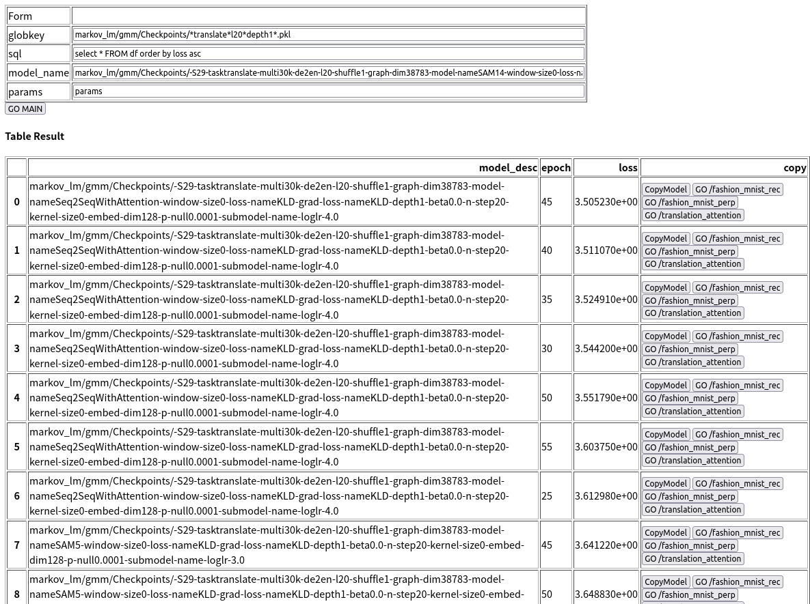
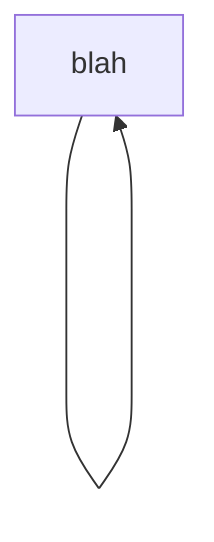

#! https://zhuanlan.zhihu.com/p/548775952
# 9019-统计机器学习和神经网络机器学习的关系 Between Statistical Machine Learning and Neural Network Machine Learning

[CATSMILE-9019](http://catsmile.info/9019-summary-of-recent.html)

## 前言

- 结论:
    - 有一个明确期望的,可达性高,信息浓度高的调试反馈框架,对于模型的不断提升是有着根本的重要性的
- 背景与动机: 
    - [CATSMILE-9017](./9017-attention)从PGM出发构建了用于机器翻译的SoftAlignmentModel,SAM,首次获得了很多关于PGM的实践经验
- 备注: 
- 关键词: 方法论
- 后续目标/展望方向:
- 相关篇目:
    - [CATSMILE-9017](./9017-attention) 
- CHANGLOG:
    - 20220801 INIT

最近花了约一周时间扑在了SAM模型的搭建上,本来只是想复现一下Bahdanau2014的,但是逐渐遇到了各种并没有预料到的各种情况,幸而利用我自己硕士期间对于PGM,HMM和序列模型的理解,重新从第一性原理出发进行了一些建模,验证了这些工具的可靠性.

在这个过程中,最重要的转变是建模目标的转变:从一个唯损失论(loss)的建模目标,转向了基于数据可视化和质控的建模目标. 在其中的很多时候,有些模型是loss更加好看,但模型结构却更为糟糕的.在上一轮的建模里,我有一个专门的脚本(`plot_loss.py`),是用来比较我的各个Checkpoint的loss随epoch变化的情况的,而且也是我曾经的主要焦虑来源:我的loss怎么又掉下去了,怎么又升上来了?为什么Transformer的loss没有像预想的下降,为什么加了Attention效果却变差了呢?

但是,在SAM的构建过程中,我几乎没有怎么使用`plot_loss.py`.一方面是因为我想对各个模型进行方便地下钻显示出对齐图,所以需要一个简单的web界面,另一方面这个web界面通过表格其实也能传达和曲线图差不多的信息. 总而言之,我对可能有影响的超参数进行了统一控制,使用128维的嵌入空间,优化使用无动量的RMSProp,lr=1E-4或1E-3. 所以对于SAM的开发过程其实主要集中在:

1. 用对齐图确保数据的质量. 
2. 提出改进数据或者模型的措施.
3. 在对齐图上验证改进措施的效果. 回到2

可以注意到,这个流程之所以能够实施,是因为对于对齐图(AlignmentMap)有一个非常明确的期望值, 这就允许我从对齐图中汲取反馈信号,来衡量我这个改进措施的合理性. 这个过程其实很类似于带模型的强化学习:通过一个奖励函数指导策略的修改. 和唯loss论相比,唯对齐论的好处就在于这个反馈信息是多维的,而不像loss只有一个干巴巴的数字. 所以,有一个明确期望的,可达性高,信息浓度高的调试反馈框架,对于模型的不断提升是有着根本的重要性的.

在模型的不断迭代中,利用基于Starlette的全栈框架(前端完全残疾的),和(数据,模型,训练会话)解耦的业务模型,我可以很方便地在后端训练,和前端调试反馈进行横跳.如果没有做出这样一个Web界面,我生产调试性图像的速度会慢很多,一致性也会差很多,系统性也会差很多.估计会产生很多零碎的脚本去对各种模型画各种对齐图.从这个角度讲,HTML语言和网页渲染方法,配上一个解耦的业务模型,极大地加速了我对SAM模型的推进.

我相信,统计学习,数据分析,机器学习,其未来一定离不开这样一套通过合适反馈,来进行模型迭代的一套方法论. 这要比盯着loss曲线,调整各种超参数,要有意思太多了. 我真心希望更多人都能享受到这份建模的快乐,也让数据能够更高效地转化为生产力. 都说数据是石油,那总得有钻井和精炼厂还有内燃机不是? 不然油也只是油而已.

### SAM模型的大致开发过程

- 原始动机: 本来只是想复现一下Bahdanau2014的注意力图
- 一开始没注意到Bahdanau2014的源码链接,因为我压根没意识到Groundhog这个框架的存在...
- 于是只好(骂骂咧咧地)寻找其他源码. 反复用Attention,Seq2Seq,NMT关键词在Google和Github搜索,找到一个比较简明的,适合二次开发的实现. <https://github.com/graykode/nlp-tutorial/blob/master/4-2.Seq2Seq(Attention)/Seq2Seq(Attention).py> 简单地进行了加速. 
- 同时搭建了一下 `translation_dataset.py` 框架,事实证明这部分完全可以用 torchtext 替代,不过仍然对于理解数据loading是有好处的. 最重要的是定义了数据集和模型之间的交互形式和字段.
- 把Seq2SeqWithAttention接入了NMT数据集的评估会话,使用了Stanford的WMT14,结果消融实验也不好,对齐图也奇奇怪怪
- 为了调查出问题的根源,从第一性原理对数据进行简单的混合模型建模. 这一段受到cdyer2013启发,主要参照IBM-Model1/2,但是没有使用EM/CountingMatirx部分,而是用了SGD/EmbeddingAndSoftargmax框架,基本沿用了IBM1的概率图,得到SoftAlignmentModel (SAM1). 
    - 后续发现IBM1其实在Vogel1996就有提出,或者可能可以追溯到Brown90.但是mixture想法确实非常简单,
- 因为SAM1实在太简单了,比较容易正确地写出.通过对于对齐图的检视,发现WMT14里面有奇奇怪怪的数据,于是钻研了一下torchtext,换到了Multi30K. 但是沿用了(模型定义,训练会话,数据集接口),为Multi30K单独做了一个数据接口接进来.
- Multi30K的数据比WMT14要干净很多,对齐图也开始符合期望.于是开始在IBM1的基础上往IBM2改,主要是把原先均匀的 $P(\{a\})$ 改成了一个可训练参数. 这个先验很好地捕捉到了平行语料中的对角对齐现象 (SAM5)
    - 共享的可训练参数适合更大的学习率0.001,而Seq2SeqWithAttention适合0.0001(都是RMSProp). 目前原因不明确
- 因为Seq2SeqWithAttention的负对数比SAM5还是要好一些,虽然跟一开始SAM5训练的学习率太小有点关系.我后续测试了几个Seq2SeqWithAttention可能跟SAM5相比的一些区别. 但是目前来看对于LM的引入还不是很恰当.(SAM9,SAM10)
- 出于某些原因,我的注意力又回到了SAM5上,因为SAM5已经很接近Seq2SeqWithAttention的分数了,我想仔细对比看看为啥SAM5没有S2SWA好.于是我仔细地调整了一下对齐变量的先验,而且发现SAM5的对齐图稳定地好于S2SWA,于是我其实没有那么纠结loss的一点区别了,而且目前手上也没有能做头对头比对的工具[TBC,加入HeadToHeadCompare头对头的对比工具].于是我把注意力放到对齐变量的先验上.注意到SAM5的对齐变量先验有着扩散变糊的趋势,我做了一些思想实验,考虑一条对角线如果偏离对角线,受到的损失其实挺大的.于是想拿PFST的Copy/Insertion/Deletion来构建一个模型,但是一时无从下手.于是回到比较熟悉的Needleman-Wunsch比对算法,但是想了想NW算法即便能做自编码,也不能简单地给出一个概率形式.所以硬着头皮又想了一下,核心问题在于 $P(a_i,a_{i+1}) = P(a_i) P(a_{a+1})$ 这个独立性假设有问题,我仅仅按照单独 $a_i$ 偏离对角线的量来计算概率,如果存在 $a_1,a_2,a_3$ 系统性地偏离对角线,但是内部很一致,我是不能很好地捕捉到对于这种结构的倾向性的.所以我需要的是一个联系起相邻的对齐变量的形式,于是自然地就导向了一个时间一致的马尔科夫过程,核心参数为 $P(a_{i+1}|a_i)$ . 这样我可以用一条链重写 $P(a_i,a_{i+1}) = P(a_i)P(a_{i+1}|a_i)$ 而不需要做条件独立分解.
- 然后就是复习了一下前向后向算法的符号形式,把对数似然用动态规划解出来,怼到pytorch里面. 类似SAM5,构造了SAM14将转移矩阵变成了一个参数. SAM5和SAM14的参数对比非常简单明了,很明显SAM14通过采用一个链式结构很好地避免了概率的扩散和模糊.
- 展望:改进调试和反馈系统, 在模型上再加入一些可调整的组件,允许模型记录一些依赖性

### 数据科学中的信息流

- `业务 -> 数据 -> 模型` 在这个链条上,信息是逐渐减少的. 模型不一定能捕捉到数据的所有特征,数据也不能捕捉到业务的所有特征.
- `业务设计 <- 数据结构设计 <- 模型设计` 这是上式,在设计空间的对偶,应当先对业务进行设计,再决定用什么样的数据结构去捕捉业务信息,再决定用什么样的模型去自动分析这些数据结构. 可以说,很多灌水的深度学习的工作,就是没有尊重这个依赖链条,过多地纠结在了模型设计里.
- 当然,后续机器学习的发展方向之一,就是逐渐把这些设计过程集成起来,变成一套统一的方法论,但是目前似乎还没有令人满意的

### 辩经素材

事实上,fast_align真的编译起来和运行起来都非常丝滑,比groundhog要好很多.这其实跟我做生信的经验是类似的,易用性: C/CPP程序 > Java > Python > R, 可扩展性: Python > Java > C/CPP. 当时macs2跟samtools一比就是一个需要装conda和各种依赖库的巨无霸,而samtools就是一个轻巧的binary. 带了神经网络的deepbind就更可怕了,基本上就是又慢又不中用,性价比挺低的.这也体现出神经网络模型的一个特征,基本上都是唯loss论,通过loss来确立自己的不可替代性, 然后将可重复性和可解释性的噩梦一起带给科研人员,说是潘多拉的魔盒真不为过.

-------

加个例子,今天想用torchtext省事加载一下NLP数据集,结果发现旧版example里面的BucketIterator在最新版本里面都deprecated了... 写python简直就是打移动标靶,不freeze req的话你都不知道自己究竟在干什么...
(3.1k stars)

<https://github.com/pytorch/text/issues/969>

事实上OpenNMT-py直接表示我们要不就直接干掉这个依赖(doge)

<https://github.com/OpenNMT/OpenNMT-py/issues/1956>

------

再加个例子,Bahdanuau2014 <https://github.com/lisa-groundhog/GroundHog>, expriments/nmt/test/test.bash 显然是没有做过ci测试的,依赖的系统状态太多了

私以为,一个好的工作应该让合作者可以清晰地想到:哦我可以把这部分的代码移植到这个问题上看看能不能捕捉到XX现象. 但是糟糕的代码却是会: 哦让我们来看看他究竟是怎么画出他文章里的那几张图的. import failed报错了?没有装torchtext?emm好像没有requirements.txt,也没有conda的yaml,好吧那我按照他的dep装一下.哦又报错了?tensor shape not matched? 哎这奇怪了难道我的torch版本不对? 好的换一个...嗯,tensor not on the same device?难道作者居然是用cpu跑的代码吗?好吧那我帮他们重写一下各个device初始化...我靠,device-side assertion?哪里的index超长了吗? 啥,还没有显存了allocation failed? 

相比之下,有binary的工具真是下下来就能用,我高度推荐对可重复性有追求的研究员们多多创造可复用的binary

--- 

Large image datasets today are a mess

<https://medium.com/@amiralush/large-image-datasets-today-are-a-mess-e3ea4c9e8d22>

## 参考

- Bahdanau-Bengio2014: Neural Machine Translation by Jointly Learning to Align and Translate <https://arxiv.org/abs/1409.0473.pdf>
    - Github: <https://github.com/lisa-groundhog/GroundHog/tree/master/experiments/nmt>
    - Polarion的博客<http://polarlion.github.io/nmt/2016/06/06/ground-show-alignment.html>

Tu2016 Modeling Coverage for Neural Machine Translation <https://arxiv.org/abs/1601.04811>

- Elbayad2018 Pervasive Attention: 2D Convolutional Neural Networks for Sequence-to-Sequence Predictiton <https://aclanthology.org/K18-1010.pdf>
    - <https://github.com/elbayadm/attn2d>

Gehring2017 ConvS2S: Convolutional Sequence to Sequence Learning <https://arxiv.org/abs/1705.03122>

Nvidia OpenSeq2Seq <https://github.com/NVIDIA/OpenSeq2Seq>

WMT14 by Stanford NLP <https://nlp.stanford.edu/projects/nmt/>

- cdyer2013: A Simple, Fast, and Effective Reparameterization of IBM Model 2<https://aclanthology.org/N13-1073.pdf>
    - fast_align: <https://github.com/clab/fast_align>

- Vogel1996: HMM-Based Word Alignment in Statistical Translation <https://aclanthology.org/C96-2141.pdf>

## 草稿

