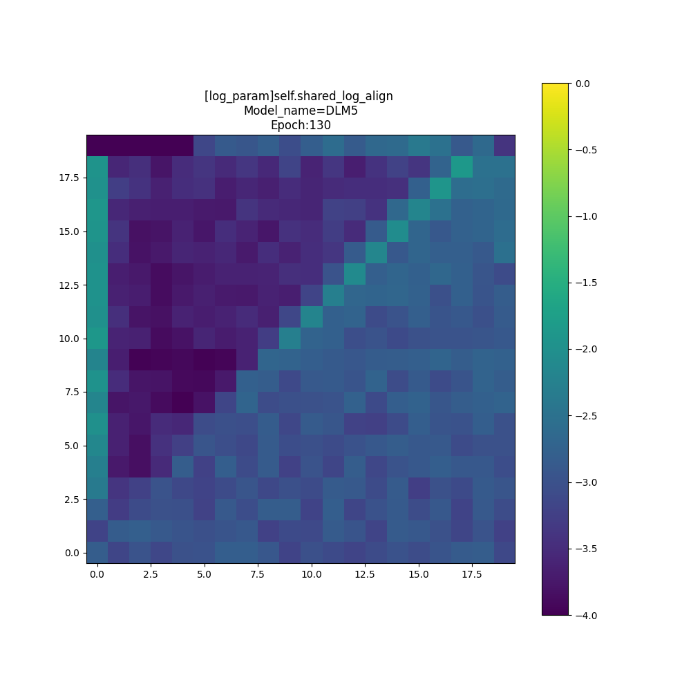
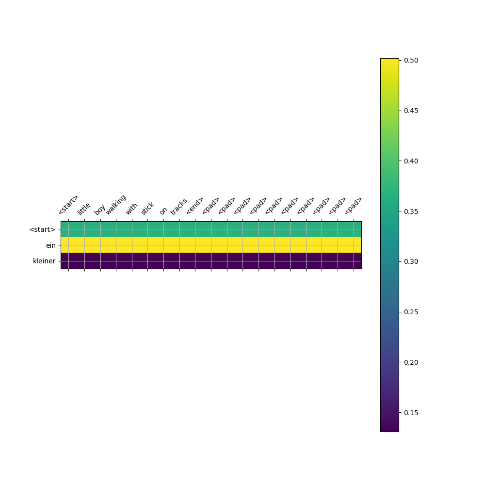
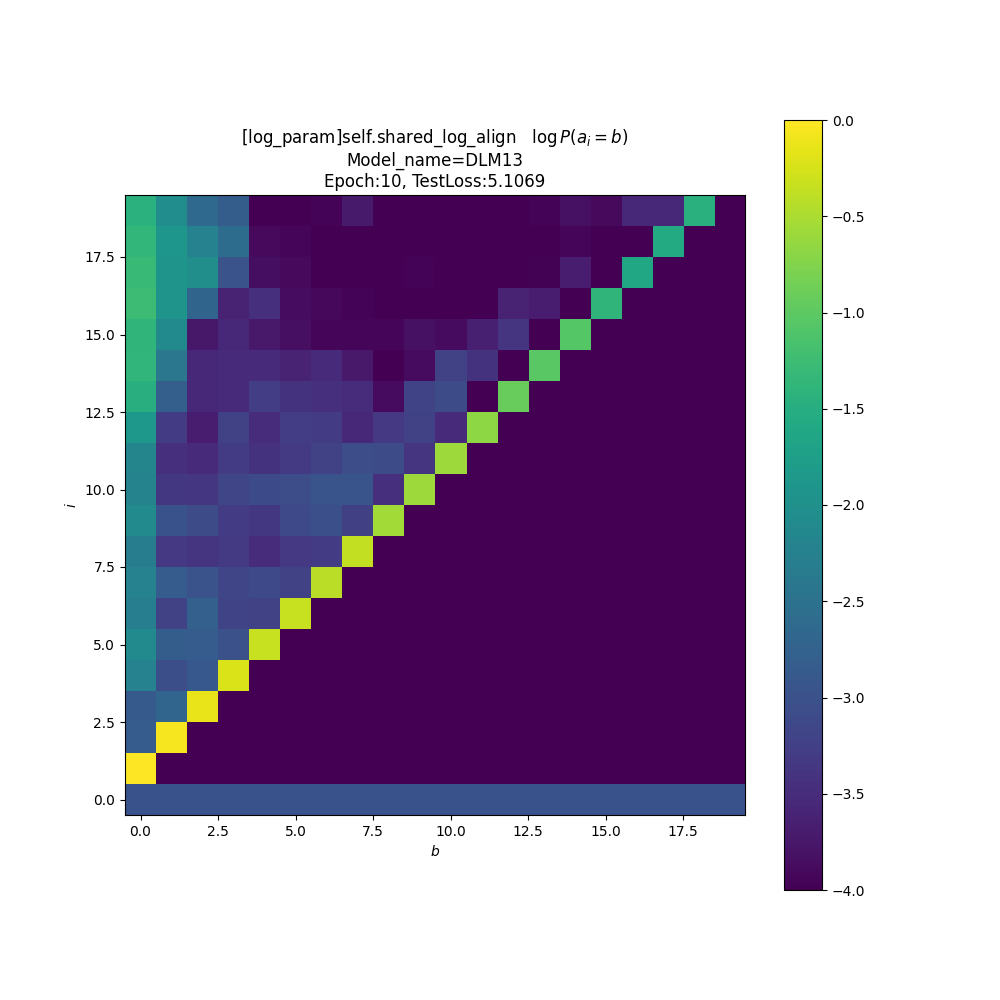
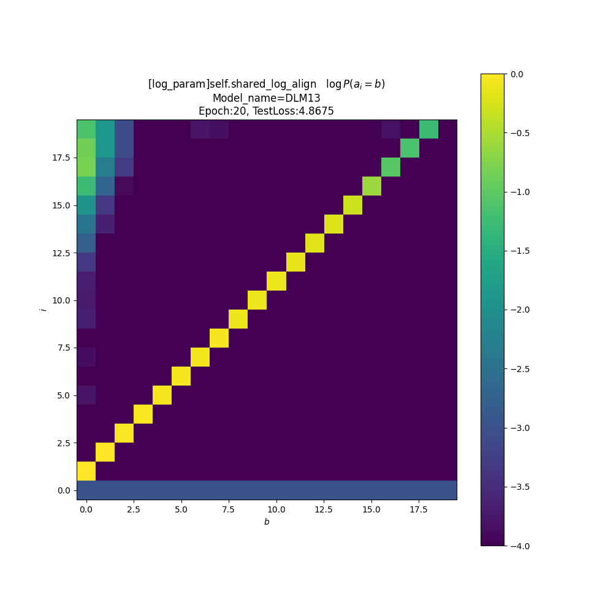
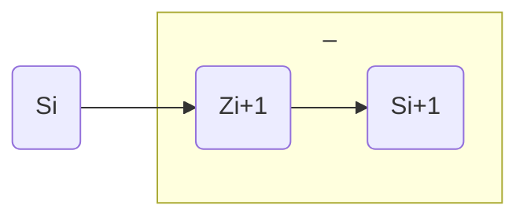
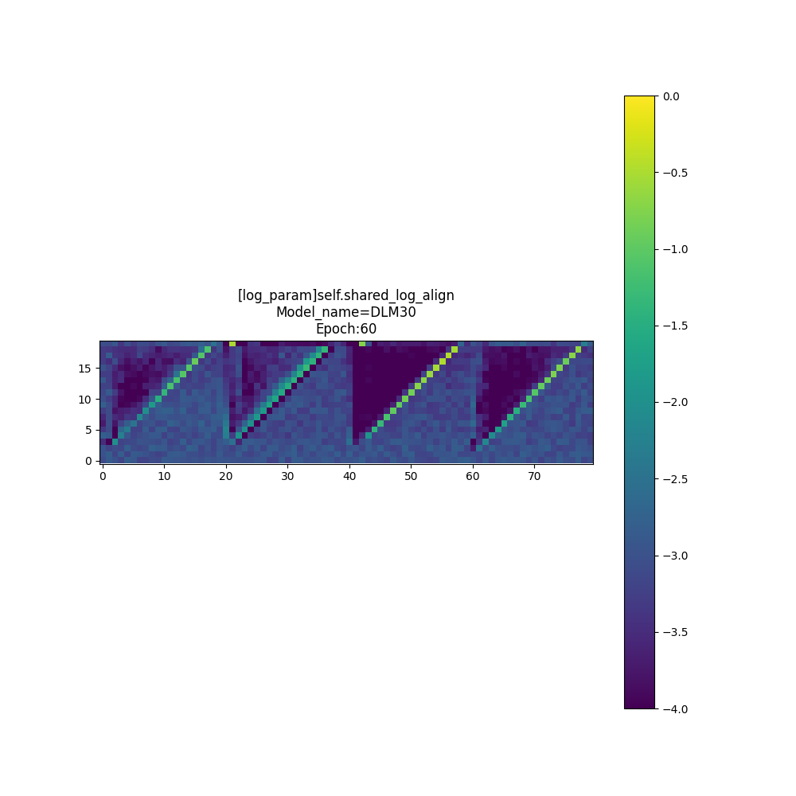

#! https://zhuanlan.zhihu.com/p/548797326

# 9020-一些语言模型的诊断调试工具 Some Diagnostic Tools for Language Models (DLM)

[CATSMILE-9020](http://catsmile.info/9020-language-model.html)

## 前言

- 结论:
    - 嵌入向量的单位球归一化是一个效果很好的魔法...这可能和相似度的点积形式有关?
    - 在单位球归一化的基础上,LSTM可以取得比5-gram好得多的每词困惑度. 如果不使用单位球归一化,LSTM和5gram基本上一样糟糕.这个现象很令人费解.从概率上讲,不对嵌入向量使用单位球归一化,其概率分布在多维空间是无法归一化的,尽管对于有限的token来说概率可以被强行归一化...可能需要检查一下未归一化模型里嵌入向量的模长是否有异动[TBC]
    - Multi30K-EN pplpt=exp(2.963)=19.3
    - 对于含有隐变量的自编码模型一定要加噪,否则其损失函数有可能过拟合/无法采样.
- 背景与动机: 
    - [CATSMILE-9017](./9017-attention)验证了PGM对于构建调试工具的有效性. 但是机器翻译MT没有语言模型LM来得广泛,鲁棒的模型也不多,并不适合做针对transformer架构的深入研究.因此考虑在LM领域开展对于Transformer的架构研究
    - 高效的诊断工具是确保模型健康的前提. 诊断错误会导致没法治病
    - 语言模型的拟合在本质上是对符号关系出现频次的拟合,而不是独立符号出现频次的混合
- 备注: 
- 关键词: 方法论/技术报告
- 后续目标/展望方向:
    - [TBC,解决字符级别词表的自动生成]
- 相关篇目:
    - [CATSMILE-9017](./9017-attention) 
- CHANGLOG:
    - 20220810 更新GRU相关的DLM46,DLM47消融/变异实验
    - 20220801 INIT

语言模型在本质上是一个符号序列模型,语言本身具有复合性(Compositionality),用不可分割的符号原子构建出更加抽象的符号(分子),乃至更大的结构. 对于词语的分割是语言模型的一个基本方法,尤其对于表音语言来说,通常用空格和标点符号就能实现语言的自然分割. 

衡量一个语言模型的目标自然是对数似然 $\log P(s_1,s_2,s_3,\dots,s_T)$ .对于有标准Token化的数据,一般对序列长度进行归一化来进行计算,称之为困惑度 $\log \text{ppl}= - E_{q(\{s\})_b}[{1\over T_b} \log P(s_1,s_2,s_3,\dots,s_T)]$ .可以发现,对于同样的序列和似然,切分Token数量越少,其负困惑度就越高,困惑度就越低. 因此在不同的分词标准上,比较困惑度是没有意义的.

### Perplexity per token 每词困惑度

困惑度本身是一个非线性指标/指数线性指标,其换算应当在对数空间内进行

$$\begin{align}
& \log (\text{ppl-per-token})  
\\ & = { 1 \over  \sum_b T_b } \log P(\{s\}_1,\{s\}_2,\dots \{s\}_B) 
\\ & = { 1 \over  \sum_b T_b } \sum_b \log P(\{s\}_b)
\\ & = { 1 \over  \sum_b T_b } \sum_b T_b {\log P(\{s\}_b) \over T_b}
\\ & =  \sum_b {T_b  \over  \sum_b T_b } {\log P(\{s\}_b) \over T_b}
\\ & =  \sum_b {T_b  \over  \sum_b T_b }   \log (\text{ppl-per-token})  
\end{align}$$

我们发现,对于每一个序列,我们可以计算pplpt,然后在合并不同批次/不同序列的时候,需要按照其包含的token数量对于pplpt赋予不同权重再进行加权平均. 如果直接采取平均的方式,就不能很好地处理不同批次间的Token数量差异了.

模型困惑度 from PaperWithCode
- PTB ppl: <https://paperswithcode.com/sota/language-modelling-on-penn-treebank-word>
- Wikidata2 ppl: <https://paperswithcode.com/sota/language-modelling-on-wikitext-2>


### 迭代语言模型的损失函数 Recursive Language Model

关于从RNN/AR模型里采样的问题,我们可以先观察一下RNN的损失函数,对于观测序列 $\{s\}_b=\{s_0,s_1,\dots,s_T\}$ 和隐态序列 $\{z\}_b=\{z_0,z_1,\dots,z_T\}$ 


### DLM1: 简单的带N-gram模型 

用类似卷积的方式对序列的似然按照Token进行分解,可以认为是一个特殊的马尔科夫过程,用一个简单的条件概率捕捉

$$
P(s_i|s_{i-5:i-1}) = \text{softargmax}({s^k}^T(\sum_{j=1}^5 W_{j} s_{i-j}),s^k=s_i)
$$

### DLM2: 带混合性质的单祖先模型

也是N-Gram的一种,但是引入一个隐变量 $a_i$ ,来表征词语的直接父节点. DLM2跟DLM1相比的优势就在于这个感生的隐变量,DLM1当然也可以用AutoEncoder的形式去得到一个隐变量. 但是DLM2的好处在于这个隐变量是离散的,直接表征明确关系的一个变量.比如(主语-谓语)关系,(修饰语-被修饰语关系). 因为语法树在语言学里面是一个常用概念,所以这种隐变量结构有可能能对应到语法树上面去.

$$\begin{align}
P(s_i|s_{i-5:i-1}) = \sum_j P(s_i,a_i|s_{i-5:i-1})
\\ =\sum_j Q(s_i|s_{a_i} ) P(a_i)
\\ =\sum_j \text{softargmax}({s^k}^T W s_{a_i},s^k =s_i) P(a_i)
\end{align}$$

### DLM3: 排列混合的多祖先模型,太慢太慢...

类似DLM1,但是在重排列上进行求和.[TBC,这里用下标用减法其实不太合适,应当用笛卡尔数组,因为不具有结合性]

$$\begin{align}
P(s_i|s_{i-5:i-1}) &= \sum_{b_{i-5:i-1}} P(s_i,b_{i-5:i-1}|s_{-:i-1})
\\ &=\sum_{b_{i-5:i-1}} Q(s_i|s_{b_{i-1}},s_{b_{i-2}},s_{b_{i-3}},s_{b_{i-4}},s_{b_{i-5}})P(b_{i-5:i-1})
\\ &=\sum_{b_{i-5:i-1}} \text{softargmax}({s^k}^T (\sum_{j=1}^5 W_j s_{b_{i-j}}),s^k =s_i) P(b_{i-5:i-1})
\end{align}$$


### DLM4: 多个N-gram模型的混合

五混似乎还没有单模型来得好? 可能这里没有什么值得捕捉的变量

### DLM5: DLM2 带对齐变量先验

可以发现,先验捕捉到的主要是条件独立信息,也就是都倾向于直接从`<sos>` Token重新产出下一个Token. 这意味着我们可能可以用一个平行的模型来建模短语中的过程,从而避免反复开始




### DLM6: DLM5,但是带两种转移变量

### DLM7: 单父节点混合

因为数据的embed是任意的,所以用混合模型直接去fit嵌入空间上的密度没有意义. 有意义的信息蕴含在TokenSpace的共现现象里

$$
P(s_{i+1} | s_{i}) = {1\over 2}(Q(s_{i+1}) + W(s_{i+1}|s_i))
$$

### DLM8: 和DLM7一样但是有多种转移态

### DLM9: 纯粹用独立混合节点预测令牌

不引入参变量,是很难通过增加Component来提高拟合效果的.这里简单跑一下验证一下这个预测.



### DLM10: Remix,预测离散状态的混合比重

核心好处是快,而且确实能学到关系的不同种类. 不过并不能直接很好地理解这些离散状态有啥区别. 和DLM11在前30Epoch不分上下,但是因为并行性质,远快于DLM11

$$\begin{align}
P(s_{i+1}|s_i) 
&= \sum_{z_{i+1}} P(s_{i+1},z_{i+1}| s_i) 
\\ &= \sum_{z_{i+1}} P(s_{i+1}|z_{i+1})P( z_{i+1} | s_i)\\
P(s_{i}|z_{i}) &= \text{softargmax}({s^k}^T W v(z_{i}),s^k = s_i)
\end{align}$$

### DLM11: RNNWithNoAttention

单层tanh的RNN,不带注意力

### DLM12: LSTMWithNoAttention

单层的LSTM,不带注意力

### DLM13: RemixWithAlignment

DLM10只允许使用直接的左侧,这里将父节点扩展到任意左侧节点. 目标是看一看是否存在近程效应.

$$\begin{align}
& P(s_{i+1}|s_{-:i})  
\\ &= \sum_{z_{i+1}}\sum_{a_{i+1}}P(s_{i+1},z_{i+1},a_{i+1}|s_{-:i})
\\
&= \sum_{z_{i+1}}\sum_{a_{i+1}}P(s_{i+1},z_{i+1}|a_{i+1},s_{-:i})P(a_{i+1}|s_{-:i}) \\
&= \sum_{a_{i+1}} \sum_{z_{i+1}} P(s_{i+1},z_{i+1}|s(a_{i+1}))P(a_{i+1}|s_{-:i}) \\
&= \sum_{a_{i+1}} \left( \sum_{z_{i+1}}  P(s_{i+1}|z_{i+1})P(z_{i+1}|s(a_{i+1}))\right) P(a_{i+1}|s_{-:i}) \\
\end{align}$$


整理后发现,这边只要确保各个概率局部归一化就可以了,可以运用MessagePassing/ForwardAlgorithm的技巧避免占用过多内存.可以看到,这里捕捉到的最强依赖还是来自于前一词.这当然跟模型的架构会有一些关系







### DLM14: 加性双父节点的模型

没啥大区别,父节点选择不是很一致

### DLM15: 局部HMM的模型

为了向长链HMM演变,先把DLM10用局部HMM重写一遍.事实上这个操作除了增加一个转移矩阵外并没有啥大区别,因为log_softmax都已经表征了局部归一化了

$$
P(s_{i+1}|s_i) = \sum_{z_{i+1}}P(s_{i+1},z_{i+1}| s_i)
\\ = \sum_{z_{i+1}}P(s_{i+1}|z_{i+1}) P(z_{i+1}| s_i)
\\ = \sum_{z_{i+1}}P(s_{i+1}|z_{i+1}) P(z_{i+1}| z_i ) P(z_i | s_i)
\\ = \sum_{z_{i+1}}P(s_{i+1}|z_{i+1}) P(z_{i+1}| z_i ) {  P(z_{i}, s_i)\over\sum_{z_{i}} P(z_{i}, s_i)}
\\ = \sum_{z_{i+1}}P(s_{i+1}|z_{i+1}) P(z_{i+1}| z_i ) {   P(z_{i})P(s_i| z_i) \over\sum_{z_{i}} P(z_{i})P(s_i| z_i)}
$$


### DLM16: 依赖前一词的CRF模型

加入HMM的目标是为了更加方便地建模 $P(s_{i+2} | s_{i+1},s_{i})$ .其实说实话直接用把转移矩阵参数化似乎也是可行的...直接用转移矩阵的限制条件可能有一点强,因为转移是不依赖于观测量的.那么考虑一下CRF分解...实际上,CRF分解中的状态函数似乎是不必要的,因为可以融合进不带归一化的转移函数里.

这里先测试一下基于转移参数化的前一词的条件分布

$$\begin{align}
blah
\end{align}$$

### DLM17: 依赖前两词的CRF模型

但是这玩意为啥跟前一词的模型在LOSS上没有区别呢??....

$$\begin{align}
P(z_{i+2}|s_i,s_{i+1}) = \sum_{z_{i+1}} P(z_{i+2},z_{i+1}|s_{i+1},s_i) 
\\ = \sum_{z_{i+1}} P(z_{i+2}|z_{i+1})_{s_{i+1}} P(z_{i+1}|s_{i+1},s_i) 
\\ = \sum_{z_{i+1}} P(z_{i+2}|z_{i+1})_{s_{i+1}} {P(z_{i+1}|s_{i+1}) P(z_{i+1}|s_i) \over \sum_{z_{i+1}}P(z_{i+1}|s_{i+1}) P(z_{i+1}|s_i)}
\end{align}$$


### DLM18: 前一词混合模型

允许选择固定向量 $z_k$ 或者 $W^T s_{i-1}$  ,看看是否会在两种间抉择. 固定向量对于向量信息保留的比较少, 而旋转对向量信息保留的多,可能更适合模拟连续的词语.

结果: 模型很少使用旋转来获得下一词

<del>FFFKK 掉档了,DLM6-DLM17不见了</del> 找到了,虚惊. [TBC,自动保存和恢复需要提上日程了]

### DLM19: 用一个条件概率下界来增广状态空间

动机: 做一个思想实验,如果要通过HMM来表征句子的生成过程, 那就势必要增加每个时间步的状态空间,否则即便我们能最优地预测到S个状态,也会被这个瓶颈所限制. 比如词表里有10,000个单词,采用了500个状态,即使每个状态最优地对应到200个单词上的均匀分布,那么其困惑度也最低只能降低到200.要想像GPT一样降低困惑度到20,那就得至少使用5000个状态. 直接使用5000x5000的转移矩阵进行拟合,是很低效的.因此就有了把隐变量分解成条件独立的变量的想法,这样可以把一个巨大的相空间100x100x100分解成3个100态Categorical变量的外积,从而只需要考虑3x(100x100)的转移变量,而不需要考虑(100x100x100)^2.

状态空间的量对于拟合能力有很大的影响,而且前述模型不能很好地描述一个正交解耦的相空间.如果我们得到了两个局部归一化的弱生成器,简单地将条件概率相乘,会给出一个未归一化的概率.可以考虑用如下不等式,来将此乘积视作是一个归一化概率的下界. 在计算实际损失时,再计算这个昂贵的归一化常数.

实验结果: 这个下界可能不够紧,训练的效果不是很理想

$$\begin{align}
&P(s_{i+1}|s_i) \\
&\propto \sum_{s_{i+1}}P(s_{i+1}|z_{i+1}) P(z_{i+1}|s_i) \sum_{w_{i+1}} P(s_{i+1}|w_{i+1}) P(w_{i+1}|s_i) \\
\dots \\
&P(s_{i+1}|s_i) \\
&= {\sum_{w_{i+1},z_{i+1}}P(s_{i+1}|z_{i+1}) P(s_{i+1}|w_{i+1})P(z_{i+1}|s_i)P(w_{i+1}|s_i)\over \sum_{s_{i+1}} \sum_{w_{i+1},z_{i+1}} P(s_{i+1}|z_{i+1}) P(s_{i+1}|w_{i+1})P(z_{i+1}|s_i)P(w_{i+1}|s_i)}
\end{align}$$

我们可以证明,分母是小于1的

$$\begin{align}
&\text{Denom} 
\\&= { \sum_{s_{i+1}} \sum_{w_{i+1},z_{i+1}} P(s_{i+1}|z_{i+1}) P(s_{i+1}|w_{i+1})P(z_{i+1}|s_i)P(w_{i+1}|s_i)}
\\&= { \sum_{s_{i+1}} \sum_{z_{i+1}} P(s_{i+1}|z_{i+1}) P(z_{i+1}|s_i) \left(\sum_{w_{i+1}}P(s_{i+1}|w_{i+1})P(w_{i+1}|s_i)\right)}
\\&\leq { \sum_{s_{i+1}} \sum_{z_{i+1}} P(s_{i+1}|z_{i+1}) P(z_{i+1}|s_i) \cdot 1 }
\\&= { 1  }
\end{align}$$

因为分母小于1,所以这个概率大于其分子,为了简化其分子的具体计算,可以用条件独立公式对每个节点单独logsumexp

$$\begin{align}
&P(s_{i+1}|s_i) \\
&\geq  \sum_{w_{i+1},z_{i+1}}P(s_{i+1}|z_{i+1}) P(s_{i+1}|w_{i+1})P(z_{i+1}|s_i)P(w_{i+1}|s_i)
\\ &=  \sum_{w_{i+1},z_{i+1}} P(s_{i+1}|z_{i+1}) P(z_{i+1}|s_i) P(s_{i+1}|w_{i+1})P(w_{i+1}|s_i)
\\ &=  \sum_{z_{i+1}} P(s_{i+1}|z_{i+1}) P(z_{i+1}|s_i) \sum_{w_{i+1}}  P(s_{i+1}|w_{i+1})P(w_{i+1}|s_i)
\\ &=  \left( \sum_{z_{i+1}} P(s_{i+1}|z_{i+1}) P(z_{i+1}|s_i) \right) \left( \sum_{w_{i+1}}  P(s_{i+1}|w_{i+1})P(w_{i+1}|s_i) \right)
\end{align}$$

这一技巧完全可以扩展到多个条件分布上,比较极端的例子是每个弱态都用伯努利变量.

### DLM20: 用前几词预测下一词

Very prone to overfitting....

### DLM21: DLM20,对输出层重参数化

### DLM22: DLM20, 对向量重整化为单位球上的分布

### DLM23: DLM12, 对向量重整化为单位球上的分布

DLM22和DLM23对于向量长度归一化后,显著好于未归一化的模型,这应该是由于归一化以后模型不能通过更改模长来改变分数了,只能专注于方向的确定. pplpt可以达到约20, 也就是在对数空间 log(pplpt)<=3.0

### DLM30: 用平均场近似,辅以slot预测器构造的下一词

ngram的一个改造方向是将gram做成灵活的元组,而不是固定前x个前导词.这样理论上可以更好地处理反序问题,并且捕捉更长距离的信息. 这意味着我们取一个条件概率

$$
P(s_{i+1}|b_{i+1}^1,b_{i+1}^2,b_{i+1}^3,s_{-:i}) \\
= \text{softargmax}(s_{k}^T (W_1 b_{i+1}^1 + W_2 b_{i+1}^2 + W_3 b_{i+1}^3),s_k=s_{i+1})
$$

于是剩下的目标就是构造辅助变量的分布,并在其分布上求条件概率的期望.不过这个分布上的期望涉及组合求和,如果不用动态规划的话很难精确求解.

$$
P(b_{i+1}^1,b_{i+1}^2,b_{i+1}^3|s_{-:i})
$$

DLM30对于每个 $P(b_i^m|s_{-:i})$ 单独进行建模,考虑一个softargmax过程

$$
P(b_i^m = s_j) \propto P(j|i)\exp (W_m s_j) \\
P(b_i^m = s_j) = \text{softargmax}(\log P(j|i) +W_m s_j, j=k)
$$

检查优化得到的先验 $P(j|i)$ ,基本上对应的是前X词的对齐模式,侧面印证前X词本身是一个很稳定的预测范式.



### DLM31

DLM30的预测器并没有对b变量代表的context内部进行建模.最简单的方式是假设一个链式HMM,对b变量的概率进行分解

$$
P(b)
$$

### DLM40: minGPT接口

<!-- 目前跑不出啥好看的效果 -->

### DLM43: GRU-RNN with vector emission

### DLM44: GRU-RNN with mixture emission

### DLM46: GRU-RNN with mixture emission with pytorch impl

对GRU做了一下消融实验,发现 `UM[4]` 消融掉以后对于指标还有正向效果. 看起来把0/2/3/4/5删除掉似乎都没有大的区别. 但是0和3显然是有相互作用的,同时变异了就完全感知不了输入了. 为了简化后续分析,我们将2450变异株称为MGRU (Minimal Gated Recurrent Unit ). 后续文献搜索显示这跟GBZhou2016提出的GRU变种MGU有一定相似性,并且跟再后来的Heck2017提出的MGU2变种联系紧密.说明这种简化是被反复发现有效了的

```python
    def forward(self,x,h0):
        B = x.size(0)
        T = x.size(1)
        EO = self.hidden_size
        outs = torch.zeros((B,T,EO),device=self.device,dtype=self.dtype)
        ht1 = h0
        UM = self.NOT_MUTATED
        for t in range(T):
            xt = x[:,t]
            ft  = (   UM[0] * xt @ self.wxf
                    + UM[1] * ht1 @ self.whf
                    + UM[2]*self.bf[None,:]).sigmoid()
            htp = (   UM[3] * xt @ self.wxh 
                    + UM[4] * (ht1 * ft) @ self.whh
                    + UM[5] * self.bh[None,:]).tanh()
            h   =  UM[6] * (1-ft) * ht1 + UM[7]* ft * htp
            outs[:,t] = h
            ht1 = h
        return outs, ht1

```

| model_desc | mutated_pos | epoch | loss_E20  | loss_E30  |
|------------|-------------|-------|---------|---------|
| DLM47      | 4,6         | 20    | 3.739  | 3.560 |
| DLM46      | 0,2,4,5     | 20    | 3.7811 |  |
| DLM46      | 0,4,5       | 20    | 3.745  |  |
| DLM46      | 4           | 20    | 3.7434  | 3.62257 |
| DLM51      | 0,4,5       | 20    | 3.775  |  3.709 |
| DLM46      | 5           | 20    | 3.7914  | 3.70547 |
| DLM46      | 0           | 20    | 3.80641 | 3.76959 |
| DLM46      | 2           | 20    | 3.81147 | 3.73109 |
| DLM46      | 3           | 20    | 3.81406 | 3.72296 |
| DLM46      | -1          | 20    | 3.8209  | 3.72316 |
| DLM47      | 4,6,9       | 20    | 3.859   |    |
| DLM47      | 4,6,7       | 20    | 3.921   |    |
| DLM47      | 5           | 20    | 4.03182 | 3.86436 |
| DLM46      | 1           | 20    | 4.0029  | 3.89041 |
| DLM47      | 4,6,11      | 20    | 4.03    | 3.85   |
| DLM47      | 4,6,10      | 20    | 4.052   | 3.779   |
| DLM46      | 6           | 20    | 4.21133 | 4.1882  |
| DLM47      | 4,6,8       | 20    | 4.242   |    |
| DLM46      | 3,2,4,5         | 20    | 4.296  |  4.091|
| DLM46      | 7           | 20    | 4.31114 | 4.11738|
| DLM29      | -1          | 20    | 4.31308 | 4.28537|
| DLM47      | 4              | 20    | 4.527  |  4.348|

loss是Multi30k-en数据上的每词困惑度 $\log(pplpt)$


PS: Table2Markdown 工具
    - 这个Table2Markdown转换器酷了.(File-PasteTableData)<https://www.tablesgenerator.com/markdown_tables>
    - 还有这个简洁版本 <https://tabletomarkdown.com/convert-spreadsheet-to-markdown/>

DLM47的mut4是调整了激活函数为sigmoid. mut4,6是互补的变异,mut6确保在mut4的的基础上,让参数矩阵面对一个0-centered而不是0.5-centered的数值. 这意味着我可以在mut4的基础上对MGRU赋予一个混合模型的内涵,据我所知之前对RNN的LSTM变种是并未能够做到的.让我们尝试写下这个模型. 我们将模型看成是一个 $P(h_t^f=1)$ 的迭代,引入一个图模型上的链接变量 $a_{t+1} \in \{h_t,g_{t+1}\}$ .不过这里对于记号的处理有一些粗糙,大致意思是用Bernoulli变量和其概率作为迭代参数进行边际化. 事实上,这里的随机变量一般都是Bernouli的参数,所以是用图模型决定哪个Bernoulli参数被继承到下一步去.

$$\begin{align}
&P(h_{t+1}^f=1|\{h\}_-,\{x\}_-) \\
&= \sum_{a_{t+1}}P(h_{t+1}^f=1,a_{t+1}|h_t,x_{t+1},\{h\}_-,\{x\}_-)  \\ 
&= \sum_{a_{t+1}}P(h_{t+1}^f=1|a_{t+1})P(a_{t+1}|h_t,x_{t+1},\{h\}_-,\{x\}_-,)  \\ 
&= \sum_{a_{t+1}} P(v(a_{t+1})=1|a_{t+1},h_t,x_{t+1},\{h\}_-,\{x\}_-) \\
& \cdot P(a_{t+1}|h_t,x_{t+1},\{h\}_-,\{x\}_-) 
\\ 
& \left \{ \begin{aligned}
& P(v(a_{t+1})=1|a_{t+1}=h_t)     &=& P(h_t=1|\{h\}_-,\{x\}_-) 
\\ & P(v(a_{t+1})=1|a_{t+1}=g_{t+1}) &= &P(g_{t+1}=1|x_{t+1}) 
\\ & P(a_{t+1}=g_{t+1}|h_t) 
&=& f_{t+1}(W_h, h_t) 
\\&&=& \sigma \left[ W_h ( P(h_t=1)-0.5)\right ]
\\ & P(a_{t+1}= h_{t} |h_t) &=& 1- f_{t+1}(W_h, h_t) 
\\
& &=&1-\sigma \left[ W_h ( P(h_t=1)-0.5)\right ]
\end{aligned} \right.
\end{align}$$

[TBC,f_t的形式目前是以经验为主的,不知道能不能赋予更多的意义]

[TBC,Transformer之所以在这里效果不显著,或许跟序列长度比较短有关?]

从宏观来看,这里的混合计算意味着我们把条件分布的图模型式的依赖,看成是上一个时间步的状态的一个函数,让MGRU单元自行决定如何混合出下一步的状态, 并且对于每个子单元来说,其开关取决于所有其他单元的状态.一个可能的改进是使用logit来代替prob,从而获得更大的动态感受野(试过了,没啥效果).

现在离transformer和attention只差最后一个问题:解决长序列中的长程关联.
MGRU的长程关联是受到门控单元控制的,而不是像transformer可以借助一个嵌入空间计算关联

### Protein LM : CATH-S35-L100


| model_desc | mutated_pos | epoch | loss_E20  | loss_E30  |
|------------|-------------|-------|---------|---------|
| DLM26      | -1          | 20    | 2.575  | 2.524 |
| DLM46      | -1          | 20    | 2.591  | |
| DLM47      | 4,6         | 20    | 2.689  | 2.641 |
| DLM29      | -1          | 20    | 2.805  | 2.777 |
| DLM40,W8   | -1          | 20    | 2.865  |  |

### Protein LM : CATH-S35-L20


| model_desc | mutated_pos | epoch | loss_E20  | loss_E30  |
|------------|-------------|-------|---------|---------|
| DLM26      | -1          | 20    | 1.817  | 1.774 |
| DLM46      | -1          | 20    | 1.855  | 1.801 |
| DLM47      | 4,6         | 20    | 1.998  | 1.943 |
| DLM29      | -1          | 20    | 2.419  | 2.508 |
| DLM40,W8,D6| -1          | 20    | 2.819  | 2.810 |


| model_desc | arch_nam | x | loss_cath_E20  | x  |
|------------|-------------|-------|---------|---------|
| DLM26      | LSTM        |     | 1.817  | 1.774 |
| DLM46      | GRU   |     | 1.855  | 1.801 |
| DLM47      | MGRU         |     | 1.998  | 1.943 |
| DLM29      | RNN-tanh          |     | 2.419  | 2.508 |
| DLM40,W8,D6| minGPT        |    | 2.819  | 2.810 |


比较奇怪的是,在CATH数据集上, LSTM和GRU>MGRU ,而在multi30k上效果 MGRU>LSTM/GRU. 这种不均匀的表现很令人疑惑,但是CATH这种蛋白质数据集想要直接调试是很困难的,因为人脑没法直接评估生成的蛋白质是否合理,但评估句子是否通顺还是相对容易的


### English LM : Multi30k English CharLevel L100

这个字符级数据集更离谱,连RNN-tanh都超车上来了...这说明2450+46变异对于字符级数据有某种天然缺陷.

| model_desc | mutated_pos | epoch | loss_E20  | loss_E30  |
|------------|-------------|-------|---------|---------|
| DLM51      | -1          | 20    | 1.000  | 0.949 |
| DLM26      | -1          | 20    | 1.004  | 0.944 |
| DLM46      | -1          | 20    | 1.009  | 0.969 |
| DLM46,W5   | -1          | 20    | 1.011  | 0.955 |
| DLM50      | -1          | 20    |        |       |
| DLM47      | 4,6         | 20    | 1.254  | 1.155 |
| DLM29,W5   | -1          | 20    | 1.115  | 1.068 |
| DLM29,W1   | -1          | 20    | 1.119  | 1.081 |
| DLM47      | -1          | 20    | 1.136  | 1.078 |
| DLM40,W8,D6| -1          | 20    |        |       |
| DLM26,E64  | -1          | 20    | 1.167  | 1.105 |

### Thoughts: RNN级别的混合模型?

让每句话从同一个起始点出发其实是很强的一个限制. 这意味着我们不能对RNN设置初始状态,也就没有办法捕捉到比较合理的隐变量. 一个办法是从多个起始状态运行同一个RNN. 我用W参数表征可选的初态数量,可以看到加入初态,有助于降低E30的loss.

### DLM50,DLM51 RNN-VAE

很多NLP模型关心数据泄露的问题,但是在自编码情景下这并不是一个本质问题,我们完全可以用拟合联合KL的思路来逼近一个生成模型. 在GAE的框架里,我们可以直接用一个点估计作为混合似然的下界. 这里比较头疼的是对于隐变量概率的处理,因为点估计在连续变量空间中的概率是0的,因为没有体积,所以如果直接用Gauss去估计其隐变量的损失,会造成模型趋向于尖峰函数. 一个解决方法是使用VAE的框架,将点映射到一个体积不为0的分布上,然后用采样估算这个后验上的ELBO

在[CATSMILE-1019](./1019-vaml)中我们已经验证过VAE框架的KL损失严格大于等于交叉熵,主要有一步在变分后验上采样的步骤 $E_{q_e(z|x)}$ .对于LSTM或者GRU模型来说,高斯先验并不那么合适,多维伯努利可能会好一点. 不过多维高斯先验倒是可以加入协方差矩阵,多维伯努利的协方差注入可能还没有那么容易.

实验结果: 目前得到的后验都是在原点附近的,没有啥variance...


$$
\begin{align}
&-D_{KL}(p_{data}(x,z)||q(x,z)) 
\\ &= -D_{KL}(p_{data}(x)q_e(z|x)||q_r(x|z)w(z)) 
\\
&= c + \sum_{x,z} p_{data}(x)q_e(z|x) \log {q_r(x|z)w(z)
\over p_{data}(x)q_e(z|x) } \\
&= c + \sum_{x} p_{data}(x) \sum_z q_e(z|x) \log {q_r(x|z)w(z)
\over q_e(z|x) } \\
&= c + \sum_{x} p_{data}(x) \sum_z q_e(z|x) \log q_r(x|z) + \sum_z q_e(z|x) \log {w(z) \over q_e(z|x) } \\
&= c + E_{p_{data}(x)} \left [ E_{q_e(z|x)}[ \log q_r(x|z)] - D_{KL}( q_e(z|x)  || w(z) )  \right ]\\
&= c + E_{p_{data}(x)} \left [ E_{q_e(z|x)}[ \log q_r(x|z)- \log q_e(z|x) + \log w(z) ]\right ]\\
\end{align}
$$

### DLM53 RNN-AE 迭代自编码器

VAE形式的损失函数有点不太稳定,还是先回归到纯粹AE的框架下来研究一下句子的可压缩性.根据RNNLM的范式,句子在seq2seq的框架下应当是可以压缩成一个固定维数的向量的. 在压缩了以后,再chain一个VAE啥的,这样应该训练起来稳定一点. 可以看到,GRU明显比rnn-tanh更加擅长压缩句子信息. 但是令人吃惊的是,单层的自编码器(DLM55)能够取得最佳的压缩效果, 且增加层数(DLM56)并不能提升效果. 这就有一点尬了,难道说自编码器可以直接做采样? 还是说过拟合了趋近一个自映射函数?

实验结果: 应该是过拟合了一个自映射函数...DLM55加上噪音后非常不鲁棒,不像之前的生成模型会自动把噪音挪到原点, AutoEncoder加上噪音就直接炸了. 所以不能寄希望于没有加噪音的自编码模型....DAE里的D是有重要正则化意义的

- DLM53:GRU
- DLM54:RNN-tanh
- E: 嵌入向量维数


### translate-multi30k-de2en-l20 English

| model_desc | mutated_pos | epoch | loss_E20  | loss_E30  |
|------------|---------|-------|---------|----------|
| DLM55,E128,K400| -1  |  20   |  2.464  | 2.431    |
| DLM53,E128,K400| -1  |  20   |  2.877  | 2.712    |
| DLM56,E128,K400| -1  |  20   |  3.593  | 3.771    |
| DLM55,E20,K400 | -1  |  20   |  3.878  | 3.552    |
| DLM53,E20,K400 | -1  |  20   |  4.195  | 3.901    |
| DLM54,E128,K400| -1  |  20   |  4.131  | 4.096    |


### multi30k-de2en-chardata-l100 English

| model_desc | mutated_pos | epoch | loss_E20 | loss_E30 |
|------------|--------|-------|----------|---------|
| DLM55,E128,K90 | -1    | 20    | 0.561 | 0.4609  |
| DLM53,E128,K90 | -1    | 20    | 0.933 | 0.857   |
| DLM53,E20,K90  | -1    | 20    | 1.507 | 1.434   |


### Thoughts

目前以上方法能够将ppl降低到190左右, NLP数据之特殊性在于其结构是离散而不是连续的. 而且都得基于离散令牌的概率来进行预测. 这和NMT的区别还是很大的. 考虑向量空间  $s_i$ 我们可以把一个混合模型理解成成对的支持向量之间的流动. 

$$
P(s_{i+1}|s_i) = \sum_{a_{i+1}} P(s_{i+1}| a_{i+1}) P(a_{i+1}|s_i)
$$

目前的目标是捕捉到联结词(X is a Y, X is an Y, X is the Y)左右之间的关系P(Y|X). 这相当于对数据集先进行一些转换/标注,来引导模型的性质.

### Thoughts:

我现在怀疑Transformer就是一个典型的mixtureModel操作额...


## 参考

- Chiu-Rush2020 Scaling Hidden Markov Language Models. <https://aclanthology.org/2020.emnlp-main.103.pdf>
    - 一篇比较新的文章,PTB bank ppl 125.

- GRU network <https://arxiv.org/abs/1412.3555.pdf>

- pytorch GRU cpp source
    - calls torch::gru in this file <https://github.com/pytorch/pytorch/blob/master/torch/csrc/api/src/nn/modules/rnn.cpp>
    - cpp的逻辑太难扒了,找不到`torch::gru`的具体实现...倒是有找到vulkan后端的实现,但是rnn为啥会直接调用cuda底层代码呢?不知道是不是有啥加速特性 <https://github.com/pytorchpytorch/blob/9ec8d64d0c464d0b23b564bd10869bb2819d223b/aten/src/ATen/native/vulkan/ops/Gru.cpp>
    - 搜了一下,有人尝试过直接手写gru实现 https://github.com/emadRad/lstm-gru-pytorch

- GBZhou2016 MGU: Minimal Gated Unit for Recurrent Neural Networks <https://arxiv.org/abs/1603.09420>

- Heck2017 More MGU: Simplified Minimal Gated Unit Variations for Recurrent Neural Networks. <https://arxiv.org/abs/1701.03452>