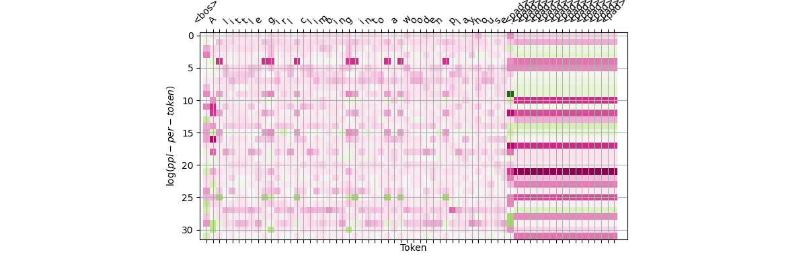
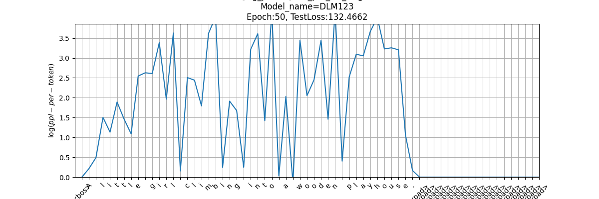
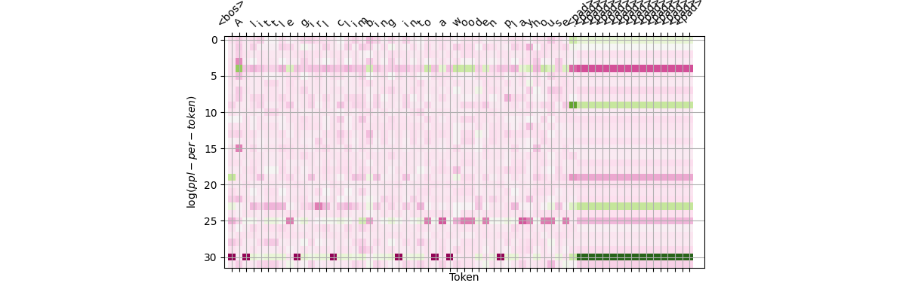
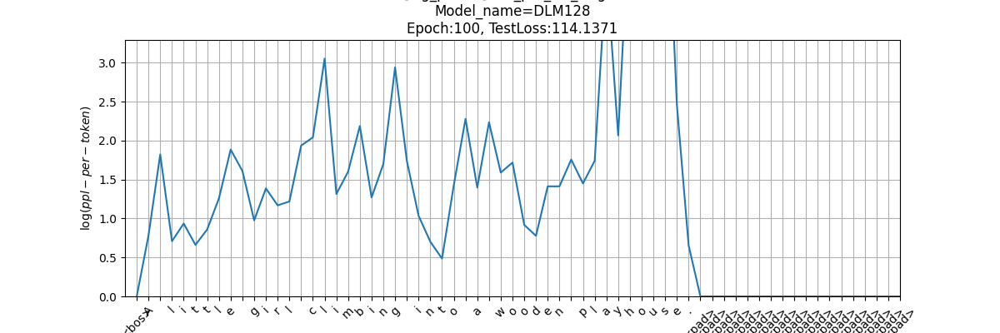
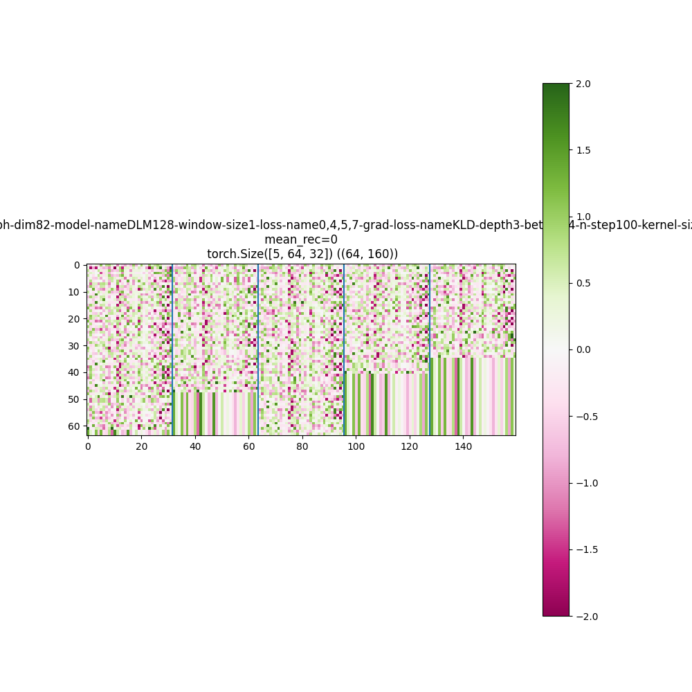
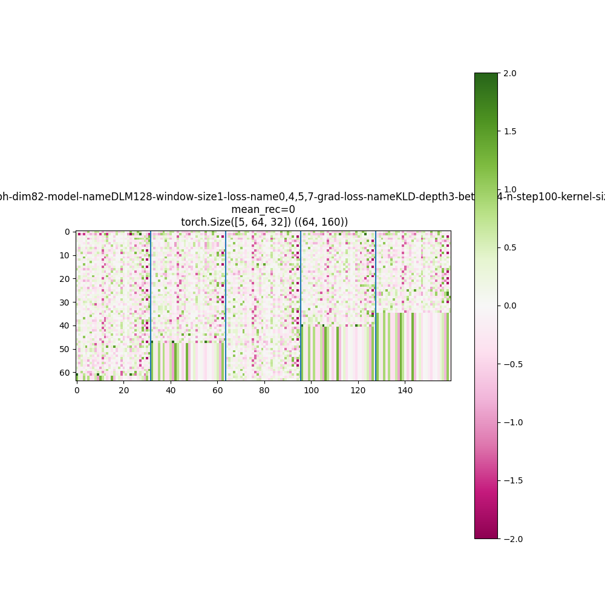
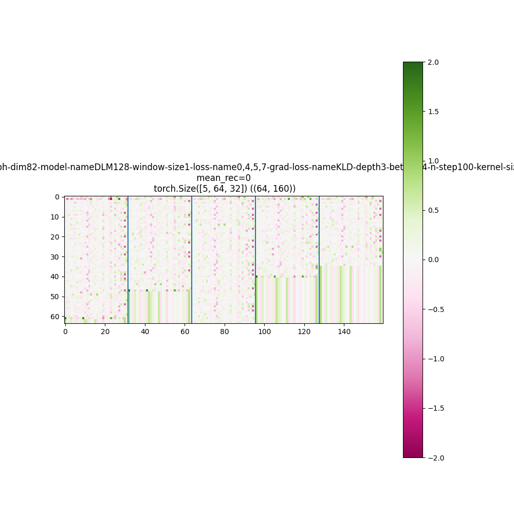
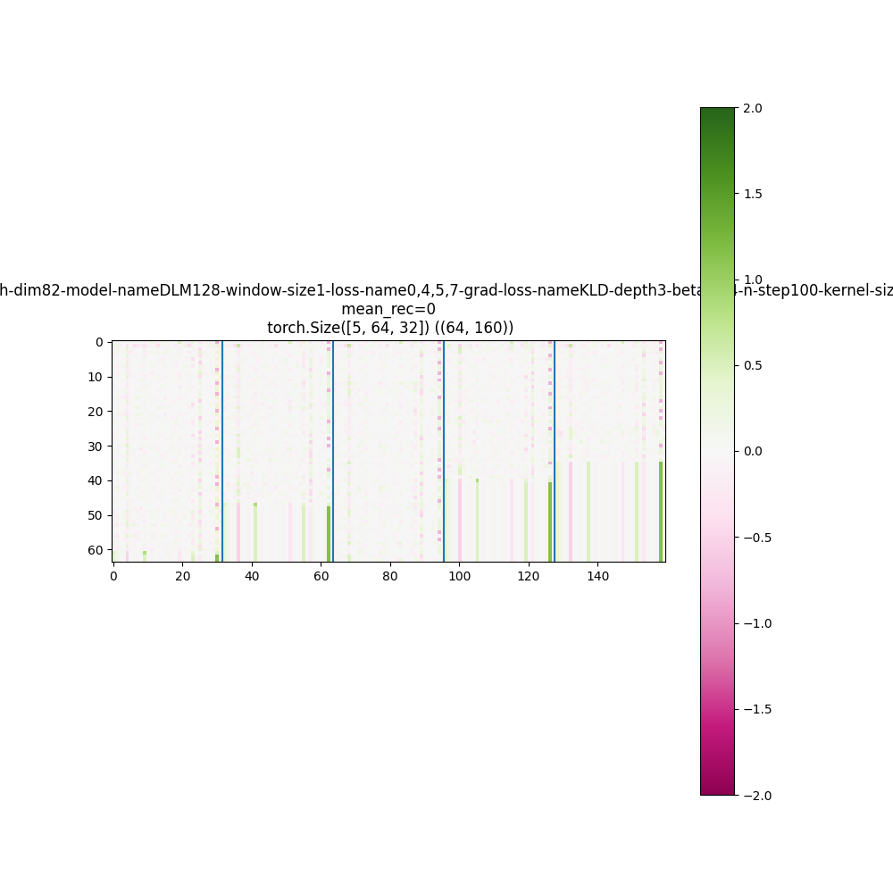
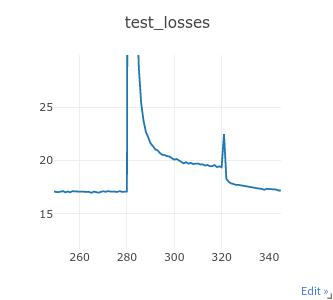

#! https://zhuanlan.zhihu.com/p/555931754

# 9022-复合性语言模型 Compositional Language Model

[CATSMILE-9022](http://catsmile.info/9022-comp-lm.html)

## 前言

- 结论:
- 背景与动机: 
    - CATSMILE-9020 太臃肿了, 单独开文记录新思路. 9020大致探测了哪些思路是不work的,做了一些数据集,得到了一些思路,希望能确保9022的构造性强一些.
- 备注: 
- 关键词: 
- 后续目标/展望方向:
- 相关篇目:
    - [CATSMILE-9020](./9020-language-model) 
- CHANGLOG:
    - 20220920 加入DLM142相关的逆扩散模型
    - 20220820 INIT


### 9020 总结

#### 一些不work的东西清单:

- 手写的RNN: 太慢,没有CUDA加速
- 手写的Transformer-RNN: 太慢,不知道CUDA加速有没有用
- LSTM离散序列先验的VAE: 收敛到了无聊的隐变量序列上, 可能直接指望RNN学到合理的序列变化是困难的. 

#### Work的东西

- 各类RNN-VAE, 无论是单隐变量的,还是分布式隐变量,都work. 不过可能高斯先验不是很合理.


### CLM

CLM的目标是自动分词. 我们尝试在VAE的框架内,构造一个具有层次的语言模型, 分为以下三个部件

1. Segmentator 分词器 $q_e(z|x)$
    - 最简单的分词器就是 `x.split()`
1. Auto-regressive Decoder 解码器
    - 具有一个RNN形式
    - 对于输入segment,使用KV矩阵构造一个arbitrary的非线性lookup变换,得到segment vector. 
    - 在输出时,倒过来使用KV矩阵,解码出具体的低级符号.
    - 自回归地计算 $q(z_1,z_2,\dots,z_S)$ ,经过强制concat得到观测序列的.
    - 在使用KV矩阵时,需要注意segment长度的处理. c2s过程中,必须pad到同样长度. s2c过程中,可以截断s到c一样的长度. 

### DLM100: Refactoring DLM28

奇怪的是,无论基于character进行训练,还是基于word进行训练,得到
的似然居然是差不多的?

- 重要的可能bug: 直接对数据取词表是会隐式地泄露数据给模型的. 比如训练集中没有出现'dog',测试集中出现了'dog',如果在统一建立词表时检索了测试集而加入了'dog'令牌,那么就相当于把这个组合泄露给了模型.考虑更加极端的情况,如果模型把整句长序列视为一个待预测令牌,那么在测试时,模型只需要做选择题而不是写作题.这是不科学的,因为这个长序列压根可能在训练集里没有出现过,模型也不应该被告知这个序列的存在性.
    - 简单来说,OOV词语的概率估计需要谨慎
    - 应用char-based rnn的模型一般没有这种问题
    - 应用DLM101的kv-pair lookup也可以规避这个bug


### DLM101=CLM001: 使用一个最简单的`x.split(' ')`分词器

字符到词语的转换是一个令人头疼的问题. 一个heuristic是采取KV注意力来取出键值,但是这可能会造成很多间断点.

实验记录:
- 对DLM101使用不同的字母进行分词,得到的结果是用空白字符' '分词效果最好.这是符合直觉的. 在前几个字母里,使用a/i分词的效果好于b/c.

### DLM102:

DLM101给出了一个进行segmentation-concatenation的框架. 但是KV注意力的性质可能并没有那么好. 考虑到KV的主要作用是把字符串编码成词向量,再从词向量解码出字符串,这听起来似乎可以用一个RNN完成,于是我们尝试往里面扔一个RNN来做这个编码解码.

即便只把编码器换成RNN,效果都已经比KV好很多了...但是这仍然意味着模型可以做自回归建模

### DLM104: Use CNN to encode words

CNN似乎不会有很强的surprise效应. 这侧面说明了token层面的自回归是一个很奇特的框架. 

在这个框架里,我们直接取了一个唯一且可逆的parsing,根据VAE框架,这是一个特例.因为parsing的可逆,确保了重要性采样是成立的(?).这里的隐变量其实只有parsing的位置: 在给定观测序列时, parsePosition的位置是确定的,映射到唯一的parsed序列. 在给定parsed序列时,直接concat,就映射到唯一的观测序列,不存在一对多或多对一的情况.

$$\begin{aligned}
ELBO &= E_{q_e(z|x)}[\log {q(z)q_r(x|z)\over q_e(z|x)}] 
\\&= \log q(z)
\end{aligned}$$

对于一个具有一定随机性的parser,就需要应用VAE的ELBO技巧. 采样出一个parsing,映射到一个parsed序列,不过concat的唯一性还是一样的. 这时候对梯度的估算就要用到REINFORCE技巧.

$$\begin{aligned}
&\nabla_m ELBO 
\\&= E_{q_e(z|x)} \nabla_m \left[ \begin{aligned} & \log q_e(z|x) sg( \log { q(z) q_r(x|z) \over q_e(z|x)} - c) 
\\ &\dots + \log q(z) q_r(x|z)  \end{aligned}\right] 
\\ &\text{c is the estimated baseline to reduce variance}
\end{aligned}$$

### Thoughts:

RNN的自回归建模从某种程度上是一种逐步的建模,这是通常的神经网络并不能很好地做到的一个点. 但是RNN的parsing是一种比较trivial的parsing. 可以认为,目前DDPM等分段模型,某种程度上也是一种类似RNN的自回归建模. 这两者的共性在于,parsing过程,或者生成中间态的过程都是预设好的/不可训练的.那么从概念上讲,这个中间态最好是能够由模型自行编码生成.

## DLM106:

DLM104加上了ConcatenationToken

## DLM107:

DLM106 with a VAE loss

$$
q_r(x|z) = 1
\\ q(z) \text{ from RNN}
\\ q(z|x) \text{ from parsing}
$$

## DLM108: DLM107 with GRU segment encoders

DLM107 and DLM108 的实验结果说明Tokenizer倾向于输出一个
确定的全空或者全1的tokenization,并利用其中一个RNN来进行自回归. 从VAE的角度来讲,生成模型倾向于不使用或者一直使用segmentationToken, 而其ELBO并没有显著好于一个RNN

### Thoughts:

RNN隐式建模了很多玩意儿.实际上RNN做生成任务效果是挺好的,并没有performance的问题.接下来会更多地做拆解RNN的工作,而不把RNN作为一个子模块.

### DLM110:

其实ngram是比RNN更为基础的一个模型.如果用embed-unembed范式去建模一个ngram,就要牵扯到概率的分解形式.最简单的bigram模型需要用到前一邻来为embedding提供梯度. 但是bigram对上下文的丢失,会让模型不知道怎么处理 'bag' 'dag' 'tag' 'tab' 'pad' 'dad' 等等 'xax' 的概率. 这并不能通过在字母间插入复杂的混合隐变量来实现,因为基于markov性bigram建模的方法压根就不允许模型获得更多的信息. 一个比较简单的词模型,需要绕过RNN,实现一个自编码的建模过程. 也就是,要用一个层级式的生成过程, 配合一个解码器, 来模拟词语的建构. 其实词语无非就是很简单的一个词表,但是要模拟出实体/词语的边界,却并不简单. 我们需要一个把空间切块的过程,并且让词语尽量地不要跨越区块. 在区块内,我们使用一个转子来寻找词向量里的下一个投影. 也就是说,我们用几个词向量, 来表征反复出现的连续字符串. 比如我允许模型取10个vmf向量,并且允许它进行几个动作:下一词(且下一字符),同一词下一字符. 模型当然有可能把所有信息都压缩到第一个vmf向量里.所以建模的方式必须鼓励模型去合并更小的信息单元.

但是问题在于,如何确保一个局部的结构能够降低数据的似然? 如果
vmf向量只是存储第x位是y字符,那么这某种程度上只是一个kmer counter,用kmer的概率来替代1mer的概率.

假定charVector固定,那么每一个词语可以对应到char上面的一条路径,如果这条路径满足马尔科夫性质,那就可以浓缩到一个Attention矩阵里.

### DLM111: CNN模型

最简单粗暴的方法,当然是不用RNN模型,直接搞一个CNN检测器. 这样可以在先验上动一些脑筋.

### DLM112: Simple VAE

我们知道VAE-ELBO具有简单的IS形式. 对于确定性很高的encoder,其编码分布的熵也就越小,损失的ELBO也就越多. 

$$\begin{aligned}
 E_{q_e(z|x)}[ \nabla_m\log q_e(z|x)] 
&= \int_z  q_e(z|x) \nabla_m \log q_e(z|x).dz
\\&= \int_z  \nabla_m  q_e(z|x).dz
\\&= 0
\end{aligned}$$

考虑一个trivial的生成模型: 从高斯q(z)里解码出离散token,同时用token嵌入的扩散定义一个编码器. 这将作为研究CNN模型的基础.


$$\begin{aligned}
ELBO &= E_{q_e(z|x)}[\log {q(z)q_r(x|z)\over q_e(z|x)}] 
\\ &= - D_{KL}(q_e(z|x)||q(z)) + E_{q_e(z|x)}[\log q_r(x|z)]
\end{aligned}$$


$$\begin{aligned}
&\nabla_m ELBO 
\\&= E_{q_e(z|x)} \nabla_m \left[ \begin{aligned} & \log q_e(z|x) sg( \log { q(z) q_r(x|z) \over q_e(z|x)} - c) 
\\ &\dots + \log q(z) q_r(x|z)  \end{aligned}\right] 
\\&= - \nabla_m  D_{KL}(q_e(z|x)||q(z)) 
\\&\dots+ E_{q_e(z|x)} \nabla_m \left[ \begin{aligned} & \log q_e(z|x) sg( \log { q_r(x|z) } - c) 
\\ &\dots +  \log q_r(x|z)  \end{aligned}\right] 
\\ &\text{c is the estimated baseline to reduce variance}
\end{aligned}$$

$$\begin{aligned}
\log q_e(z|x) = - 0.5 \beta^2 (x_i-\mu_i)^2 +\log \beta - 0.5 \log (2\pi)
\end{aligned}$$

- 注意: 
    - DLM112在采样数为1的时候是不work的,可能跟采样估计效率有关
    - DLM112 VAE会倾向于弥散的无穷大sigma,只有clip了sigma才能收敛/避免爆炸
    - 给定编码器的情况下，是否可以考虑在q(z)里面嵌入一个VAE?

$$\begin{aligned}
\log p(x) & \geq  E_{q_e(z|x)}[\log {q(z)q_r(x|z)\over q_e(z|x)}] 
\\ 
&= E_{q_e(z|x)}[\log q(z) + \log q_r(x|z) - \log q_e(z|x)] 
\\ &= E_{q_e(z|x)}[\log E_{q(z1|z)} [q(z|z1) q(z1)/q(z1|z)] + \log q_r(x|z) - \log q_e(z|x)] 
\\ &\geq E_{q_e(z|x)}[ E_{q(z1|z)} [ \log q(z|z1) q(z1)/q(z1|z)] + \log q_r(x|z) - \log q_e(z|x)] 

\end{aligned}
$$


结果: 模型倾向于把先验分布到空间的各个地方. 这可能是由高斯先验的性质所确定的. 而随着先验和后验不断地稀释,采样效率越來越低,导致模型的梯度估算的方差越來越大,不再能实现梯度下降.

一个比较简单的办法是,用一个高斯混合的先验,来实现高斯的方差.用了高斯混合以后,虽然ppl降低是快了一些,但是还是会退化成一个均匀分布,所以我手动把标准差差clip在2.5以下. 最近做的实验都是以negative logppl-per-sequence(NLPPS)作为表征,DLM114终于收敛到一个正常的ppl. 只能说高斯先验的方差真的需要控制.

### tasktranslate-multi30k-de2en-chardata-l100

NLPPS: Negative Log-Perplexity Per Sequence 

| model_desc | mutated_pos | epoch | NLPPS_E20  | NLPPS_E30  |  NLPPS_E40  |
|------------|-------------|-------|---------|---------|---------|
| DLM100        | -1          | 20 | 76  |   | |
| DLM123,D3,K30,E32,W5| -1       | 20 | 149 | 142 | 136|
| DLM123,D3,K30,E32,W1| -1          | 20 | 152 | 147 | 139|
| DLM128,D3,K30,E32,W1,B4| -1          | 20 |   |  | 140,E100-120|
| DLM123,D5,K30,E32,W5| -1       | 20 | 152 | 145 | 136|
| DLM124,D5,K30,E32,W1| -1       | 20 | 147 | 144 | 142|
| DLM121,K30,E32| -1          | 20 | 155 | 150 | 144|
| DLM121,K30    | -1          | 20 | 245 | 161 | 145|
| DLM119,K30 | -1          | 20 | 191 | 162 | 156|
| DLM120,K30 | -1          | 20 | 226 | 170 | 159|
| DLM118,K30 | -1          | 20 | 286  | 180|162|
| DLM117,K30 | -1          | 20 | 322  |   | 163|
| DLM122,K30 | -1          | 20 | 307 | 199 | 167|
| DLM114,K30 | -1          | 20 | 193  |   | |
| DLM115,K30 | -1          | 20 | 199  |   | |
| DLM112     | -1          | 20 | 310  |   | |

看这张表可以发现自回归的RNN模型还是很猛,直接干到了76. 相比之下最简单的GMMVAE在193,加了卷积的VAE能够提到136. 这说明用卷积去捕捉局部结构可能确实是可行的.

### DLM115

让我继续瞪着ELBO看一会...

- q(x|z) 用简单的unembed
- q_e(z|x) 用embed + noise
- q(z) 用个bigram看看?
- bigram其实在这里应该属于RNN的方法,没啥大意思

$$\begin{aligned}
ELBO &= E_{q_e(z|x)}[\log {q(z)q_r(x|z)\over q_e(z|x)}] 
\\ &= - D_{KL}(q_e(z|x)||q(z)) + E_{q_e(z|x)}[\log q_r(x|z)]
\end{aligned}$$


### DLM116:

考虑一个不太一样的noise形式,更加接近demasking的模型. 这个noise以一定概率把当前token替换成一个mask token. 但是其生成模型应当有一个尽量简单的形式,一个办法是考虑从全`|mask|`里生成目标序列.不过这个模型压根不需要encoder,因为生成过程比较简单. 也就是说如果写不出一个生成模型,那么去凑编码器也是很困难的. 通常目前生成模型的隐变量最多也就是语序了,很少有见对NER或者对词汇进行生成式建模的.

### DLM123: GMMVAE with convolution layers

- prior: per-location gaussian mixture
- encoder: conv neural net
- decoder: conv neural net with tanh
- comment: 模型似乎优先学到了词语间的停顿.在句首也有奇怪的pattern
- E32,D3




```
log(pplpt):105.968505859375

rand_log(pplpt):105.968505859375

[TARGET]:|bos|A little girl climbing into a wooden playhouse.
```

### Thoughts:

以上模型的高斯分布的方差都被clip了才能收敛，这可能侧面说明高斯后验不能很好地捕捉到后验应有的差异值，或者说没法可靠地找出一个适合解码的表征，完全受到最大熵导引，而被迫训练出极大的方差。联想到混合模型是一个表征差异的好方法，我们考虑把后验也变成混合模型的形式。

### Thoughts:

                The gaussian posterior assumption may be not that useful
                explore sampling by descent instead 

                There is no guarantee that the encoder would return a good estimate of posterior
                just because it is a neural network.

                Instead, we can try harvesting gradient to find good encoding representation.

                in fact, we can expand encoder with gaussian to make sure the importance samplng holds
                


### DLM128:

允许不同的层使用不同的参数。观察：embed_dim>=44的时候会需要降低学习率，loglr-3.0的情况只能用比较小的embed_dim，目前不太能确定原因。有可能又是高斯分布的方差炸了。NLLPS能达到114,比RNN的76还是差很多。


```
markov_lm/gmm/Checkpoints/-S29-tasktranslate-multi30k-de2en-chardata-l100-shuffle1-graph-dim82-model-nameDLM128-window-size1-loss-name0,4,5,7-grad-loss-nameKLD-depth3-beta0.04-n-step100-kernel-size30-embed-dim44-p-null0.0001-submodel-name-loglr-3.0_100_113.89570.pkl
```






在学习一开始，对空格的感知并不显著。随着模型收敛，更多序列性的二维变量浮现出来，隐变量的模也越來越小，看起来跟先验分布有一定的关系










#### 采样: Gibberish

```
log(pplpt):131.53076171875

rand_log(pplpt):200.40673828125

[TARGET]:|bos|Several men in hard hats are operating a giant pulley system.

[RANDOM]:|bos|A man is |p| fuctewlens husng hts bhihk iiptle in a s sie mare`(i t n tc taw o the mavnng in whple o


log(pplpt):81.6474609375

rand_log(pplpt):213.255859375

[TARGET]:|bos|A little girl climbing into a wooden playhouse.

[RECONS]:G Ande somesiirikes w n Fhrdboolarer swwond unriliowur of wnge 4 a sidcpucnie oulsocorilaw of iiir

[RANDOM]:|bos|Two men a|p|iis 4 marsirocenccdrns n an srprrirnmen and an wy ritl brown ararert cuntaloa, a ne pors.

log(pplpt):130.81298828125

rand_log(pplpt):190.90234375

[TARGET]:|bos|Several men in hard hats are operating a giant pulley system.

[RECONS]:Ilcing itrureci-hent rardat tined bite civy sirhbel oucksrounduihtganoary shonarrer (onbragiobnort a

[RANDOM]:|bos|A little |p|ging ceaceghacing placsew hot (srtetisg s s cidags slaltng a cowenh, on hit 1a caletooalt.
```

- [TBC,增加采样函数]
- [TBC,增加visualiser理解模型对于超参数敏感性]
- [TBC,更换到有限体积(unitInterval)上的隐变量空间]


- 目前想要得知VAE的参数随训练的变化
    - 耦合到梯度训练过程中。这需要把训练抽象成带visdom和不带visdom的
    - 或者新开接口，单独对ckpt进行可视化
- 可视化流程？
- 使用visdom可视化的结论:训练VAE的时候，由于KL项或者说最大熵项，很容易得到一个坍塌的后验分布，也就是说无论样本是啥，后验分布都是同一个高方差的类似先验的分布，也就是学不到有信息的隐变量，具体原因在[CATSMILE-9023](./9023-notes-ar-ae)里加以讨论了

### DLM140,DLM141,DLM142

由于前述VAE后验坍塌的问题，我们自然地寻求一个避免的办法。一个比较简单的办法就是直接把后验设定成noise-based posterior，这个时候隐变量分布已经不能算是（后验）了，但是在形式上ELBO仍然可以成立。

- DLM140: RNN based reverse diffusion
- DLM141: CNN-based reverse diffusion
- DLM142: CNN-based reverse diffusion with tanh.
   - 经过测试，DLM142在loglr=-4时可以加深到11层，取得比较好的ELBO。

- 目标: 借助于扩散范式寻找最适合表达复合性的结构。
- 结论:
    - 深层CNN可以较好地描述(字->词)结构
    - 加入增加对于候选图连接的选择模块，可以提高模型效果。
- 方向:
    - 参数量 `60*60*5*12=216k=0.22M`
    - [TBC]目前还不具备插入和删除字符的能力。加入插入和删除的噪音。
        - 没写
    - [TBC,CRUCIAL]加入对比不同模型的界面，更加系统地扩展ablation study.
        - 没写。**比较不同模型擅长的样本，理解哪些样本对于模型是冲突的，而加深模型如何化解了冲突**
        - what's the improvment? 理解模型为什么更加好了，在哪些情境下更好了，是重中之重！
        - 第一步，测试不同模型对同一测试集的效果。
        - 同样的模型训练更久，平均损失下降了，但是灾难case变多了

    - [TBC]测试不同噪音等级(noise-level)对于拟合的影响，是否单独拟合低噪音更有效果？
        - 试验了，增加低噪音权重，对提升整体似然没有明显效果，但是对于提升低噪音似然比较有效，
        可能可以分区间进行拟合，可以考虑在不同噪音等级用不同的模型，并且用一个先验选择器观察选择不同的模型偏好的噪音区间。
    - [TBC]测试不同的skip机制，看放松相空间是否有益处
        - 用DLM143试了，没啥显著效果，模型还是用单一来标记是否跳过。改变激活方式和判断方法会有一点加速，但是不太明显。
    - [TBC]对于中文这种字符不好切分的语言，无法在字-词层面观察演生现象？
        - 没啥想法
    - [TBC]架构尝试: 加入tfm实现。
        - 写了个DLM144,效果不好，复现tfm不是很简单
        - 验证注意力对于超距作用应该还是相对简单的。
    - [DONE] 对比字符级别Transformer
        - 结果:没有比较合适的transformer-based character-level model做对比
        - <https://github.com/nadavbh12/Character-Level-Language-Modeling-with-Deeper-Self-Attention-pytorch/>
        - OMFG这个模型的架构也太臃肿了吧！接到DLM147里面要降低到batch25,E32,Depth3才能跑起来。。。。




```
DLM142,D11,E50,Epoch106,Dataset-char100-multi30k

RandomSample:
g emping on a ball rady hand wearing to spressed wall chow of a bat on font of the grasting over the

homdler water to another men citire at park water in air sidep does standing towards and blow dooff

man in white a teater, and the dow opplays are take a nadis takes is is walking putting treet in pa

white paling are outing bolles stoper top of a wall a down to with a stre ride is reading a putting

men sustion in and with pusing a tree over in acrastives roles watting in his as there to toms read 
```

### Refs:

### [TBC,Transformer为啥这么慢??]

层次模型似乎不是很多

- Building End-To-End Dialogue Systems Using Generative Hierarchical Neural Network Models <https://arxiv.org/abs/1507.04808.pdf>

VAE

- Diverse Text Generation via Variational Encoder-Decoder Models with Gaussian Process Priors <https://arxiv.org/abs/2204.01227.pdf>

- Pointer Generator For summarization <https://aclanthology.org/P17-1099.pdf

- Hierarchical Representation in Neural Language Models: Suppression and Recovery of Expectations <http://aclanthology.lst.uni-saarland.de/W19-4819.pdf>

- Stochastic RNN SRNN: Sequential Neural Models with Stochastic Layers <https://arxiv.org/abs/1605.07571>

## 参考

基于句法树对RNN有过一些改造得到的模型据说效果还不错 ON-LSTM.

- GRU network <https://arxiv.org/abs/1412.3555.pdf>

- pytorch GRU cpp source
    - calls torch::gru in this file <https://github.com/pytorch/pytorch/blob/master/torch/csrc/api/src/nn/modules/rnn.cpp>
    - cpp的逻辑太难扒了,找不到`torch::gru`的具体实现...倒是有找到vulkan后端的实现,但是rnn为啥会直接调用cuda底层代码呢?不知道是不是有啥加速特性 <https://github.com/pytorchpytorch/blob/9ec8d64d0c464d0b23b564bd10869bb2819d223b/aten/src/ATen/native/vulkan/ops/Gru.cpp>
    - 搜了一下,有人尝试过直接手写gru实现 https://github.com/emadRad/lstm-gru-pytorch

- GBZhou2016 MGU: Minimal Gated Unit for Recurrent Neural Networks <https://arxiv.org/abs/1603.09420>
