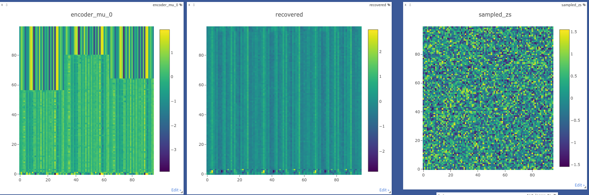

#! https://zhuanlan.zhihu.com/p/565663111

# 9023-去噪，自回归，自编码，后验坍塌 (Denoising, Autoregression, Autoencoding, Posterir Collapse)

[CATSMILE-9023](http://catsmile.info/9023-notes-ar-ae.html)

## 前言

- 结论:
    - 一个固定的无参的变分后验，很可能好于一个有参的变分后验。
- 背景与动机: 
- 备注: 
- 关键词: 
- 后续目标/展望方向:
- 相关篇目:
    - [CATSMILE-9013:DDPM](./9013-ddpm)
- CHANGLOG:
    - 20220918 INIT


### 问题例子: VAE范式下的后验模式崩溃

考虑重要性采样，可以对数据的对数似然给出一个ELBO下界

$$\begin{align}
\log p(x) 
&= \log E_{q(z|x)}[{p(x,z) \over q(z|x)}] 
\\ 
&\geq  E_{q(z|x)}[ \log {p(x,z) \over q(z|x)}] 
\\
&=  E_{q(z|x)}[ \log {p(x,z)}] + E_{q(z|x)}[ - \log{  q(z|x)}] 
\\ &=  E_{q(z|x)}[ \log {q(z)q_r(x|z)}] + H[q(z|x)]
\end{align}$$

我们知道高斯分布的变分熵是 $H(N(\mu,\sigma^2)) = {1\over 2}+{1\over 2}\log (2\pi \sigma^2)$

9022对于DLM的隐变量做了诸多尝试，但是一个反复出现的问题是模型恢复出来的emission Vector基本上都是没有什么variation的，只学到了first-order的独立分布。




从变分后验中采样，会引入噪音。由于ELBO的架构，最大化ELBO，会增加变分后验分布的熵，这样就会增加噪音的量（ $\log(\sigma^2)$ ）。噪音一旦变大，就需要更大的样本量来
测算梯度的均值，否则就会因为梯度的方差太大而无法收敛。

如果简单地允许编码模型无限制增加噪声的量，那么解码器就将被迫从完全
随机的分布里，解码出原始的模型。这可能就是为啥直接用简单的VAE架构，会坍缩到一个一阶分布的原因。因为这个时候的变分后验已经是一个和数据无关的分布了，自然也就继承不了数据本身的内部差异性，因此每个
位点的输出分布都是一样的。

### 两种解药

模式崩溃的根本原因，可能还是在于优化目标里允许了崩溃的存在。根据dai2020,似乎认为模式崩溃的根源是unidentifiability。一种办法是加入防止崩溃的正则项目，另外一种办法就是直接把后验分布固定成
不会崩溃的分布(包含了降噪范式)。从近期的发展来看，第二种方法是应用得更为广泛的。这暗合dai2020的想法，也就是说更改后验形式，可能增加了identifiability. 如果这个说法成立，那么VAE的ELBO本身可能就是一个misleading的范式。

### 防崩溃正则项

- InfoVAE: MMD-VAE
- betaVAE: reweighting KL term

### 防崩溃后验: 降噪范式

但是只要最大熵这一项还在ELBO里，那总有可能做妖。相比之下，最近兴起的一系列基于自回归和梯度对齐的方法，似乎很好地避开了这个问题。因为在自回归的框架里，posterior-latent就是加了噪音的数据。那么因为posterior里没有参数了，其熵就是固定的，也就不存在最大熵的一个问题。换句话说，一个固定的无参的变分后验，很可能好于一个有参的变分后验。在这个框架里几乎容纳了最近几年大火的所有框架，从PixelCNN/Seq2Seq，到Bert/GPT,再到DDPM。其根本联系就在于，用一个固定的噪声分布去破坏数据，再训练模型从中恢复出数据。

举个例子，我们常见的自回归生成范式，就可以写成一种从mask噪声中恢复序列的降噪问题

```
t=0;中国的首都是北京
t=1;中国的首都是北口
t=2;中国的首都是口口
t=3;中国的首都口口口
t=4;中国的首口口口口
t=5;中国的口口口口口
t=6;中国口口口口口口
t=7;中口口口口口口口
t=8;口口口口口口口口
```

我们可以看到，令 $x=z_0$, $p(z_8|z_0)$ 是一个完全确定的分布，且只在序列空间的一点上非零。原则上我们可以考察 $-D_{KL}(p(z_{8:0})||q(z_{8:0}))$ 来优化模型 $q(z_{8:0}|z_8)$ ，而且只需要考虑 $\max E_{p(z_{8:0})}[ \log  q(z_{8:0})]$ 。在这个特例中，在其他的z序列上，$p(z_{8:0})$ 是等于零的。而KL式子的推广，允许我们采用任意的 $p(z_{8:0}|z_0)$ 进行加噪，并恢复出数据。

### 

停止生成问题？如果按照一个均匀破坏的噪声，那么需要一些步数才能到达
无序的序列。问题是，在倒过来生成的时候，我们并不清楚什么时候应该停止生成。如果破坏过程的步数是一定的话，那么生成应该也应该跑相同的步数，但是如果破坏过程的步数取决于句子的长度的话，那生成过程中间有几个态就不太确定了，当然也可以通过增加一些隐藏变量来加以控制。又譬如说，可以在破坏的时候，用spanBert的方式，进行连续性的破坏。这里我们先考虑一个最简单的破坏方式，每次把k个位置替换成随机的token。如果这k个位置恰好是连在一起的k个token，那么模型将需要直接猜出这个组合。

对于任一位置i，如果 $s_i=1$ ,那么这里发射一个随机token，如果 $s_i=0$ ，那么这里发射正确的token $y_i$ .每次加噪音，随机挑选k个token，将 $s_i=0 \rightarrow1$ 。经过 L/k 步破坏， 所有位置都是 $s_i=1$，同时也达到所有token随机的一个场景。这样会得到一个在相空间内比较均匀的一个样本，借助DDPM的联合KL下界，我们只需要计算出相空间里破坏轨迹上的对数降噪概率，就可以约束模型。


$$\begin{aligned}
\\ \nabla_m ELBO &= \int_z \nabla_m \left [q_e(z|x) \log { q(z) q_r(x|z) \over q_e(z|x)} \right ] dz
\\&= E_{q_e(z|x)} \nabla_m \left[ \begin{aligned} & \log q_e(z|x) sg( \log { q(z) q_r(x|z) \over q_e(z|x)} ) 
\\ &\dots + \log q(z) q_r(x|z)  \end{aligned}\right] 
\\&= E_{q_e(z|x)} \nabla_m \left[  \log q(z) q_r(x|z)  \right] 
\end{aligned}$$


$$
ELBO \leq \log \int_z q_e(z|x) { q(z) q_r(x|z) \over q_e(z|x)}  
$$

我们知道，当联合分布正比于后验概率的时候，ELBO取到对数似然概率。
但是对数似然又是取决于解码器的。因此jensen不等式的等号成立条件，
并不能给出最优生成模型的目标。我们只能说，ELBO的优化，同时要求
生成分布符合破坏分布，又要求生成分布给观测数据尽量大的似然值。

### 模型例子:

破坏噪音:每次选k个token，替换成随机的token。

恢复:每次预测每个token是否需要被恢复，如果需要恢复，则预测恢复出的目标。


## 参考

- vae mode collapse <https://ai.stackexchange.com/questions/8879/why-doesnt-vae-suffer-mode-collapse>
- dai2020: The Usual Suspects? Reassessing Blame for VAE Posterior Collapse <http://proceedings.mlr.press/v119/dai20c/dai20c.pdf>
    - 这篇似乎认为mode collapsing的根源是unidentifiability

## 草稿

### AAE,GAN

AAE利用GAN的思想对隐变量后验分布和先验分布之间的距离进行了另一种参数化，不是单纯地用KL距离。因此不会直接要求最大化后验熵。利用一个判别器来进行真假样本之间的区分。但是当后验分布和先验分布重合时，可能仍然会发生模式崩溃。GAN也常常发生模式崩溃的问题(mode collapsing)。我们希望隐变量的空间在宏观上是符合先验的，但是在微观上要保持多样性。一个简单的办法是使用数据相关的隐变量(类似DDPM加噪)来确保隐变量不会坍塌，另一个办法是要求隐变量蕴含恢复出显变量的信息。

这可能由一些不同的原因造成的，比较可能的原因是第二点

1. 网络架构问题
1. 噪声注入问题，噪声的注入和对下界的直接求导，会造成去噪难度特别高。

